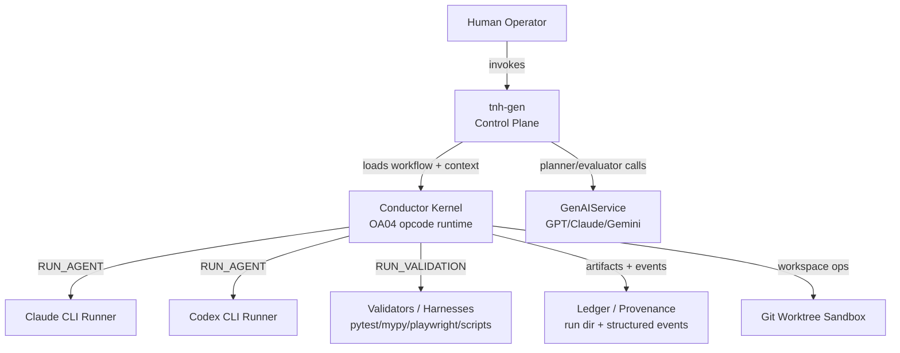
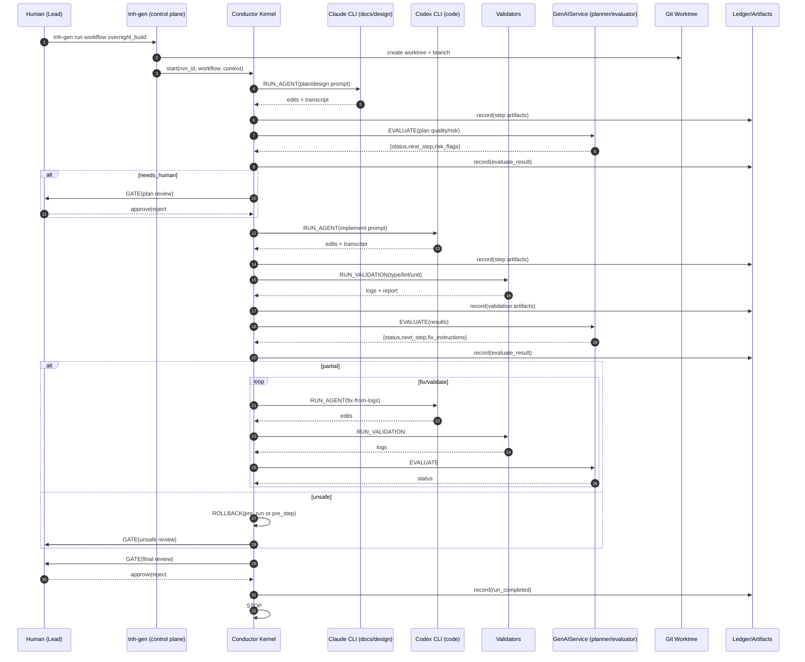
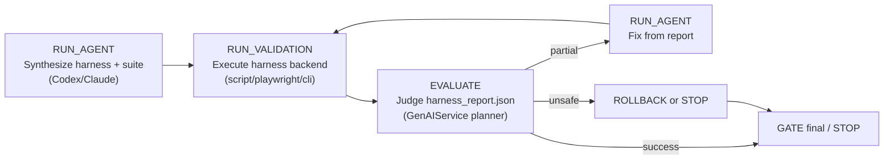
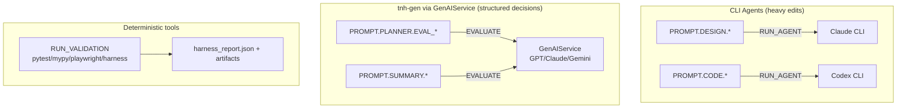

# ADR-OA04.1: Implementation Notes - MVP Build-Out Sequence

Implementation-guide addendum for OA04, defining expected operational flow and the incremental MVP build sequence.

- **Status**: WIP
- **Type**: Implementation Guide
- **Date**: 2026-02-10
- **Owner**: Aaron Solomon
- **Author**: Aaron Solomon, GPT 5.3, GPT-5 Codex, Claude Code
- **Parent ADR**: [ADR-OA04](/architecture/agent-orchestration/adr/adr-oa04-workflow-schema-opcode-semantics.md)

---

## ADR Editing Policy

**IMPORTANT**: How you edit this ADR depends on its status.

- **`proposed` status**: ADR is in the design loop. We may **rewrite** or edit the document as needed to refine the design.
- **`accepted`, `wip`, `implemented` status**: Implementation has begun or completed. **NEVER edit** the original Context/Decision/Consequences sections. Only append addendums.

---

## Context

ADR-OA04 defines workflow schema and opcode semantics. Implementation still needs a practical build order for rapid prototyping so the team can ship a walking skeleton quickly, without over committing to late-stage capabilities.

This ADR captures execution-focused notes for:

1. Crisp role boundaries between `tnh-gen`, kernel, runners, and validators.
2. MVP operational loops that can run safely inside a worktree.
3. Ordered build-out milestones that keep risk bounded and maintain forward progress.

---

## Decision

### 1. System Role Split

- `tnh-gen`: control plane (workflow selection, context packaging, prompt routing, planner/evaluator calls via GenAIService, provenance/artifact collation, policy enforcement entrypoint).
- Conductor kernel: deterministic OA04 step executor (opcodes only; no embedded domain judgment).
- CLI runners (`claude`, `codex`): heavy edit performers invoked by `RUN_AGENT`.
- Validators/harnesses: deterministic execution surfaces invoked by `RUN_VALIDATION`, returning structured reports + artifacts.

### 2. MVP Operational Loops

Builder loop:

1. `RUN_AGENT` (plan/design)
2. `EVALUATE` (plan quality/risk)
3. `RUN_AGENT` (implement)
4. `RUN_VALIDATION`
5. `EVALUATE` (results)
6. `RUN_AGENT` (fix) repeated as needed
7. `GATE` (final review)
8. `STOP`

Evaluator loop (generative):

1. `RUN_AGENT` (synthesize harness)
2. `RUN_VALIDATION` (run harness)
3. `EVALUATE` (harness report)
4. Route to fix loop or gate

### 3. Prompt Routing Contract

- Heavy work prompts (`design`, `code`, `refactor`, `fix`) execute through CLI runners.
- Planner/evaluator/summarizer prompts execute through `tnh-gen` + GenAIService under `EVALUATE`.
- Harness execution remains deterministic and local under `RUN_VALIDATION`; planner consumes structured reports, not raw log streams.

### 4. MVP Scope (Walking Skeleton)

Implement first:

- OA04 engine + minimal opcodes: `RUN_AGENT`, `RUN_VALIDATION`, `EVALUATE`, `GATE`, `STOP`.
- **`ROLLBACK(pre_run)` is REQUIRED** — kernel MUST implement this in MVP. Workflows may omit rollback usage, but the capability must exist for unattended/overnight runs.
- Script validator support in `RUN_VALIDATION` for generated harnesses.
- Worktree sandbox + path/policy guardrails (no push/merge by default).

### 4a. Checkpoint Implementation (MVP)

| Target | MVP Support | Description |
|--------|-------------|-------------|
| `pre_run` | **Implicit, always available** | Snapshot at workflow start |
| `pre_step` | Optional, implicit | Snapshot before each step (if enabled) |
| `checkpoint:<id>` | Reserved | No explicit checkpoint authoring in MVP |

**Rationale:** Minimizes surface area while preserving safety escape hatch.

### 4b. Harness Execution Sandboxing (MVP)

Script validators run with the following constraints:

| Constraint | MVP Implementation |
|------------|-------------------|
| **Worktree isolation** | Harness executes in conductor worktree, not main repo |
| **Sanitized environment** | No secrets in env vars; minimal PATH |
| **No network by default** | Harness cannot make external requests (configurable override) |
| **Entrypoint allowlist** | Scripts must be under `.tnh/run/<run_id>/...` |

**Deferred:** Container/VM isolation. Worktree + constraints are adequate for Phase 1.

### 4c. Artifact Retention Policy

- **Decision:** Retention is **system-level**, not workflow-authored.
- **Defaults:** Configured in tnh-gen settings (e.g., last N runs or last N days).
- **Workflow role:** Workflows MAY tag artifacts as `important` (advisory only).
- **Rationale:** Avoids inconsistent cleanup semantics across workflows.

### 5. MVP Generative Evaluation Deliverables

- Standard run artifact directory: `.tnh/run/<run_id>/...`.
- Minimal harness runner contract:
  - accepts suite spec path
  - executes declared cases (CLI/web)
  - emits `harness_report.json` plus referenced artifacts (stdout/stderr, screenshots)
- Planner output contract (MVP minimum for routing correctness): `status`, `next_step`, optional `fix_instructions`, `blockers`, `risk_flags`.

### 5a. Schema Freeze (MVP)

**Freeze now** (cross-boundary contracts):

- `harness_report.json` minimal schema (OA04 Section 9)
- Planner output object for EVALUATE (MVP minimum): `{status, next_step, fix_instructions?, blockers?, risk_flags?}`

**Defer** (internal evolution):

- UX flag taxonomy and severity levels
- Rich observation typing
- Visual diff conventions
- Accessibility report schema

**Rationale:** Stabilize only the contracts that cross component boundaries; internal schemas can evolve.

### 5c. Planner Contract Layering

- OA01.1 defines the full planner output contract (conceptual and future-facing).
- OA04 defines the subset the kernel requires for deterministic routing.
- OA04.1 defines the minimum planner fields required for MVP correctness.

### 5b. Component Hints (Operational Guidance)

Workflow `defaults` may include optional hints:

- `component_kind`: `docs`, `cli`, `web`, `vscode_ui`, `library`
- `eval_profile`: `smoke`, `overnight`, `release_candidate`

**Usage:** Guide harness synthesis prompts only. **No kernel semantics** — kernel does not interpret these values.

**Rationale:** Improves agent reliability without adding kernel complexity.

### 6. Incremental Build-Out Sequence

1. Kernel + runners wired, simple workflow execution, provenance logging, worktree isolation.
2. Validator baseline (`type`, `lint`, `unit`) via `RUN_VALIDATION`.
3. Planner `EVALUATE` with bounded routing through `allowed_next_steps`.
4. Script validators with artifact capture.
5. Generative harness synthesis into `.tnh/run/<run_id>/...`.
6. CLI and web harness backends (including Playwright headless screenshot capture).
7. Golden workflow with snapshot diffs + `GATE` approval before accepting updates.
8. Advanced later: VS Code UI automation backend, richer capture, flake detection, perf budgets, named checkpoints.

### 7. Guardrail Constraints

- Kernel does not embed domain-specific evaluation logic.
- All evaluation must emit structured reports; planner reads report payloads and artifact references.
- Golden updates are always gated; never auto-accepted.
- Fix/adjust loop is primary recovery; rollback is emergency brake and determinism aid.

---

## Consequences

### Positive

- Provides a clear implementation order for rapid prototype execution.
- Preserves OA01.1 separation of concerns between kernel mechanics and planner intelligence.
- Enables immediate value with a small opcode/runtime surface.

### Negative

- Defers richer capabilities (UI automation, flake handling, named checkpoints).
- Requires discipline to keep prompt routing and runner responsibilities clean during fast iteration.

---

## Open Questions

*All original open questions have been resolved.*

| Original Question | Resolution | Location |
|-------------------|------------|----------|
| `ROLLBACK(pre_run)` required? | Yes, REQUIRED in MVP | Section 4: MVP Scope |
| Split harness synth/execution? | No; keep in one workflow for MVP | Section 5 (unchanged) |
| Which schemas to freeze? | `harness_report.json` + planner output now; defer internals | Section 5a: Schema Freeze |

---

## Mermaid Artifacts

### 1) Role + Control-Plane Architecture

### 2) Overnight Build Sequence

### 3) Generative Evaluation Loop

### 4) Prompt Routing Map

---

## Related ADRs

- [ADR-OA01.1: Conductor Strategy v2](/architecture/agent-orchestration/adr/adr-oa01.1-conductor-strategy-v2.md)
- [ADR-OA04: Workflow Schema + Opcode Semantics](/architecture/agent-orchestration/adr/adr-oa04-workflow-schema-opcode-semantics.md)
- [ADR-OA05: Prompt Library Specification](/architecture/agent-orchestration/adr/adr-oa05-prompt-library-specification.md)
- [ADR-OA06: Planner Evaluator Contract](/architecture/agent-orchestration/adr/adr-oa06-planner-evaluator-contract.md)
