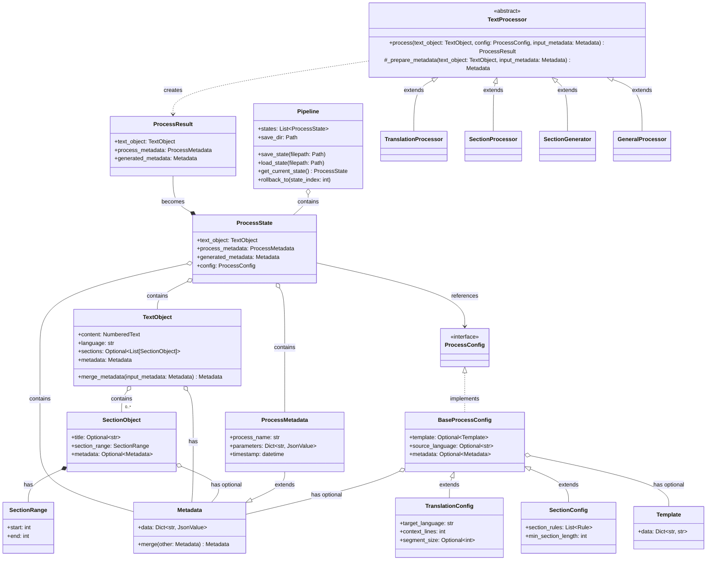
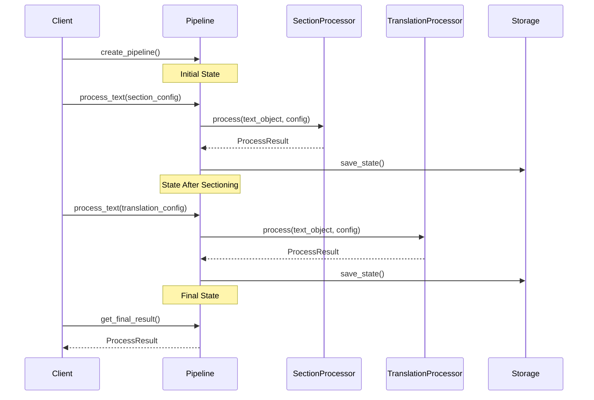
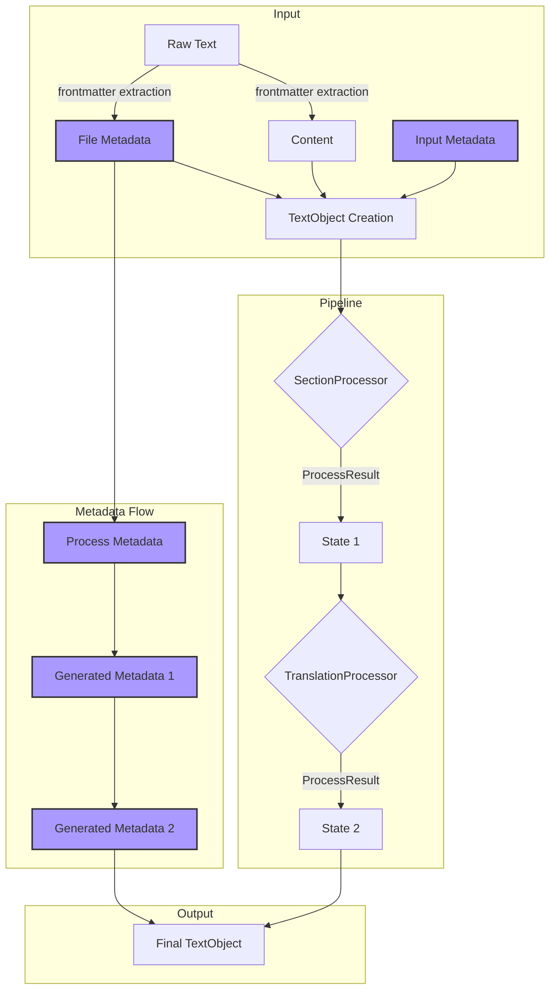

# ADR-AT01: AI Text Processing Pipeline Redesign

Establishes the TextProcessor abstraction, metadata strategy, and functional pipeline needed for AI text transformations.

- **Status**: Proposed
- **Date**: 2025-02-26

### Context

The TNH Scholar system requires a flexible, maintainable architecture for AI-based text processing that can:

- Handle multiple processing stages (translation, sectioning, etc.)
- Maintain process history and state
- Track metadata through processing pipeline
- Support configuration of processing steps
- Enable recovery from processing failures
- Scale to handle large text processing tasks

The system must balance the needs of rapid prototyping with foundational architecture that can evolve toward production use.

### Decision Drivers

1. AI Processing Characteristics:
   - High computational cost
   - Long processing times
   - Significant latency
   - Processing costs (API usage)

2. System Requirements:
   - Pipeline composability
   - State recovery capabilities
   - Configuration flexibility
   - Type safety
   - Metadata tracking

3. Development Phase:
   - Rapid prototyping priority
   - Minimal error handling initially
   - Focus on core functionality
   - Clear path to production evolution

### Decisions

#### 1. Core Architecture

#### 1.1 Base Processor Architecture

Implement abstract base processor with metadata handling:

```python
class TextProcessor(ABC):
    """Abstract base class for text processors."""
    
    @abstractmethod
    def process(
        self,
        text_object: TextObject,
        config: ProcessConfig,
        input_metadata: Optional[Metadata] = None
    ) -> ProcessResult:
        """
        Process text and return result with metadata.
        
        Args:
            text_object: Input text with existing metadata
            config: Process configuration
            input_metadata: Optional additional metadata to merge
            
        Returns:
            ProcessResult containing new text object and metadata
        """
        pass
        
    @staticmethod 
    def _prepare_metadata(
        text_object: TextObject,
        input_metadata: Optional[Metadata]
    ) -> Metadata:
        """
        Merge input metadata with text object metadata.
        
        Delegates actual merging to TextObject to maintain encapsulation
        and consistent merge behavior.
        """
        if input_metadata:
            return text_object.merge_metadata(input_metadata)
        return text_object.metadata

```

Adopt a functional pipeline architecture with explicit state tracking:

```python
@dataclass
class ProcessState:
    """Complete state after a process."""
    text_object: TextObject
    process_metadata: ProcessMetadata
    generated_metadata: Metadata
    config: ProcessConfig

@dataclass
class ProcessResult:
    """Result of a text processing operation."""
    text_object: TextObject
    process_metadata: ProcessMetadata
    generated_metadata: Metadata
```

Key aspects:

- Pure functional processor interface
- Complete state capture
- Separation of process and content metadata
- Clear data flow

#### 2. Type Safety Approach

Extend existing Metadata class for type-safe containers:

```python
class ProcessMetadata(Metadata):
    """Records information about a specific processing operation."""
    def __init__(
        self,
        process_name: str,
        parameters: Dict[str, JsonValue],
        timestamp: Optional[datetime] = None
    )
```

Key aspects:

- Built on existing Metadata foundation
- Enforces required process fields
- Maintains JSON serializability
- Type-safe parameter handling

#### 3. Configuration Management

Implement hierarchical configuration system:

```python
class BaseProcessConfig:
    """Base configuration with common fields."""
    template: Optional[str]
    source_language: Optional[str]
    metadata: Optional[Metadata]

class TranslationConfig(BaseProcessConfig):
    """Translation-specific configuration."""
    target_language: str
    context_lines: int = 3
    segment_size: Optional[int] = None
```

Key aspects:

- Common base configuration
- Process-specific extensions
- Type-safe parameter definitions
- Configuration inheritance

#### 4. State Preservation

Implement full state preservation strategy:

```python
class Pipeline:
    """Maintains full process history."""
    def __init__(self, save_dir: Optional[Path] = None):
        self.states: List[ProcessState] = []
        self.save_dir = save_dir
        
    def save_state(self, filepath: Optional[Path] = None) -> None:
        """Save current pipeline state to disk."""
```

Key aspects:

- Full in-memory state maintenance
- Simple disk persistence
- Manual and automatic save points
- State recovery capabilities

### Implementation Scope

This high-level design intentionally omits several implementation concerns that will be addressed in later phases:

1. Validation
   - Data validation
   - State validation
   - Configuration validation
   - Type constraints

2. Error Handling
   - Process failures
   - State recovery
   - Configuration errors
   - Type errors

3. Operational Concerns
   - Logging
   - Monitoring
   - Performance optimization
   - Resource management

These concerns, while critical for production deployment, are deferred to maintain focus on core architectural decisions and relationships. This allows the design to evolve naturally as implementation requirements become clearer through prototyping and initial development.

### Diagrams

#### Text Processing Pipeline Flow



#### Example Processing Sequence



#### Data Flow Through Pipeline



### Consequences

#### Positive

1. Clean, Functional Design
   - Clear data flow
   - Easy to reason about
   - Simple to test
   - Straightforward recovery

2. Type Safety
   - Early error detection
   - Clear interfaces
   - IDE support
   - Self-documenting code

3. Flexible Configuration
   - Easy to extend
   - Type-safe parameters
   - Clear hierarchy
   - Process-specific options

4. Complete State Tracking
   - Full recovery capability
   - Clear process history
   - Simple debugging
   - Easy state inspection

#### Negative

1. Memory Usage
   - Full state history in memory
   - Potential memory pressure
   - May require paging
   - Duplicate state on disk

2. Storage Overhead
   - Multiple state copies
   - No automatic cleanup
   - Growing disk usage
   - Basic save/load

3. Implementation Complexity
   - Many classes to implement
   - Configuration hierarchy
   - State serialization
   - Recovery logic

### Open Issues

1. State Management
   - Cleanup strategy for saved states
   - Memory pressure handling
   - Recovery validation
   - State versioning

2. Configuration
   - Parameter validation rules
   - Configuration versioning
   - Default value handling
   - Configuration persistence

3. Process Flow
   - Error recovery strategy
   - Process validation
   - Pipeline branching
   - Parallel processing

4. Type System
   - Parameter type constraints
   - Custom type definitions
   - Validation rules
   - Type conversion

### Implementation Plan

1. Phase 1: Core Framework
   - Basic Pipeline class
   - ProcessState/Result
   - Simple persistence
   - Type definitions

2. Phase 2: Configuration
   - Base configuration
   - Process configurations
   - Configuration validation
   - Parameter typing

3. Phase 3: State Management
   - State persistence
   - Recovery mechanisms
   - Cleanup utilities
   - Validation tools

### Notes

This design prioritizes:

- Clarity over optimization
- Type safety over flexibility
- State tracking over memory efficiency
- Simple persistence over sophisticated storage

The approach provides a clear path from prototype to production while maintaining core architectural principles. The functional design with complete state tracking trades memory efficiency for reliability and recoverability, acknowledging that AI processing times dominate system resource considerations.

Implementation should proceed incrementally, focusing first on core functionality while maintaining awareness of future requirements. The design allows for evolution toward more sophisticated state management, configuration handling, and error recovery as the system matures.

## ADR 002: Pipeline State Management Strategy

### Status

Proposed

### Context

The text processing pipeline transforms content through multiple stages (sectioning, translation, etc.). Initially considered keeping full state history in memory by creating new TextObject instances at each stage. Shifted to an in-place modification approach with disk checkpointing.

Original approach:
```python
# New object created at each stage
section_result = section_processor.process(text_obj)
translate_result = translation_processor.process(section_result)
format_result = format_processor.process(translate_result)
```

New approach:
```python
# Single object transformed and checkpointed
text_obj.transform(content=sectioned_text, process_tag="section")
save_checkpoint(text_obj, "after_section")
text_obj.transform(content=translated_text, process_tag="translate")
save_checkpoint(text_obj, "after_translation")
```

### Decision Drivers

1. Resource Management
   - Long processing pipelines create many objects
   - Large text content duplicated across objects
   - Memory pressure with multiple TextObjects
   - Need for state recovery on failure

2. Pipeline Requirements
   - Must track processing history
   - Need ability to recover from failures
   - State checkpointing essential
   - Process history must be maintained

### Decision

Adopt in-place modification with disk checkpointing:
- Single TextObject flows through pipeline
- Object transformed in-place at each stage
- Process history tracked in metadata
- State checkpointed to disk after transforms

### Consequences

#### Positive

1. Resource Efficiency
   - Minimal memory usage
   - No content duplication
   - Clear cleanup points
   - Efficient state management

2. Process Management
   - Simple state recovery
   - Clear process tracking
   - Explicit checkpoints
   - Disk-based history

#### Negative

1. Code Clarity
   - In-place modifications less obvious
   - State changes need clear documentation
   - Checkpoint management required
   - More complex testing

### Implementation Notes

- Use `transform()` method for clear intent
- Document state modifications
- Implement robust checkpoint system
- Maintain comprehensive process history

The tradeoff of code clarity for resource efficiency is mitigated through clear method naming and documentation.

## ADR 003: TextObject Transform Method Design

### Status

Proposed

### Context

The TextObject class requires a method for modifying its state during pipeline processing. Initially considered conventional update patterns, but the processing pipeline performs transformational operations like translation that fundamentally change both content and metadata.

Two main approaches were considered:

1. Conventional `update()` method
2. Domain-specific `transform()` method

### Decision Drivers

1. Memory Efficiency
   - Need to avoid creating multiple TextObject instances
   - System performs disk-based checkpointing
   - In-place modification is acceptable

2. Semantic Clarity
   - Operations fundamentally transform content
   - Multiple aspects may change simultaneously (content, language, metadata)
   - Changes are part of a processing pipeline
   - Need to track transformation history

3. Processing Context
   - Translation changes both content and metadata language
   - Sectioning modifies structure while preserving content
   - Each step in pipeline represents a transformation

### Decision

Implement `transform()` method for in-place modification:

```python
def transform(
    self,
    content: str,
    language: str, 
    process_tag: str,
    sections: Optional[List[SectionObject]] = None,
    timestamp: Optional[datetime] = None
) -> None:
    """Transform TextObject by modifying content and metadata in-place.
    
    Represents a fundamental transformation of the object's state as part
    of a processing pipeline. Records transformation in process history.
    """
```

### Consequences

#### Positive

1. Better semantic alignment with operations
2. Clearer expression of pipeline transformations
3. Self-documenting code
4. More accurate process history tracking

#### Negative

1. Deviates from conventional update pattern
2. In-place modification less obvious from method name
3. Requires clear documentation about state modification

### Notes

Choose `transform` over `update` because:

- Better represents domain operations
- Clearer about fundamental state changes
- Aligns with pipeline architecture
- Supports tracking transformation chain

Memory efficiency through in-place modification is maintained while improving semantic clarity of operations.

### Implementation Notes

- Clear documentation about in-place modification
- Consistent usage across processors
- Robust process history tracking
- Proper logging of transformations

## ADR 004: Flexible Function Parameters in Processing Pipeline

### Status

Proposed (Prototype Phase)

### Context

During rapid prototyping of the processing pipeline, we need to handle various processing configurations while maintaining code flexibility. The system frequently needs optional parameters with sensible defaults, especially in text processing methods.

Current pattern uses Optional types with None defaults:

```python
def translate_text(
    self,
    text: TextObject,
    segment_size: Optional[int] = None,
    source_language: Optional[str] = None,
    target_language: Optional[str] = None,
    template_dict: Optional[Dict] = None,
) -> TextObject:
```

### Decision Drivers

1. Prototype Phase Requirements
   - Need for rapid iteration
   - Flexibility in parameter combinations
   - Easy testing with minimal parameters
   - Clear default behaviors

2. Processing Context
   - Many parameters can be derived from context
   - Sensible defaults exist for most parameters
   - Some parameters depend on others
   - Parameters may be overridden by configuration

3. Future Evolution
   - Will eventually move to configuration objects
   - Need to maintain clear parameter relationships
   - Must support transition to formal configuration
   - Should document parameter dependencies

### Decision

Use Optional types with None defaults for processing parameters:

```python
def process_text(
    self,
    text: TextObject,
    source_language: Optional[str] = None,  # Can be derived from text
    segment_size: Optional[int] = None,     # Has calculable default
    template_dict: Optional[Dict] = None,   # Optional customization
) -> TextObject:
    """Process text with flexible parameter configuration."""
    # Derive missing parameters
    if not source_language:
        source_language = text.language
        
    # Calculate defaults when needed
    if not segment_size:
        segment_size = _calculate_segment_size(
            text.content, DEFAULT_TARGET_TOKENS
        )
```

### Consequences

#### Positive

1. Flexibility
   - Easy to call with minimal parameters
   - Clear default behaviors
   - Simple parameter overriding
   - Supports rapid prototyping

2. Clarity
   - Type hints maintain clarity
   - Default values are explicit
   - Parameter requirements are clear
   - Dependencies are visible

3. Evolution Path
   - Easy transition to configuration objects
   - Clear parameter relationships
   - Documented default behaviors
   - Maintains type safety

#### Negative

1. Validation Overhead
   - Need to check for None values
   - Parameter dependency checking required
   - Default calculations may be repeated
   - Validation spread across code

2. Documentation Requirements
   - Need to document default behaviors
   - Parameter dependencies must be clear
   - Default calculations should be explained
   - Configuration patterns need description

### Implementation Notes

1. Parameter Documentation

```python
def process_text(
    text: TextObject,              # Required base content
    source_language: Optional[str] = None,  # Derived from text if None
    segment_size: Optional[int] = None,     # Calculated if None
):
    """Process text with flexible configuration.
    
    Args:
        text: Base content to process
        source_language: Override text's language if provided
        segment_size: Custom segment size or None for automatic
    """
```

2. Default Handling Pattern

```python
def _resolve_parameters(
    self,
    text: TextObject,
    source_language: Optional[str],
    segment_size: Optional[int]
) -> tuple[str, int]:
    """Resolve processing parameters with defaults."""
    language = source_language or text.language
    size = segment_size or _calculate_segment_size(text.content)
    return language, size
```

### Future Migration

This approach provides clear migration path to configuration objects:

```python
# Future configuration pattern
class ProcessConfig:
    source_language: Optional[str] = None
    segment_size: Optional[int] = None
    
    def resolve(self, text: TextObject) -> ResolvedConfig:
        """Resolve configuration with defaults."""
```

### Notes

This flexible parameter pattern:

- Supports rapid prototyping needs
- Maintains type safety and clarity
- Documents parameter relationships
- Provides path to formal configuration

The approach balances immediate flexibility needs with future evolution to more structured configuration handling.
