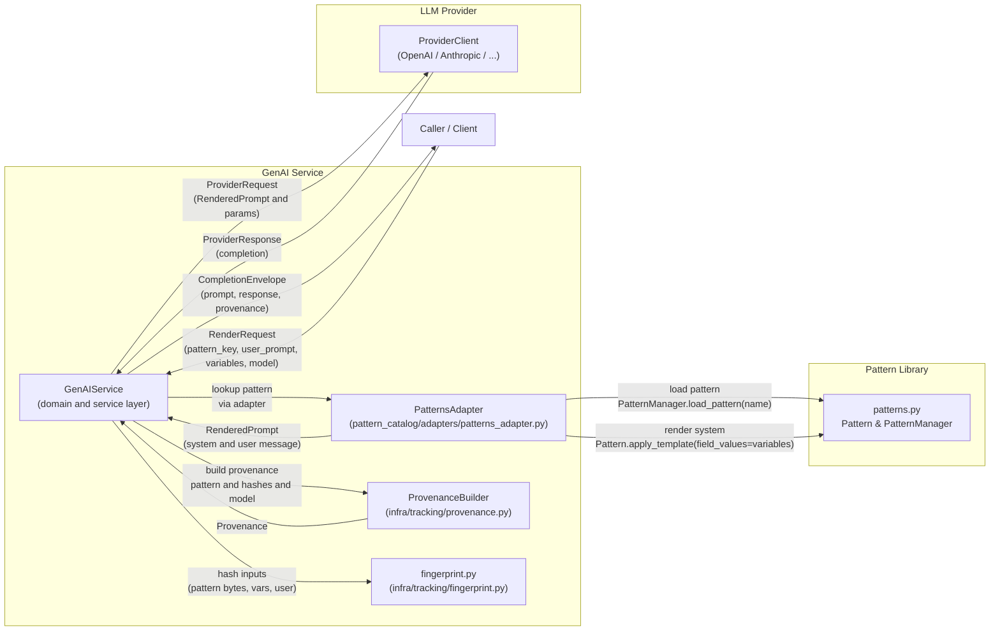

# ADR-A01: Adopt Object-Service for GenAI Interactions

Adopts the Object-Service pattern so GenAI requests use consistent domain objects while provider adapters stay isolated.

**Status:** Accepted  
**Date:** 2025-10-02  
**Author:** Aaron Solomon with GPT-5.0, Claude AI

See also: [GenAI Service Strategy](../design/genai-service-strategy.md)

## Context

As we integrate Generative AI (GenAI) capabilities into our platform, we need a clear architectural approach to manage interactions with various GenAI providers. The complexity and variability of provider 1APIs, request/response formats, and operational policies necessitate a structured pattern that promotes maintainability, extensibility, and observability.

The Object-Service pattern offers a clean separation between domain data structures (Objects) and the business logic that operates on them (Services). This approach allows us to encapsulate GenAI interaction logic within dedicated service components while keeping domain shapes explicit and reusable.

## Decision

We will adopt the Object-Service pattern for GenAI interactions by defining a central `GenAIService` responsible for orchestrating requests and responses to multiple GenAI providers. The domain shapes will be clearly defined to represent the core data exchanged:

- **CompletionRequest / CompletionResponse**: Standardized domain objects representing the input prompt and the generated completion from a GenAI provider.

- **ProviderRequest / ProviderResponse**: Provider-specific request and response objects that adapt the generic Completion shapes to the particular API requirements of each GenAI service.

- **PatternCatalog**: A shared repository of prompt engineering patterns and templates that can be injected into requests to improve prompt quality and consistency.

### Configuration Taxonomy

To manage configuration complexity, we will organize configuration into three conceptual layers:

- **Config**: Static configuration parameters such as API keys, endpoint URLs, and default timeouts.

- **Params**: Dynamic parameters that can be varied per request, such as prompt text, temperature, max tokens, etc.

- **Policy**: Operational policies including rate limits, safety filters, and content moderation rules that govern how requests are processed and responses validated.

### Policy and Safety

Given the risks associated with generative AI outputs, we will embed safety policies within the GenAIService implementation. For v1, content filtering and moderation will be limited to stubs and placeholders for future enhancement. Rate and cost limiting are recognized as significant operational concerns but will be kept minimal at this stage to allow flexibility and iteration.

### Observability and Provenance

To maintain transparency and traceability of GenAI interactions, we will implement observability features as primarily hooks and stubs at this stage. However, the necessary data structures and logging frameworks will be in place to enable detailed tracing, correlation IDs, and metadata tagging as the system matures.

Timing is captured by an injected Observer via context-managed spans; the service reads span.duration_ms rather than computing durations itself.

### Domain Data Structures (Outline)

- **CompletionRequest**: Encapsulates the input prompt, parameters such as temperature, max tokens, and any contextual metadata.

- **CompletionResponse**: Contains the generated text, usage statistics, and any relevant metadata or provenance information.

- **ProviderRequest**: Adapts CompletionRequest into the specific request format required by a GenAI provider, including authentication and endpoint details.

- **ProviderResponse**: Parses and normalizes the provider's raw response into a CompletionResponse format.

- **PatternRef, RenderedPattern, PatternCatalog**: Structures to manage prompt engineering patterns; PatternRef identifies a pattern, RenderedPattern is the instantiated prompt text, and PatternCatalog holds reusable templates.

- **CompletionParams**: Defines dynamic parameters influencing generation such as temperature, top-p, max tokens, stop sequences.

- **BudgetPolicy**: Defines constraints related to cost, rate limits, and quotas.

- **MediaPolicy**: Governs usage of media types, content restrictions, and safety filters.

- **SecurityConfig**: Configuration for authentication, encryption, and access control.

- **Provenance**: Tracks metadata about request origin, timestamps, applied policies, and audit trails. In v1, provenance may later include `provider_request_id`, `routing_reason`, `retry_count`, and `policy_version` for multi-provider debugging.

### Architecture Diagram (V1)



### Reference Code Skeletons (v1)

Below are minimal, typed skeletons to anchor implementation; no error handling, aligned to v1 prototyping.

```python title="ai_service/domain.py"
from __future__ import annotations
from typing import Any, Optional, Literal, Protocol, Sequence
from pathlib import Path
from pydantic import BaseModel, Field

Role = Literal["system", "user", "assistant"]
OutputMode = Literal["text", "json"]

class PatternRef(BaseModel):
    id: str
    version: Optional[str] = None  # git tag/commit or semantic version

class RenderedPattern(BaseModel):
    text: str
    metadata_json: str
    fingerprint: str  # sha256(text + metadata_json)

class MediaAttachment(BaseModel):
    path: Optional[Path] = None
    bytes_: Optional[bytes] = None
    mime: str
    width: Optional[int] = None
    height: Optional[int] = None

class CompletionParams(BaseModel):
    temperature: float = 0.2
    top_p: float = 1.0
    max_output_tokens: int = 1024
    output_mode: OutputMode = "text"

class BudgetPolicy(BaseModel):
    max_dollars: float = 0.20
    fail_on_budget_exceeded: bool = True

class MediaPolicy(BaseModel):
    allow_images: bool = True
    max_image_count: int = 4
    max_total_image_mb: float = 10.0

class SecurityConfig(BaseModel):
    redact_pii: bool = True
    max_input_chars: int = 120_000

class CompletionRequest(BaseModel):
    pattern: PatternRef
    variables: dict[str, Any] = Field(default_factory=dict)
    images: list[MediaAttachment] = Field(default_factory=list)
    params: CompletionParams = Field(default_factory=CompletionParams)
    correlation_id: Optional[str] = None

class UsageInfo(BaseModel):
    prompt_tokens: int
    completion_tokens: int
    total_tokens: int
    dollars: float

class CompletionResult(BaseModel):
    text: str
    json_obj: Optional[dict[str, Any]] = None
    model: str
    usage: UsageInfo
    latency_ms: int
    warnings: list[str] = Field(default_factory=list)

class Provenance(BaseModel):
    backend: str
    model: str
    correlation_id: str
    pattern_id: str
    pattern_fingerprint: str
    started_at: str
    completed_at: str
    schema_version: str = "1.0"

class Envelope(BaseModel):
    status: Literal["pending", "running", "succeeded", "failed", "timeout"]
    error: Optional[str] = None
    diagnostics: dict[str, Any] = Field(default_factory=dict)
    provenance: Provenance

class CompletionResponse(Envelope):
    result: Optional[CompletionResult] = None  # present on success
```

```python
from __future__ import annotations
from typing import Protocol, Any

class ObsSpan(Protocol):
    def __enter__(self) -> "ObsSpan": ...
    def __exit__(self, exc_type, exc, tb) -> None: ...
    @property
    def duration_ms(self) -> int: ...

class Observer(Protocol):
    def phase(self, name: str, **fields: Any) -> ObsSpan: ...

class NoOpObserver:
    def phase(self, name: str, **fields: Any) -> ObsSpan:
        class _Span:
            def __enter__(self): return self
            def __exit__(self, exc_type, exc, tb): pass
            @property
            def duration_ms(self) -> int: return 0
        return _Span()
```

```python title="ai_service/providers/base.py"
from __future__ import annotations
from typing import Optional, Literal, Protocol
from pydantic import BaseModel
from ..domain import MediaAttachment, UsageInfo

OutputMode = Literal["text", "json"]

class ProviderRequest(BaseModel):
    input_text: str                  # Rendered prompt
    images: list[MediaAttachment] = []
    model: str
    temperature: float
    max_output_tokens: int
    top_p: float
    output_mode: OutputMode = "text"
    correlation_id: str
    system_text: Optional[str] = None  # for providers like Anthropic

class ProviderResponse(BaseModel):
    text: str
    usage: UsageInfo
    model: str
    finish_reason: Optional[str] = None
    raw_response: Optional[dict] = None

class ProviderClient(Protocol):
    def generate(self, request: ProviderRequest) -> ProviderResponse: ...
```

```python title="ai_service/router.py (updated)"
from dataclasses import dataclass
from .patterns import PatternMeta
from .domain import CompletionParams

@dataclass
class RoutingDecision:
    provider: str
    model: str
    reason: str

class ModelRouter:
    def select(self, pattern_meta: PatternMeta, params: CompletionParams, policy: "CompletionPolicy") -> RoutingDecision:
        # Precedence: params.model_hint → pattern_meta.default_model_hint → config default
        chosen = params.model_hint or pattern_meta.default_model_hint or "gpt-4o-mini"
        return RoutingDecision(provider="openai", model=chosen, reason="precedence/model_hint→pattern_default→global_default")
```

```python title="ai_service/patterns.py"
from __future__ import annotations
from typing import Any
from pydantic import BaseModel
from .domain import PatternRef, RenderedPattern

class PatternMeta(BaseModel):
    task_kind: str              # e.g., "translate", "summarize"
    output_mode: str            # "text" | "json"
    default_model_hint: str     # e.g., "gpt-4o-mini"

class PatternCatalog(Protocol):
    def render(self, ref: PatternRef, variables: dict[str, Any]) -> RenderedPattern: ...
    def introspect(self, ref: PatternRef) -> PatternMeta: ...
```

```python title="ai_service/service.py (updated generate flow)"
from __future__ import annotations
from typing import Any
from pydantic import BaseModel
from .domain import (
    CompletionRequest, CompletionResponse, CompletionResult,
    Envelope, Provenance, UsageInfo, RenderedPattern,
)
from .patterns import PatternCatalog
from .providers.base import ProviderClient, ProviderRequest
from .router import ModelRouter, RoutingDecision
from .obs import Observer, NoOpObserver

def generate_ulid() -> str:
    import uuid
    return str(uuid.uuid4())

class GenAIServiceConfig(BaseModel):
    api_key: str
    base_url: str | None = None
    default_timeout_s: float = 60.0

class GenAIService:
    def __init__(self, config: GenAIServiceConfig, catalog: PatternCatalog, client: ProviderClient, policy: "CompletionPolicy", *, observer: Observer | None = None):
        self.config = config
        self.catalog = catalog
        self.client = client
        self.policy = policy
        self.router = ModelRouter()
        self.obs: Observer = observer or NoOpObserver()

    def _build_provider_request(self, req: CompletionRequest, rendered: RenderedPattern, routing: RoutingDecision) -> ProviderRequest:
        # v1 enforces a fixed temperature to improve determinism
        return ProviderRequest(
            input_text=rendered.text,
            images=req.images,
            model=routing.model,
            temperature=0.2,
            max_output_tokens=req.params.max_output_tokens,
            top_p=req.params.top_p,
            output_mode=req.params.output_mode,
            correlation_id=req.correlation_id or generate_ulid(),
        )

    def generate(self, req: CompletionRequest) -> CompletionResponse:
        correlation_id = req.correlation_id or generate_ulid()

        with self.obs.phase("introspect", correlation_id=correlation_id, pattern_id=req.pattern.id):
            pattern_meta = self.catalog.introspect(req.pattern)

        with self.obs.phase("render", correlation_id=correlation_id, pattern_id=req.pattern.id):
            rendered = self.catalog.render(req.pattern, req.variables)

        with self.obs.phase("route", correlation_id=correlation_id, pattern_id=req.pattern.id):
            routing = self.router.select(pattern_meta, req.params, self.policy)

        provider_request = self._build_provider_request(req, rendered, routing)

        with self.obs.phase("provider_call", correlation_id=correlation_id, provider="openai", model=routing.model) as s_call:
            pr = self.client.generate(provider_request)

        latency_ms = getattr(s_call, "duration_ms", 0)  # computed by observer span

        result = CompletionResult(text=pr.text, json_obj=None, model=pr.model, usage=pr.usage, latency_ms=latency_ms)
        prov = Provenance(
            backend="openai",
            model=pr.model,
            correlation_id=provider_request.correlation_id,
            pattern_id=req.pattern.id,
            pattern_fingerprint=rendered.fingerprint,
            started_at="",    # optional: observer can record wall/monotonic separately
            completed_at="",
            schema_version="1.0",
        )
        return CompletionResponse(status="succeeded", result=result, provenance=prov)
```

```python title="ai_service/errors.py"
class GenAIServiceError(Exception):
    pass

class PolicyError(GenAIServiceError):
    pass

class TransportError(GenAIServiceError):
    pass

class ProviderError(GenAIServiceError):
    pass

class FormatError(GenAIServiceError):
    pass
```

## Consequences

- **Pros**: Clear separation of concerns, easier maintenance, and extensibility for adding new GenAI providers. Improved safety and compliance through embedded policies. Enhanced observability facilitates debugging and operational insights.

- **Cons**: Additional complexity in defining and maintaining domain shapes and service layers. Potential overhead in adapting provider-specific requests/responses.
