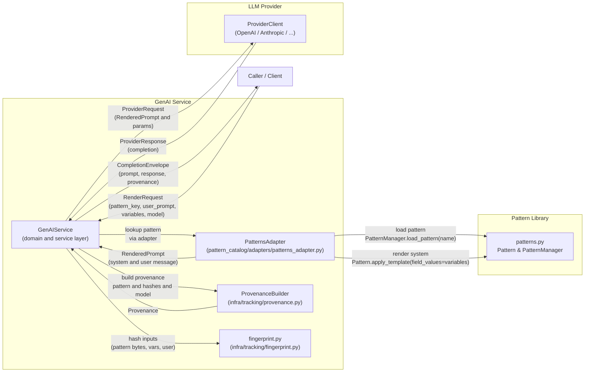

# ADR-A02: PatternCatalog Integration (V1)

Locks the GenAI Service to the existing PatternCatalog by defining how rendered templates populate system prompts and messages.

**Status:**  Superseded by ADR-A12 Prompt System and FingerPrint Architecture (V1)
**Date:** 2025-11-08  
**Author:** Aaron Solomon, GPT 5.0
**Related:** ADR-A01 (Object-Service blueprint), ADR-A11 (Model params), ADR-P02 (Pattern catalog, if any)

---

## Context

- A file-backed pattern library (patterns.py) provides single-template Jinja2 "system prompts" with optional front-matter (e.g., model_hint) and a PatternManager rooted at TNH_PATTERN_DIR. This library is first‑class, stable, and external to GenAI Service.
- The new `GenAIService` expects a `RenderedPrompt` with an optional system string and a list of messages, where the caller's freeform prompt is sent as a "user" message.
- We want a walking skeleton that fully reuses assets without content migration, while establishing durable provenance & fingerprinting hooks.

---

## Decision

### 1. V1 Prompt Composition (Semantics)

- **system** = rendered template (Jinja2) using caller-provided variables
- **messages** = exactly one: `Message(role="user", content=<verbatim user prompt>)`
- No user-message templating in V1

### Rendering Engine (Canonical Seam)

V1 rendering is delegated entirely to the Pattern Library.  
All system prompt rendering must occur via:

```python
Pattern.apply_template(field_values=variables)
```

This ensures:

- unified template semantics for all tooling consuming patterns,
- correct precedence ordering (default fields < front‑matter < caller variables),
- consistent behavior across the TNH‑Scholar ecosystem,
- and elimination of multiple Jinja engines with divergent policies.

GenAI Service MUST NOT render templates with its own Jinja instance.
The Pattern Library is the single source of truth for rendering semantics.

### 2. Adapter of Record

- `PatternsAdapter` wraps the PatternManager and exposes patterns to GenAI Service.
- The adapter accepts an optional base_path (Path). If provided, it uses this root; otherwise it uses the PatternManager default (TNH_PATTERN_DIR). This allows multiple catalog roots (fixtures, alternate repos).

### 3. Front-Matter → Params (Scoped)

- V1 only surfaces `model_hint` to suggest a provider/model
- No direct mapping of other front-matter keys (e.g., `temperature`, `top_p`) into `CompletionParams` in V1
- Structure for future mapping must be modular (e.g., a small "param mapping" strategy object) rather than inline

### 4. Missing-Variable Policy (V1)

- **Dev/test:** missing variables raise (strict)
- **Prod (later):** a future toggle in Settings may allow safe rendering (empty on missing). Not implemented in V1.

**Rendering strictness note:**  
`Pattern.apply_template` may use a permissive undefined policy in its current implementation.  
ADR‑A02 V1 accepts the Pattern Library’s strictness behavior as-is.  
GenAI Service does not enforce its own strict/lenient Jinja policy; strictness will be governed by the Pattern Library or by a future ADR introducing global settings.

### 5. Discovery & Namespacing

- **Primary:** PatternManager using `TNH_PATTERN_DIR`
- **Optional override:** adapter-level `base_path` for alternative roots / fixtures
- Name resolution remains compatible; uniqueness is enforced per effective root

**Pattern Library Boundary:**

The pattern system is a first‑class shared utility within TNH‑Scholar. GenAI Service does not interpret pattern files directly; it consumes them through the PatternsAdapter. This ensures the Pattern Library can evolve independently and may later be extracted as a standalone package.

**Rendering boundary guarantee:**  
GenAI Service does not execute Jinja directly.  
All rendering passes through `Pattern.apply_template`, which forms the canonical API seam.  
This guarantees that future changes to template semantics, front‑matter behavior, or variable precedence occur in one place only: the Pattern Library.

### 6. Fingerprinting & Provenance (V1)

- Establish a dedicated `infra/tracking/fingerprint.py` module with pure functions for deterministic hashing:
  - `pattern_content_hash`: based on template file bytes (post front-matter combine as defined by pattern library)
  - `resolved_vars_hash`: SHA-256 of JSON-canonicalized variables
  - `user_prompt_hash`: SHA-256 of raw user prompt
- Introduce a `ProvenanceBuilder` (module: `infra/tracking/provenance.py`) responsible for constructing a `Provenance` payload from inputs (pattern id/path, hashes, provider, model)
- Service code should call the builder, not construct provenance ad hoc. For V1, keep the payload minimal but place it in the correct module.

### 7. Data Shapes (V1)

- `RenderRequest.variables`: prefer a named type alias for readability:

```python
from typing import Any, Dict
RenderVars = Dict[str, Any]
```

(A Pydantic model can be added later if schemas stabilize.)

- `RenderedPrompt`: unchanged (`system: str|None`, `messages: list[Message]`)
- `CompletionEnvelope.provenance`: produced by `ProvenanceBuilder` (see "Provenance Payload" below)

### Architecture Diagram (V1)



---

## Consequences

**Pros:**

- Clear boundary between Pattern Library and GenAI Service
- Clear seam for future param mapping
- Early placement of provenance/fingerprinting in the infra layer
- Testable, swappable pattern roots
- Canonical rendering semantics centralized in the Pattern Library

**Cons:**

- No user-message templating and no rich multi-role patterns in V1
- Limited front-matter propagation
- Rendering strictness controlled by Pattern Library until stricter policy toggles are added

**Risk Mitigation:**

- Clean seams (adapter + provenance builder) localize future changes

---

## Provenance Payload (V1 Skeleton)

Produced by `infra/tracking/provenance.py`:

```json
{
  "schema_version": "prov-1",
  "pattern": {
    "name": "summarize_chapter",
    "base_path": "/abs/path/to/patterns",
    "content_hash": "sha256:…"
  },
  "variables": {
    "hash": "sha256:…"
  },
  "user_prompt": {
    "hash": "sha256:…"
  },
  "provider": "openai",
  "model": "gpt-4o-mini"
}
```

## Model Selection Precedence

V1 (walking skeleton): When both an explicit model is provided and the pattern includes a model_hint, the adapter MUST select the explicit model. In other words, RenderRequest.model overrides the pattern’s model_hint.

Future (policy-driven): This precedence MUST be governed by a configurable policy, not hard-coded in the adapter or domain models. Implement a ModelSelectionPolicy owned by the configuration layer (suggested path: src/tnh_scholar/config/render_policy.py) with an interface such as:

```python
class ModelSelectionPolicy:
    def choose_model(self, explicit: str | None, hint: str | None) -> str | None:
        ...
```

The GenAIService delegates to this policy to determine the effective model, allowing precedence (and other constraints, e.g., per-intent or per-tenant rules) to be changed without code edits. ADR-A02 V1 keeps the simple override rule to minimize surface area while policy infrastructure is bootstrapped.

## V1 Clarifications & Guarantees

### Provenance type (Pydantic v2)

`ProvenanceBuilder` returns a **Pydantic v2** model named `Provenance` with `extra="forbid"` and `frozen=True` and the fixed `schema_version="prov-1"`.

```python
# src/tnh_scholar/gen_ai_service/infra/tracking/provenance.py
from pathlib import Path
from pydantic import BaseModel, Field, ConfigDict

class Provenance(BaseModel):
    model_config = ConfigDict(frozen=True, extra="forbid")

    schema_version: str = Field(default="prov-1")
    pattern_name: str
    pattern_base_path: Path
    pattern_content_hash: str  # "sha256:<hex>"
    variables_hash: str        # "sha256:<hex>"
    user_prompt_hash: str      # "sha256:<hex>"
    provider: str              # e.g. "openai"
    model: str                 # e.g. "gpt-4o-mini"
```

### Hash algorithm & collision stance

All hashes are **SHA-256** of canonicalized bytes and are used for identity/fingerprints and cache keys. We prefix hex digests with the algorithm (e.g., `"sha256:<hex>"`). We **accept the birthday-paradox collision risk** for SHA-256 in V1 and do not apply salt/HMAC. If future requirements demand stronger guarantees, we will extend the schema to include `(algo, hex, length)` and/or add an HMAC.

### Variable canonicalization (definition)

Variables are canonicalized prior to hashing as follows:

1. Coerce values to JSON-encodable forms:
   - `Path` → `str(path)`
   - `Enum` → `enum.value`
   - `datetime/date/time` → ISO-8601 string (UTC if applicable)
   - `set` → sorted list
   - custom objects → `str(obj)` **in V1**
2. Serialize with `json.dumps(obj, sort_keys=True, separators=(",", ":"), ensure_ascii=False)`
3. UTF-8 encode and hash with SHA-256; store as `"sha256:<hex>"`.

### Missing-variable policy

In V1 the Jinja2 environment uses `undefined=StrictUndefined`. Missing variables raise `PatternRenderError` (a `ValueError` subclass) naming the missing keys. A future settings flag may switch to `SilentUndefined` and substitute empty strings.

### Fingerprint source of truth

`pattern_content_hash` is computed over **the exact bytes of the template file on disk including front-matter**, not the rendered output.

### RenderVars evolution (promotion criteria)

`RenderVars = dict[str, Any]` in V1. A given pattern is upgraded to a typed `VariablesModel` (Pydantic v2) and validated **before rendering** when **both** hold:

1. The pattern is used in ≥ 3 call sites or appears in a public API surface; and
2. The pattern’s required variable fields are unchanged across **two minor releases**.

When a `VariablesModel` exists, canonicalization MUST hash `model_dump()` of that model.

### ProvenanceBuilder signature (mechanical contract)

```python
def build_provenance(
    *,
    pattern_name: str,
    pattern_base_path: Path,
    pattern_content_hash: str,
    variables_hash: str,
    user_prompt_hash: str,
    provider: str,
    model: str,
) -> Provenance:
    ...
```

### Deterministic smoke tests (V1)

- Changing only the **user prompt** changes only `user_prompt_hash`.
- Changing only **one variable** changes only `variables_hash`.
- Changing only the **template file bytes** changes only `pattern_content_hash`.

---

## Minimal Implementation Plan

### A. Adapter

- Update `PatternsAdapter` to accept `base_path: Path | None`
- If `base_path` is provided, initialize a `PatternManager` instance rooted there; else use the PatternManager default (TNH_PATTERN_DIR). Adapter uses a provided PatternManager instance; GenAI Service constructs one at startup and reuses it for all requests.
- `get(name)` returns a lightweight wrapper with `model_hint` and defaults from front-matter

### B. Render

- Merge variables per pattern library rules; render to system
- Build `messages = [Message(role="user", content=user_prompt)]`
- Return `RenderedPrompt`

### C. Fingerprint & Provenance

**New: `infra/tracking/fingerprint.py`**

- `sha256_bytes(b: bytes) -> str`  # returns "sha256: -hex-"
- `hash_user_prompt(s: str) -> str`
- `hash_vars(d: RenderVars) -> str`  # uses the canonicalization rules above
- `hash_pattern_bytes(b: bytes) -> str`

**New: `infra/tracking/provenance.py`**

- Pydantic model `Provenance` (frozen, extra="forbid", `schema_version="prov-1"`)
- `build_provenance(...) -> Provenance` (see signature in Clarifications)

**Jinja render policy:**

- Use `undefined=StrictUndefined` so missing variables raise `PatternRenderError` in dev/test.

**Hash inputs:**

- `pattern_content_hash` over exact on-disk template bytes (including front-matter)
- `variables_hash` over canonicalized variables JSON
- `user_prompt_hash` over raw user prompt (UTF-8)

### D. Testing (Smoke)

- Dev strict mode: missing variable raises
- Content-stable fingerprint:
  - Changing only user prompt changes only `user_prompt.hash`
  - Changing only a var changes only `variables.hash`
  - Changing only pattern file changes only `content_hash`

---

## Open Questions (Deferred)

- Global vs per-pattern toggle for safe rendering in prod
- Param mapping from front-matter beyond `model_hint` (e.g., `temperature`) via a pluggable strategy

---

## Migration Path (Post-V1)

- Introduce multi-part patterns (system/user/assistant blocks) in a new catalog format while retaining this adapter for backward compatibility
- Add optional user-message templating with opt-in flags
- Expand provenance with sequence numbers, latency, token counts, and cached-hit markers when the usage/accounting layer is in place

---

## File/Module Placement

```python
src/tnh_scholar/
  gen_ai_service/
    pattern_catalog/
      adapters/
        patterns_adapter.py      # wraps PatternManager
    models/
      domain.py                         # RenderRequest/RenderedPrompt/Message (existing)
    infra/
      tracking/
        fingerprint.py                    # pure hashing helpers
        provenance.py                     # ProvenanceBuilder
```

---

## Type Alias Definition

```python
# somewhere shared, e.g., gen_ai_service/models/types.py
from typing import Any, Dict

RenderVars = Dict[str, Any]
```
