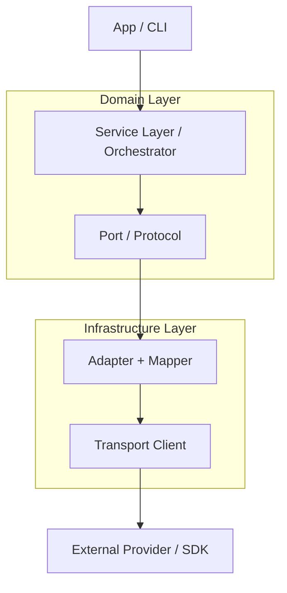

# ADR-OS01: Object-Service Design Architecture V3

Practical, opinionated architecture for design, implementation, and evolution of complex objects and API-backed services across the TNH Scholar suite.

- **Filename**: `adr-os01-design-v3.md`
- **Heading**: `# ADR-OS01: Object-Service Design Architecture V3`
- **Status**: Accepted
- **Date**: 2025-10-24
- **Authors**: Aaron Solomon, OpenAI GPT-5, Anthropic Claude Sonnet 4.5
- **Version**: 3.0 (Integrated)

---

## 0. Big Picture (At a Glance)

**Goal:** Ship reliable, composable features fast by separating concerns and keeping boundaries explicit.

### Architectural Overview

```text
Application Layer (CLI, notebooks, web, Streamlit)
  └─ Orchestrators (thin): <Feature>Processor, ResultWriter
        ▲
        │ domain objects / protocols
        │
Domain Service Layer
  └─ <Feature>Service (Protocol-based orchestrator)
     └─ ProviderClient (impl: OpenAIClient, PyannoteClient, etc.)
        └─ RequestMapper (bi-directional: domain ↔ transport)
           └─ TransportClient (HTTP, polling, streaming)
        ▲
        │ transport models (anti-corruption boundary)
        │
Transport Layer
  └─ VendorClient  (upload/start/status/poll, retries, rate-limit)
     JobPoller     (backoff, jitter, deadline)
```

### Unified Layer Model



### Core Contracts

- **Config at init**, **Params per call**, **Response envelope** always
- Service protocol is minimal: `start()`, `get_response()`, `generate()` for async jobs; `generate()` or `run()` for sync
- Adapter maps API shapes → canonical domain shapes (bi-directional)
- All payloads use strong typing (Pydantic or dataclass models)
- **No literals or untyped dicts** in application logic

---

## 1. Design Goals & Principles

### 1.1 Core Design Goals

1. **Strong Typing:** All payloads, parameters, and responses use Pydantic or dataclass models
2. **No Literals:** No string or numeric literals in app logic; defaults come from Settings or Policies
3. **Bi-directional Adapters:** Each adapter maps domain → SDK (request) and SDK → domain (response)
4. **Protocol-based Ports:** All boundaries declared as `Protocol` interfaces (structural typing)
5. **Replaceable Providers:** Any external dependency isolated behind an adapter implementing common protocol
6. **Declarative Configuration:** Every component derives runtime config from typed sources
7. **Transport / Domain Separation:** Domain logic independent of serialization or transmission
8. **No Side-Effects in Domain:** All side-effects (I/O, network) live exclusively in adapters or clients
9. **Explicit Boundaries:** Clear separation between config, params, policy, and context

### 1.2 Rule of Thumb

- Wire behavior → Client
- Canonical data shape → Adapter/Service  
- Usage intent → Params/Policy
- Long-lived configuration → Config/Settings
- Defaults → Settings < Pattern < Policy < Request (precedence order)

---

## 2. Core Concepts & Naming Taxonomy

### 2.1 Configuration & Runtime Concepts

| Concept | Type | Scope | Purpose | Example |
|---------|------|-------|---------|---------|
| **Settings** | `BaseSettings` | Application | Environment/deployment config | API keys, base URLs, default models |
| **Config** | `<Thing>Config` | Service/Client | Construction-time settings; immutable | TransportConfig, ProviderConfig |
| **Params** | `<Thing>Params` | Per-call | Request-specific inputs; vary run-to-run | DiarizationParams, RenderRequest |
| **Policy** | `DomainPolicy`, `ServicePolicy` | Service | Opinionated behavior toggles | ParamsPolicy, completion_mode, overlap handling |
| **Pattern** | `Pattern` | Domain | Prompt templates with metadata | System/user message templates |
| **Context** | `ExecutionContext` | Pipeline | Ephemeral runtime state (optional) | Current stage, accumulated metadata |

### 2.2 Response & Result Concepts

| Concept | Type | Purpose | Presence |
|---------|------|---------|----------|
| **Envelope** | `Envelope` | Universal response wrapper | Always |
| **Result** | `<Feature>Result` | Domain success payload | Only when `status == "succeeded"` |
| **Response** | `ProviderResponse` | Transport-level response | At adapter boundary |
| **Provenance** | `Provenance` | Metadata about execution | Always (in Envelope) |

### 2.3 Architectural Concepts

| Concept | Purpose | Location | Implements |
|---------|---------|----------|------------|
| **Client** | Pure transport/HTTP operations | `transport/` | Protocol (e.g., `ProviderClient`) |
| **Mapper** | Bi-directional type translation | Inside Adapter | Pure functions or classes |
| **Adapter** | Transport ↔ domain mapping | `adapters/` or `providers/` | Protocol + uses Mapper |
| **Service** | Orchestration, composes ports | `service/` | Protocol |
| **Processor** | Application façade | `app/` | Thin; wires persistence |
| **Port** | Abstract interface | Domain layer | `Protocol` definition |

---

## 3. Layer Structure & Responsibilities

### 3.1 Conceptual Layers

| Layer | Responsibility | Example Classes | Allowed Dependencies |
|-------|----------------|----------------|---------------------|
| **Application** | Entry points, user interaction | CLI, notebooks, Streamlit | Service protocols only |
| **Service (Orchestrator)** | Coordinates flow, composes ports | `GenAIService`, `DiarizationService` | Ports, Settings, Policy |
| **Ports (Protocols)** | Abstract interfaces | `ProviderClient`, `AudioDiarizer` | Domain models only |
| **Adapters** | Implement protocols, SDK mapping | `OpenAIClient`, `PyannoteClient` | Mappers, Transport models |
| **Mappers** | Bi-directional type translation | `OpenAIRequestMapper` | Transport + SDK types |
| **Transport Clients** | HTTP, polling, streaming | `VendorClient`, `JobPoller` | Config only |
| **Domain Models** | Typed business objects | `CompletionResult`, `SpeakerBlock` | Nothing (pure) |
| **Transport Models** | I/O-level contracts | `ProviderRequest`, `JobStatusResponse` | Nothing (pure) |

### 3.2 Dependency Direction

Dependencies flow inward: `Application → Service → Port → (Adapter → Mapper → Transport Client) → External`.

**Forbidden dependencies:**

- Domain → Infrastructure
- Models → Services
- Ports → Implementations

---

## 4. Configuration Taxonomy

### 4.1 Settings (Application-wide)

```python
# config/settings.py
from pydantic_settings import BaseSettings, SettingsConfigDict

class Settings(BaseSettings):
    """Application-wide environment configuration."""
    model_config = SettingsConfigDict(
        env_file=".env",
        env_file_encoding="utf-8",
        extra="ignore"
    )
    
    # Provider credentials
    openai_api_key: str | None = None
    openai_org: str | None = None
    assemblyai_api_key: str | None = None
    
    # Defaults
    default_provider: str = "openai"
    default_model: str = "gpt-4o-mini"
    default_temperature: float = 0.2
    default_max_output_tokens: int = 512
    
    # System configuration
    log_level: str = "INFO"
    enable_tracing: bool = False
    
    @classmethod
    def from_env(cls) -> "Settings":
        return cls()
```

### 4.2 Transport Configuration

```python
# config/transport.py
from pydantic import BaseModel, Field

class TransportConfig(BaseModel):
    """Pure transport/HTTP configuration; only the client sees this."""
    base_url: str
    api_key: str = Field(repr=False)
    organization: str | None = None
    connect_timeout_s: float = 10.0
    read_timeout_s: float = 30.0
    max_retries: int = 5
    backoff_base_s: float = 0.5
    backoff_max_s: float = 8.0
    rate_limit_rps: float = 5.0

    @classmethod
    def from_env(cls, prefix: str) -> "TransportConfig":
        import os
        return cls(
            base_url=os.environ.get(f"{prefix}_BASE_URL", ""),
            api_key=os.environ.get(f"{prefix}_API_KEY", ""),
        )
```

### 4.3 Policy Structures

```python
# config/policy.py
from typing import Literal
from pydantic import BaseModel

class DomainPolicy(BaseModel):
    """Domain concerns about how the app wants to use the service."""
    completion_mode: Literal["snapshot", "wait"] = "wait"
    deadline_s: float | None = None
    allow_partials: bool = True
    overlap_mode: Literal["ignore", "merge", "separate"] = "merge"

class ServicePolicy(BaseModel):
    """Adapter/service-side normalization and mapping decisions."""
    default_label: str = "DEFAULT"
    normalize_case: bool = True
    min_unit_size: int = 0
    preserve_formatting: bool = True

class ParamsPolicy(BaseModel):
    """GenAI-specific parameter precedence policy."""
    provider: str
    model: str
    temperature: float
    max_output_tokens: int
    seed: int | None = None
    top_p: float | None = None
```

### 4.4 Policy Precedence

**Order of precedence (highest to lowest):**

1. Explicit request parameters (RenderRequest, FeatureParams)
2. Pattern defaults (from Pattern catalog)
3. Config policy (YAML or database)
4. Settings defaults (environment/deployment)

---

## 5. Canonical Domain Envelope

### 5.1 Envelope Structure

```python
# domain/models.py
from typing import Any, Literal
from pydantic import BaseModel

class Provenance(BaseModel):
    """Metadata about how/when/with what the result was produced."""
    backend: str                        # e.g., "openai", "pyannote", "assemblyai"
    model: str | None = None
    job_id: str | None = None
    started_at: str | None = None
    completed_at: str | None = None
    schema_version: str = "1.0"
    policy_version: str = "1.0"
    params: dict = {}                   # Effective parameters used
    system_version: str | None = None   # Git SHA/tag for reproducibility

class Envelope(BaseModel):
    """Universal response wrapper for all services."""
    status: Literal["pending", "running", "succeeded", "failed", "timeout"]
    result: Any | None = None           # Feature-specific; present only on success
    error: str | None = None
    diagnostics: dict = {}              # Curated metrics, not raw dump
    provenance: Provenance

    def succeeded(self) -> bool:
        return self.status == "succeeded"
    
    def failed(self) -> bool:
        return self.status == "failed"
```

### 5.2 Envelope Invariants

- `result` only present when `status == "succeeded"`
- `error` only present for `status == "failed"`
- `provenance.job_id` set when available (embed at transport boundary)
- `diagnostics` contains curated, actionable metrics (not raw dumps)
- `provenance.params` records effective policy/parameters used
- Always include `schema_version` and `policy_version` in provenance

---

## 6. Service Protocols

### 6.1 Protocol Design Rules

- Use `Protocol` for interfaces (structural typing)
- Use `ABC` only when enforcing init-time invariants or providing mixins
- Every service has exactly one orchestrator class
- Every adapter implements exactly one protocol
- Keep protocol interfaces minimal (3-5 methods maximum)

### 6.2 Async Job Service Protocol

```python
# domain/service.py
from pathlib import Path
from typing import Protocol
from .models import Envelope

class FeatureParams(BaseModel):
    """API-facing parameters (safe subset)."""
    pass

class AsyncFeatureService(Protocol):
    """Protocol for services that support async job patterns."""
    
    def start(
        self, 
        input_path: Path, 
        params: FeatureParams | None = None
    ) -> str:
        """Start async job, return job_id."""
        ...
    
    def get_response(
        self, 
        job_id: str, 
        *, 
        wait_until_complete: bool = False
    ) -> Envelope:
        """Get job status/result. If wait=True, poll until complete."""
        ...
    
    def generate(
        self, 
        input_path: Path, 
        params: FeatureParams | None = None,
        *, 
        wait_until_complete: bool = True
    ) -> Envelope:
        """Convenience: start + wait for result."""
        ...
```

### 6.3 Sync Request/Response Protocol

```python
# domain/service.py
class SyncFeatureService(Protocol):
    """Protocol for synchronous request/response services."""
    
    def generate(self, req: RequestParams) -> ResultModel:
        """Synchronous generation; returns domain result directly."""
        ...
```

### 6.4 GenAI Service Protocol (Example)

```python
class GenAIServicePort(Protocol):
    """Protocol for GenAI text generation services."""
    
    def generate(self, req: RenderRequest) -> CompletionResult:
        """Generate completion from rendered prompt."""
        ...

class GenAIService:
    """Orchestrator for GenAI generation."""
    
    def __init__(
        self,
        settings: Settings,
        catalog: PatternCatalog | None = None,
        provider: ProviderClient | None = None,
    ):
        self.settings = settings
        self.catalog = catalog or LegacyPatternCatalog()
        self.provider = provider or OpenAIClient(
            settings.openai_api_key,
            settings.openai_org
        )
    
    def generate(self, req: RenderRequest) -> CompletionResult:
        # 1. Get pattern from catalog
        pattern = self.catalog.get(req.pattern_key)
        
        # 2. Render prompt with context
        rendered = self.catalog.render(pattern, req)
        
        # 3. Apply policy precedence
        params = apply_policy(
            req.intent,
            pattern.default_params,
            req.model_hint
        )
        
        # 4. Build transport request
        provider_req = ProviderRequest(
            provider=params.provider,
            model=params.model,
            messages=rendered.messages,
            system=rendered.system,
            temperature=params.temperature,
            max_output_tokens=params.max_output_tokens,
            seed=params.seed,
        )
        
        # 5. Call provider through port
        resp = self.provider.generate(provider_req)
        
        # 6. Return domain result
        return CompletionResult(
            text=resp.text,
            usage=resp.usage,
            model=resp.model,
            provider=resp.provider,
            prompt_fingerprint=rendered.fingerprint,
        )
```

---

## 7. Transport Models & Domain Models

### 7.1 Transport Models (at boundaries)

```python
# models/transport.py
from pydantic import BaseModel

class Message(BaseModel):
    """Universal message format for chat-based APIs."""
    role: Literal["system", "user", "assistant"]
    content: str

class ProviderRequest(BaseModel):
    """Transport-level request for any GenAI provider."""
    provider: str
    model: str
    messages: list[Message]
    system: str | None = None
    temperature: float
    max_output_tokens: int
    seed: int | None = None
    top_p: float | None = None

class ProviderResponse(BaseModel):
    """Transport-level response from GenAI provider."""
    text: str
    usage: Usage
    model: str
    provider: str
    finish_reason: str | None = None

class JobStatusResponse(BaseModel):
    """Transport-level job status for async services."""
    status: str                    # "pending" | "running" | "succeeded" | "failed"
    job_id: str                    # Embed job_id for propagation
    elapsed_s: float = 0.0
    payload: dict = {}             # Raw vendor payload (optional)
    error: str | None = None
```

### 7.2 Domain Models

```python
# models/domain.py
from pydantic import BaseModel

class CompletionResult(BaseModel):
    """Domain result for GenAI completions."""
    text: str
    usage: Usage
    model: str
    provider: str
    prompt_fingerprint: str

class DiarizationResult(BaseModel):
    """Domain result for speaker diarization."""
    segments: list[SpeakerBlock]
    num_speakers: int
    duration_s: float

class SpeakerBlock(BaseModel):
    """Individual speaker segment."""
    speaker_id: str
    start_s: float
    end_s: float
    confidence: float | None = None
```

---

## 8. Adapter Architecture

### 8.1 Adapter Role & Responsibilities

Adapters encapsulate all external I/O logic. Each adapter:

- Implements exactly one `Protocol` (port)
- Acts as **bi-directional translator**: domain ↔ transport ↔ SDK
- Isolates SDK-specific code from domain logic
- Handles provider-specific error mapping

### 8.2 Bi-Directional Mapping Contract

Every adapter implements request and response mapping:

```python
class ProviderRequestMapper:
    """Maps between domain and SDK request formats."""
    
    def to_sdk_request(self, req: ProviderRequest) -> SDKRequest:
        """Domain → SDK request transformation."""
        ...
    
    def from_sdk_response(self, resp: SDKResponse) -> ProviderResponse:
        """SDK → domain response transformation."""
        ...
```

### 8.3 Adapter Boundary Diagram


### 8.4 Sync Adapter Pattern (GenAI)

```python
# providers/openai_adapter.py
from openai import OpenAI

class OpenAIClient:
    """Adapter for OpenAI chat completions API."""
    PROVIDER = "openai"
    
    def __init__(
        self,
        api_key: str,
        organization: str,
        mapper: OpenAIRequestMapper | None = None
    ):
        self._client = OpenAI(api_key=api_key, organization=organization)
        self._mapper = mapper or OpenAIRequestMapper()
    
    def generate(self, req: ProviderRequest) -> ProviderResponse:
        """Implement ProviderClient protocol."""
        # 1. Map domain → SDK
        mapped = self._mapper.to_sdk_request(req)
        
        # 2. Call SDK
        try:
            sdk_resp = self._client.chat.completions.create(
                **mapped.model_dump()
            )
        except Exception as e:
            raise ProviderError(f"OpenAI API error: {e}") from e
        
        # 3. Map SDK → domain
        return self._mapper.from_sdk_response(sdk_resp)

class OpenAIRequestMapper:
    """Bi-directional mapper for OpenAI API."""
    
    def to_sdk_request(self, req: ProviderRequest) -> dict:
        """Convert ProviderRequest to OpenAI API format."""
        messages = [{"role": m.role, "content": m.content} for m in req.messages]
        if req.system:
            messages.insert(0, {"role": "system", "content": req.system})
        
        return {
            "model": req.model,
            "messages": messages,
            "temperature": req.temperature,
            "max_tokens": req.max_output_tokens,
            "seed": req.seed,
            "top_p": req.top_p,
        }
    
    def from_sdk_response(self, resp) -> ProviderResponse:
        """Convert OpenAI response to ProviderResponse."""
        return ProviderResponse(
            text=resp.choices[0].message.content,
            usage=Usage(
                input_tokens=resp.usage.prompt_tokens,
                output_tokens=resp.usage.completion_tokens,
            ),
            model=resp.model,
            provider="openai",
            finish_reason=resp.choices[0].finish_reason,
        )
```

### 8.5 Async Adapter Pattern (Diarization)

```python
# adapters/assemblyai_adapter.py
from pathlib import Path

class AssemblyAIClient:
    """Adapter for AssemblyAI async transcription API."""
    
    def __init__(self, cfg: TransportConfig, mapper: AssemblyAIMapper):
        self.client = VendorClient(cfg)  # Transport layer
        self.mapper = mapper
        self.backend = "assemblyai"
    
    def start(self, input_path: Path, params: FeatureParams | None = None) -> str:
        """Start transcription job."""
        media_id = self.client.upload(input_path)
        job_id = self.client.start(media_id, params.model_dump() if params else None)
        return job_id
    
    def get_response(
        self, 
        job_id: str, 
        *, 
        wait_until_complete: bool = False
    ) -> Envelope:
        """Get job status/result."""
        if wait_until_complete:
            jsr = self.client.poll_until_done(job_id)
        else:
            jsr = self.client.job_status(job_id)
        
        return self.mapper.to_envelope(jsr)
    
    def generate(
        self,
        input_path: Path,
        params: FeatureParams | None = None,
        *,
        wait_until_complete: bool = True
    ) -> Envelope:
        """Convenience: start + wait."""
        job_id = self.start(input_path, params)
        return self.get_response(job_id, wait_until_complete=wait_until_complete)

class AssemblyAIMapper:
    """Maps AssemblyAI responses to domain envelopes."""
    
    def __init__(self, backend: str = "assemblyai", model: str | None = None):
        self.backend = backend
        self.model = model
    
    def to_envelope(self, jsr: JobStatusResponse) -> Envelope:
        """Convert JobStatusResponse to Envelope."""
        prov = Provenance(
            backend=self.backend,
            model=self.model,
            job_id=jsr.job_id,
            params={},
        )
        
        if jsr.status == "succeeded":
            result = self._map_result(jsr)
            return Envelope(status="succeeded", result=result, provenance=prov)
        elif jsr.status == "failed":
            return Envelope(status="failed", error=jsr.error, provenance=prov)
        elif jsr.status == "timeout":
            return Envelope(status="timeout", error="Job exceeded deadline", provenance=prov)
        else:
            return Envelope(status=jsr.status, provenance=prov)
    
    def _map_result(self, jsr: JobStatusResponse) -> DiarizationResult:
        """Extract domain result from vendor payload."""
        # Parse vendor-specific payload → domain model
        segments = [
            SpeakerBlock(
                speaker_id=seg["speaker"],
                start_s=seg["start"],
                end_s=seg["end"]
            )
            for seg in jsr.payload.get("utterances", [])
        ]
        return DiarizationResult(
            segments=segments,
            num_speakers=len(set(s.speaker_id for s in segments)),
            duration_s=jsr.elapsed_s
        )
```

### 8.6 Adapter Mapping Rules

- **No literals or untyped dicts** in mapping code; use TypedDicts or SDK models
- All defaults come from `Settings` or `Policy`
- Mapper code is **pure** (no I/O, no side-effects)
- Client code handles exceptions and wraps them as typed errors
- Map vendor errors → `ProviderError` subclasses for uniform handling

### 8.7 Error Handling

```python
# models/errors.py
class ProviderError(Exception):
    """Base error for all provider failures."""
    pass

class RateLimitError(ProviderError):
    """Rate limit exceeded."""
    pass

class AuthenticationError(ProviderError):
    """Invalid credentials."""
    pass

class TimeoutError(ProviderError):
    """Request exceeded deadline."""
    pass
```

All adapters must raise **typed errors** for uniform error handling by orchestration layers.

---

### 8.8 Internal Layer Adapters (Boundary Mapping Inside Our Own System)

Adapters and mappers are not just for translating vendor payloads—they are equally critical for translating between our own internal abstraction layers. This principle applies whenever there is a semantic boundary or abstraction shift, even within our own codebase.

#### Rationale for Internal Mapping

- **Semantic Shifts:** As data moves from transport to domain to orchestration, the meaning, required fields, or invariants of objects often change. Mapping makes these changes explicit.
- **Attaching Policy, Safety, Provenance:** Internal mappers are the right place to inject policy decisions, provenance metadata, or safety checks as data crosses boundaries.
- **Orchestration Cleanliness:** Keeping orchestration code free of manual stitching, dict access, or ad hoc conversions avoids “god services” and keeps logic testable.
- **Future-Proofing:** By isolating mapping, we can later support multiple result types, partial results, or envelope variants without rewriting orchestration.

#### Example: Mapping Between Internal Layers

- **ProviderResponse → CompletionResult (GenAI)**

    ```python
    # mappers/completion_mapper.py
    def to_completion_result(resp: ProviderResponse, fingerprint: str) -> CompletionResult:
        return CompletionResult(
            text=resp.text,
            usage=resp.usage,
            model=resp.model,
            provider=resp.provider,
            prompt_fingerprint=fingerprint,
        )
    ```

- **JobStatusResponse → Envelope (Async Jobs)**

    ```python
    # mappers/job_status_mapper.py
    def to_envelope(jsr: JobStatusResponse, backend: str, model: str | None = None) -> Envelope:
        prov = Provenance(
            backend=backend,
            model=model,
            job_id=jsr.job_id,
            params={},
        )
        if jsr.status == "succeeded":
            result = ...  # map jsr.payload to the domain result
            return Envelope(status="succeeded", result=result, provenance=prov)
        elif jsr.status == "failed":
            return Envelope(status="failed", error=jsr.error, provenance=prov)
        elif jsr.status == "timeout":
            return Envelope(status="timeout", error="Job exceeded deadline", provenance=prov)
        else:
            return Envelope(status=jsr.status, provenance=prov)
    ```

#### Explicit Rules for Internal Mapping

1. **All cross-layer translations (even internal) must happen in mappers.**
2. **Mappers are pure:** No I/O, no side effects, no logging, no exception handling.
3. **Orchestrators never manually stitch domain objects or reach into dicts.**
4. **Naming convention:** Use `to_<DomainType>()` or `<DomainType>Mapper` for class mappers.
5. **Class vs Function:** Use a class if mapping depends on injected config or policy; use a pure function if stateless.

#### Benefits

- **Consistency:** All cross-boundary data flows are explicit and uniform.
- **Testability:** Mappers can be tested in isolation, including edge cases and invariants.
- **Evolution:** Adding new result types, partials, or shape changes is localized to mappers.
- **Prevents “God Services”:** Orchestration remains free of ad hoc data stitching, keeping logic readable and maintainable.

---

## 9. Transport Layer: Clients & Polling

### 9.1 Transport Client (HTTP operations)

```python
# transport/client.py
import time
from pathlib import Path
from .models import JobStatusResponse

class VendorClient:
    """Pure transport/HTTP client for async job APIs."""
    
    def __init__(self, cfg: TransportConfig):
        self.cfg = cfg
        self._session = self._create_session()
    
    def _create_session(self):
        """Create HTTP session with retries and rate limiting."""
        # Implementation details...
        pass
    
    def upload(self, path: Path) -> str:
        """Upload file to vendor, return media_id."""
        # POST file → return ID
        return "media_123"
    
    def start(self, media_id: str, params: dict | None = None) -> str:
        """Start processing job, return job_id."""
        # POST /jobs → return job_id
        return "job_abc"
    
    def job_status(self, job_id: str) -> JobStatusResponse:
        """Get current job status."""
        # GET /jobs/{job_id} → JobStatusResponse
        return JobStatusResponse(status="running", job_id=job_id)
    
    def poll_until_done(
        self,
        job_id: str,
        deadline_s: float | None = None
    ) -> JobStatusResponse:
        """Poll job until completion with exponential backoff."""
        backoff = self.cfg.backoff_base_s
        start = time.time()
        
        while True:
            jsr = self.job_status(job_id)
            
            # Terminal states
            if jsr.status in {"succeeded", "failed"}:
                return jsr
            
            # Timeout check
            if deadline_s and (time.time() - start) > deadline_s:
                return JobStatusResponse(
                    status="timeout",
                    job_id=job_id,
                    elapsed_s=time.time() - start
                )
            
            # Exponential backoff with jitter
            time.sleep(backoff + random.uniform(0, backoff * 0.1))
            backoff = min(backoff * 1.6, self.cfg.backoff_max_s)
```

### 9.2 Job Poller (Reusable)

```python
# transport/poller.py
from typing import Callable, TypeVar
import time
import random

T = TypeVar('T')

class JobPoller:
    """Reusable polling logic with backoff and jitter."""
    
    def __init__(
        self,
        check_fn: Callable[[str], T],
        is_terminal: Callable[[T], bool],
        backoff_base: float = 0.5,
        backoff_max: float = 8.0,
        deadline_s: float | None = None
    ):
        self.check_fn = check_fn
        self.is_terminal = is_terminal
        self.backoff_base = backoff_base
        self.backoff_max = backoff_max
        self.deadline_s = deadline_s
    
    def poll(self, job_id: str) -> T:
        """Poll until terminal state or timeout."""
        backoff = self.backoff_base
        start = time.time()
        
        while True:
            result = self.check_fn(job_id)
            
            if self.is_terminal(result):
                return result
            
            if self.deadline_s and (time.time() - start) > self.deadline_s:
                raise TimeoutError(f"Job {job_id} exceeded deadline")
            
            jitter = random.uniform(0, backoff * 0.1)
            time.sleep(backoff + jitter)
            backoff = min(backoff * 1.6, self.backoff_max)
```

---

## 10. Testing Strategy

### 10.1 Unit Testing (Mock Protocols)

```python
# tests/test_service.py
class FakeProviderClient:
    """Mock implementation of ProviderClient protocol."""
    
    def generate(self, req: ProviderRequest) -> ProviderResponse:
        return ProviderResponse(
            text="mocked response",
            usage=Usage(input_tokens=10, output_tokens=20),
            model=req.model,
            provider="fake"
        )

def test_generate():
    """Test service orchestration with mocked provider."""
    fake_provider = FakeProviderClient()
    settings = Settings(default_provider="fake")
    service = GenAIService(settings, provider=fake_provider)
    
    req = RenderRequest(pattern_key="test", context={})
    result = service.generate(req)
    
    assert result.text == "mocked response"
    assert result.provider == "fake"
```

### 10.2 Integration Testing

```python
# tests/integration/test_openai.py
def test_openai_integration():
    """End-to-end test with real OpenAI API."""
    settings = Settings.from_env()
    service = GenAIService(settings)
    
    req = RenderRequest(
        pattern_key="summarize",
        context={"text": "Long document..."}
    )
    result = service.generate(req)
    
    assert result.succeeded()
    assert len(result.text) > 0
```

### 10.3 Contract Testing (Envelope Shape)

```python
def test_envelope_contract():
    """Verify envelope always contains required fields."""
    env = service.get_response(job_id)
    
    assert hasattr(env, "status")
    assert hasattr(env, "provenance")
    assert env.provenance.backend is not None
    assert env.provenance.schema_version is not None
    
    if env.succeeded():
        assert env.result is not None
        assert env.error is None
```

### 10.4 Golden Testing (Policy Variants)

For each policy profile, snapshot the envelope shape to detect regressions.

---

## 11. Interface Modalities & Integration Patterns

Design for a range of service shapes. Choose the smallest that fits; keep the envelope consistent.

### 11.1 Modality Decision Tree

1. **Is the task fast (<2s)?** → Synchronous request/response
2. **Long-running and vendor can't call back?** → Async + polling
3. **Vendor supports webhooks and you can host an endpoint?** → Async + webhook
4. **You need incremental UX?** → Streaming
5. **You need decoupling/scale?** → Message queue / Pub-Sub
6. **It's a local library?** → Synchronous or streaming

### 11.2 Synchronous Request/Response

**When to use:** Small/fast tasks; local libraries; remote endpoints with low latency.

- **Contract:** `run(params) -> Envelope` (no `start()`/`get_response()`)
- **Failure model:** Exceptions for programmer errors; `failed` envelope for domain/remote errors
- **Examples:** Local Whisper inference; lightweight text cleaners; GenAI completions

### 11.3 Asynchronous Jobs with Polling

**When to use:** Long-running tasks without push callbacks.

- **Contract:** `start() -> job_id`, `get_response(job_id, wait|snapshot) -> Envelope`
- **Failure model:** Timeouts → `timeout` envelope (optionally partials); network errors retried
- **Examples:** Diarization, transcription, video processing

### 11.4 Asynchronous Jobs with Webhooks

**When to use:** Vendor can push results; you control an HTTP endpoint.

- **Contract:** `start(callback_url) -> job_id`; callback sends transport payload; adapter maps to envelope
- **Failure model:** At-least-once delivery; verify signatures; be idempotent

```python
# app/webhooks.py
from fastapi import FastAPI, Request, HTTPException

app = FastAPI()

@app.post("/callbacks/vendor")
async def vendor_callback(req: Request):
    sig = req.headers.get("X-Vendor-Signature")
    body = await req.json()
    
    if not verify_signature(sig, body):
        raise HTTPException(status_code=401)
    
    jsr = JobStatusResponse.model_validate({
        **body,
        "job_id": body.get("job_id")
    })
    env = adapter.to_envelope(jsr)
    save_result(env)  # Persist; notify UI
    
    return {"ok": True}
```

### 11.5 Streaming (SSE / WebSocket / gRPC)

**When to use:** Incremental results (tokens, segments, progress).

- **Contract:** Open stream → receive `Envelope` deltas or `Progress` events; final `Envelope` closes stream
- **Failure model:** Reconnect with resume tokens; dedupe by `event_id`
- **Notes:** Wrap stream events into mini-envelopes for consistent shape

```python
# Example: async streaming client
async def consume_stream(uri: str):
    async with websockets.connect(uri) as ws:
        await ws.send(json.dumps({"auth": token, "params": {...}}))
        async for msg in ws:
            evt = json.loads(msg)
            env = to_envelope(evt)  # Mini-envelopes or progress events
            handle_event(env)
```

### 11.6 Message Queue / Pub-Sub Integration

**When to use:** Decouple producers/consumers; batch pipelines; fan-out/fan-in.

- **Contract:** Publish `Params` + correlation IDs; consumers emit `Envelope`s on result topic
- **Failure model:** Retries with DLQ; ensure idempotency via keys

```python
@mq.consume("transcribe.jobs")
def worker(msg):
    params = FeatureParams.model_validate(msg["params"])
    env = service.generate(Path(msg["input"]), params)
    mq.publish("transcribe.results", env.model_dump())
```

### 11.7 Batch Pipelines (Orchestration)

**When to use:** Multi-stage processing: diarize → chunk → transcribe → summarize.

- **Contract:** Each stage returns an `Envelope`; orchestrator composes; pass along `provenance` and `policy`
- **Failure model:** Saga-style compensation/skip policies; partial results acceptable per policy

---

## 12. Tracing, Metrics & Observability

### 12.1 Instrumentation Boundaries

| Layer | Responsibility | Tools |
|-------|----------------|-------|
| **Domain** | Trace spans, usage accounting | `Tracer`, `UsageAccounting` |
| **Adapter** | Metrics (latency, cost, throughput) | Prometheus, DataDog |
| **Transport** | HTTP metrics, retry counts | Built-in client metrics |

### 12.2 Provenance Integration

Always record in `provenance.params`:

- Policy and policy version used
- System version (git SHA/tag) for reproducibility
- Upstream IDs (job_id/request_id) and correlation IDs
- When combining stages, **aggregate provenance**: keep list of stage-level blocks

---

## 13. Policy Evolution Strategy

### 13.1 Principles

1. **Policy ≠ Config:** Policies affect semantics; configs describe environment
2. **Additive first:** Prefer adding new policy fields with sensible defaults over changing semantics
3. **Version the policy surface:** Include `policy_version` in provenance
4. **Document intent:** Every policy field gets one-line rationale in docstrings
5. **Record used policy:** Echo effective policy into `provenance.policy` on every response

### 13.2 Versioning

- Add `policy_version: str = "1.0"` to policy model
- Bump minor (`1.1`) for additive fields; bump major (`2.0`) for behavior changes
- Store version in `provenance.params["policy_version"]`

### 13.3 Migration Patterns

**Expand → Contract:**

- Ship new policy fields with defaults that preserve old behavior
- Gather metrics; then flip defaults in major version

**Feature flags:**

- Use boolean or enum policy switches for new behaviors (e.g., `overlap_mode = "ignore|merge|separate"`)

**Policy profiles:**

- Provide named presets (e.g., `"dharma_talks"`, `"interviews"`) that resolve to concrete policy objects

**Deprecation path:**

- Mark fields as deprecated in docstrings
- Log deprecation warnings when used
- Remove only after major version bump

### 13.4 Testing & Governance

- **Golden tests** for policy variants: snapshot envelope shape for each profile
- **Contract tests** to verify provenance always includes policy version and effective values
- **Review checklist** for policy PRs: rationale, defaults, migration notes, docstrings, provenance echo

---

## 14. Key Implementation Rules

1. Use `Protocol` for interfaces; use `ABC` only when enforcing init-time invariants or providing mixins
2. Every service has exactly one orchestrator class
3. Every adapter implements exactly one protocol
4. Mappers are pure and side-effect-free
5. No dicts except at SDK boundaries (use TypedDict or Pydantic models)
6. All literals replaced by settings/policy parameters
7. Exceptions wrapped in typed error classes
8. Config at init, params per call, response envelope always
9. Domain logic never depends on infrastructure
10. All side-effects isolated to adapters and transport clients

---

## 14.1. Choosing Between Classes and Pure Functions

This section provides concrete guidance on when to use classes vs pure functions, and when to use Pydantic vs dataclasses—decisions that frequently arise when implementing the Object-Service pattern.

### When to Use Pure Functions vs Classes

**Use Pure Functions When:**
- Performing **stateless transformations** (e.g., `cli_config_to_settings_kwargs()`)
- **No injected dependencies** required
- **No shared state** across invocations
- **Simple data transformation** only
- Mapping is **uni-directional** (one input → one output)

**Use Classes When:**
- Needs **injected config, policy, or dependencies**
- **Maintains state** between calls or across method invocations
- **Implements a Protocol interface** (structural typing requirement)
- Requires **multiple related methods** (cohesive behavior)
- Mapping is **bi-directional** (request + response mapping)

**Examples:**

✅ **Pure Function (Stateless Mapping)**
```python
# mappers/completion_mapper.py
def to_completion_result(resp: ProviderResponse, fingerprint: str) -> CompletionResult:
    """Map ProviderResponse to CompletionResult (pure function)."""
    return CompletionResult(
        text=resp.text,
        usage=resp.usage,
        model=resp.model,
        provider=resp.provider,
        prompt_fingerprint=fingerprint,
    )
```

✅ **Class (Injected Dependencies, Bi-directional)**
```python
# mappers/openai_mapper.py
class OpenAIRequestMapper:
    """Bi-directional mapper with injected config."""

    def __init__(self, default_temperature: float = 0.7):
        self.default_temperature = default_temperature

    def to_sdk_request(self, req: ProviderRequest) -> dict:
        """Domain → SDK (uses injected config)."""
        return {
            "model": req.model,
            "messages": [{"role": m.role, "content": m.content} for m in req.messages],
            "temperature": req.temperature or self.default_temperature,
        }

    def from_sdk_response(self, resp) -> ProviderResponse:
        """SDK → Domain."""
        return ProviderResponse(
            text=resp.choices[0].message.content,
            usage=Usage(
                input_tokens=resp.usage.prompt_tokens,
                output_tokens=resp.usage.completion_tokens,
            ),
            model=resp.model,
            provider="openai",
        )
```

### When to Use Dataclass vs Pydantic

**Use Dataclass When:**
- **Internal DTOs** (data transfer objects within your codebase)
- **No validation** required (data already validated upstream)
- **Simple structure** (basic types, no complex serialization)
- **Performance-sensitive** code (dataclasses have lower overhead)
- **No configuration** or settings needed

**Use Pydantic When:**
- **API boundaries** (external input/output)
- **Validation required** (user input, external APIs, configuration files)
- **Complex serialization** (JSON, YAML, environment variables)
- **Settings and configuration** (Pydantic Settings for env vars)
- **Dynamic field defaults** or computed fields

**Examples:**

✅ **Dataclass (Internal DTO, No Validation)**
```python
from dataclasses import dataclass

@dataclass
class ServiceOverrides:
    """Lightweight internal overrides (no validation needed)."""
    model: str | None = None
    max_tokens: int | None = None
    temperature: float | None = None
```

✅ **Pydantic (Settings with Validation)**
```python
from pydantic_settings import BaseSettings

class GenAISettings(BaseSettings):
    """Configuration with validation and env var support."""
    openai_api_key: str  # Required, validated at init
    default_model: str = "gpt-4"
    default_temperature: float = 0.7
    max_dollars: float | None = None

    class Config:
        env_file = ".env"
        validate_assignment = True  # Validate on attribute assignment
```

✅ **Pydantic (API Boundary with Validation)**
```python
from pydantic import BaseModel, Field, validator

class RenderRequest(BaseModel):
    """External API request (validation required)."""
    prompt_name: str = Field(..., min_length=1)
    variables: dict[str, str] = Field(default_factory=dict)
    model: str | None = None
    temperature: float | None = Field(None, ge=0.0, le=2.0)
    max_tokens: int | None = Field(None, gt=0)

    @validator("temperature")
    def validate_temperature(cls, v):
        if v is not None and not 0.0 <= v <= 2.0:
            raise ValueError("temperature must be between 0.0 and 2.0")
        return v
```

### Decision Matrix

| Scenario | Recommendation | Rationale |
|----------|---------------|-----------|
| CLI flag overrides passed to service | **Dataclass** | Internal DTO, no validation needed |
| Settings loaded from env vars | **Pydantic** | Validation, env var support required |
| Stateless mapping (config → kwargs) | **Pure Function** | No state, no dependencies |
| Bi-directional adapter mapping | **Class** | Multiple methods, possibly injected config |
| User input from API endpoint | **Pydantic** | Validation at system boundary |
| Internal result object | **Dataclass** | Already validated, simple structure |
| Factory creating services | **Class** | Dependency injection, implements protocol |
| Helper converting one type to another | **Pure Function** | Stateless transformation |

### Common Anti-Patterns to Avoid

❌ **Unnecessary Class Wrapper**
```python
# AVOID: Stateless class with single method
class CLIConfigToSettingsMapper:
    def to_settings_kwargs(self, cli_config: CLIConfig, overrides: ServiceOverrides) -> dict[str, Any]:
        # ... stateless logic ...
```

✅ **Better: Pure Function**
```python
def cli_config_to_settings_kwargs(cli_config: CLIConfig, overrides: ServiceOverrides) -> dict[str, Any]:
    """Convert CLI config + overrides to Settings kwargs."""
    # ... same logic, simpler interface ...
```

❌ **Pydantic for Internal DTOs**
```python
# AVOID: Pydantic overhead for internal data
class ServiceOverrides(BaseModel):
    model: str | None = None
    max_tokens: int | None = None
```

✅ **Better: Lightweight Dataclass**
```python
@dataclass
class ServiceOverrides:
    model: str | None = None
    max_tokens: int | None = None
```

### Summary: Rules of Thumb

1. **Mappers**: Class if bi-directional or has dependencies; pure function if stateless
2. **Internal DTOs**: Dataclass (unless validation needed)
3. **Settings/Config**: Pydantic (for validation and env var support)
4. **API Boundaries**: Pydantic (for validation)
5. **Factories**: Class (for dependency injection)
6. **Simple Transformations**: Pure function (for clarity and performance)

**Guiding Principle**: Choose the simplest abstraction that satisfies your requirements. Prefer pure functions over classes, and dataclasses over Pydantic, unless you need the additional capabilities.

---

## 15. Reference Implementation Index

| Concept | GenAI Service | Diarization Service |
|----------|---------------|---------------------|
| **Orchestrator** | `service.py` (GenAIService) | `diarization_service.py` |
| **Provider Client** | `providers/openai_adapter.py` | `adapters/pyannote_client.py` |
| **Mapper** | `OpenAIRequestMapper` | `PyannoteMapper` |
| **Domain Models** | `models/domain.py` | `models/audio_domain.py` |
| **Transport Models** | `models/transport.py` | `models/audio_transport.py` |
| **Errors** | `models/errors.py` | `models/errors.py` |
| **Transport Client** | (direct SDK call) | `transport/vendor_client.py` |
| **Job Poller** | (N/A - sync) | `transport/poller.py` |

---

## 16. File/Module Scaffold (Cookie-Ready)

```text
<feature>/
  config/
    settings.py          # Application-wide settings
    transport.py         # Transport configuration
    policy.py            # Domain/service policies
  domain/
    models.py            # Domain models (Result, Envelope)
    service.py           # Service protocol definition
  transport/
    client.py            # HTTP client (upload, start, poll)
    poller.py            # Reusable polling logic
    models.py            # Transport models (JobStatusResponse)
  adapters/  (or providers/)
    <vendor>_client.py   # Adapter implementing protocol
    <vendor>_mapper.py   # Bi-directional mapper
  service/
    <vendor>_service.py  # Service orchestrator (composes ports)
  app/
    processor.py         # Application façade
    cli.py               # CLI entry point
  models/
    errors.py            # Typed error hierarchy
```

---

## 17. Design Review Questions

1. **Error Granularity:** Should `ProviderError` be subclassed per provider or remain generic?
2. **Tracing Interface:** Centralized or service-local?
3. **Policy Loading:** Should YAML policy files be lazy-loaded or pre-loaded at startup?
4. **Composite PatternCatalog:** Should multiple pattern sources (file, legacy, DB) be supported concurrently?
5. **RetryPolicy Abstraction:** Should retries be unified across audio + text services or service-specific?
6. **Mappers as Classes vs Functions:** Currently class-based; function-based mappers could simplify small providers
7. **Streaming:** Should streaming adapters implement an async interface (`ProviderClientAsync`)?
8. **Webhook Security:** Standardize signature verification across all webhook-based integrations?
9. **Rate Limiting:** Client-side vs server-enforced; per-provider or global?
10. **Partial Results:** How to handle and represent partial results in envelopes for long-running jobs?

---

## 18. Glossary

| Term | Definition |
|------|------------|
| **Adapter** | Component that implements a protocol; maps between domain and transport |
| **Anti-corruption layer** | Boundary that converts vendor shapes to domain shapes |
| **Envelope** | Universal response wrapper containing status, diagnostics, provenance, and optional result |
| **Mapper** | Pure component performing bi-directional type translation |
| **Policy** | Opinionated settings that change behavior but not capability |
| **Port** | Abstract interface defined as Protocol |
| **Provenance** | Metadata about how/when/with what the result was produced |
| **Protocol** | Structural type interface (no inheritance required) |
| **Transport** | Layer handling HTTP, polling, streaming, and retries |

---

## 19. Evolution & Versioning

- Version the envelope (`schema_version`) and keep changes additive where possible
- Be adapter-tolerant to unknown transport fields
- For breaking API shifts, add new adapter/service and migrate gradually
- Include `policy_version` and `system_version` in provenance for reproducibility
- Aggregate provenance when combining stages in pipelines

---

## 20. Closing Notes

This blueprint is **modality-agnostic**, **policy-forward**, and **strongly-typed**. It unifies patterns for:

- Synchronous request/response (GenAI)
- Asynchronous job polling (diarization, transcription)
- Webhooks, streaming, message queues

**Core principles:**

- Use the smallest viable integration pattern
- Keep envelopes consistent across modalities
- Let policy express domain decisions
- Maintain strong typing with no literals
- Persist provenance for debugging and reproducibility

**Key success metrics:**

- Can add new provider in <1 day
- Can swap providers without changing application code
- Can trace any result back to exact parameters/version used
- Can test services in isolation with mocked protocols

Copy the scaffolds and stubs from this blueprint to start new features quickly while maintaining architectural consistency.
