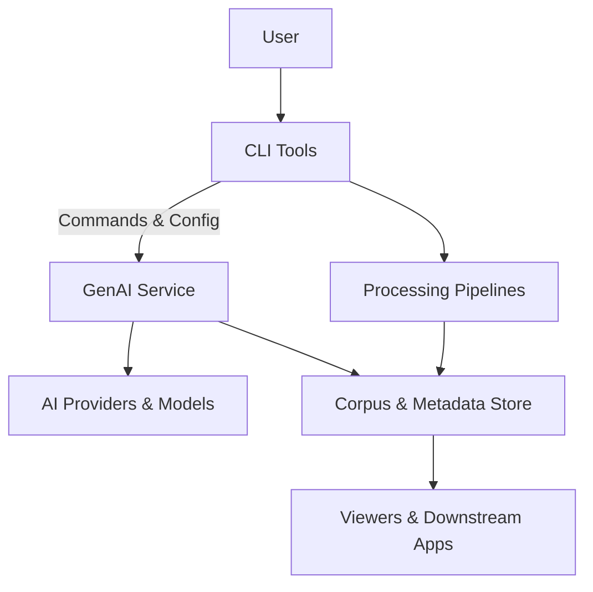

# Architecture Overview

This document provides a high-level view of the TNH Scholar architecture. It is intentionally brief and conceptual, with links to more detailed design documents and ADRs.

TNH Scholar is built around a **layered, object-service oriented architecture**. At the highest level, it consists of:

- A set of **CLI tools** for end users,
- A **GenAI Service** for orchestrating AI model calls and prompt handling,
- A family of **processing pipelines** (audio, text, metadata),
- A **knowledge and metadata layer** for long-term corpus management.

### Subsystem directory map

- **[AI Text Processing](/architecture/ai-text-processing/design/textobject-system-design.md)** — Text object system and AI text processing
- **[Configuration](/architecture/configuration/tnh-configuration-management.md)** — Configuration management system
- **[Docs System](/architecture/docs-system/design/documentation-design.md)** — Documentation system architecture
- **[GenAI Service](/architecture/gen-ai-service/design/genai-service-design-strategy.md)** — GenAI service architecture and interfaces
- **[JVB Viewer](/architecture/jvb-viewer/design/jvb-viewer-v2-strategy.md)** — JVB viewer
- **[Knowledge Base](/architecture/knowledge-base/adr/adr-k01-kb-architecture-strategy.md)** — Knowledge base architecture
- **[Metadata](/architecture/metadata/adr/adr-md01-json-ld-metadata.md)** — Metadata systems and JSON-LD
- **[Object Service](/architecture/object-service/object-service-design-overview.md)** — Core object service architecture
- **[Prompt System](/architecture/prompt-system/prompt-system-architecture.md)** — Prompt system and pattern catalog
- **[Setup TNH](/architecture/setup-tnh/design/setup-tnh-minimal-extensible-tool.md)** — Setup tool architecture
- **[Transcription](/architecture/transcription/design/diarization-system-design.md)** — Audio transcription and diarization
- **[UI/UX](/architecture/ui-ux/design/vs-code-as-ui-platform.md)** — User interface and experience design
- **[Utilities](/architecture/utilities/design/utilities-catalog.md)** — Utility functions and tools
- **[Video Processing](/architecture/video-processing/adr/adr-vp01-video-processing.md)** — Video processing pipeline
- **[ytt-fetch](/architecture/ytt-fetch/adr/adr-yf02-yt-transcript-format-selection.md)** — YouTube transcript fetching

---

## Architectural diagrams



---

```text

  +--------+           +-----------------+
  |  User  |  <----->  |    CLI Tools    |
  +--------+           +-----------------+
                             |
                             v
                    +-----------------+
                    |  GenAI Service  |
                    +-----------------+
                      /           \
                     v             v
           +-----------------+   +-----------------+
           |  AI Providers   |   | Processing      |
           |  & Models       |   | Pipelines       |
           +-----------------+   +-----------------+
                     \           /
                      v         v
                    +-----------------+
                    | Corpus &        |
                    | Metadata Store  |
                    +-----------------+
                             |
                             v
                    +-----------------+
                    | Viewers &       |
                    | Downstream Apps |
                    +-----------------+
```

---

## Key Components

### CLI Tools

The CLI layer provides user-facing commands such as:

- `audio-transcribe`
- `nfmt`
- `tnh-setup`
- `token-count`
- `ytt-fetch`

> **Note**: `tnh-gen` is the unified CLI. See [TNH-Gen Architecture](/architecture/tnh-gen/index.md) for details.

These tools are small, composable, and focused on a single responsibility. They generally:

- Accept file or directory inputs,
- Read configuration from a shared workspace or config file,
- Produce deterministic, reviewable outputs (text, JSON, or both).

More details:

- [CLI Overview](/cli-reference/overview.md)
- CLI guides: [Command Line Tools Overview](/cli-reference/overview.md)

---

### GenAI Service

The GenAI Service is an **internal orchestration layer** that:

- Manages prompt patterns and prompt catalogs,
- Routes model requests to providers (for example, OpenAI),
- Enforces configuration policies (models, parameters, safety),
- Tracks fingerprints and provenance of AI-generated outputs.

It is implemented as an object-service, following the architecture described in:

- [ADR-A01: Object-Service Blueprint for GenAI Service](/architecture/gen-ai-service/adr/adr-a01-object-service-genai.md)
- [ADR-A02: Pattern Catalog Integration & Legacy Adoption (V1)](/architecture/gen-ai-service/adr/adr-a02-patterncatalog-integration-v1.md)
- [ADR-A11: Model Parameters Fix](/architecture/gen-ai-service/adr/adr-a11-model-parameters-fix.md)
- [ADR-A12: Prompt Fingerprints (V1)](/architecture/gen-ai-service/adr/adr-a12-prompt-system-fingerprinting-v1.md)

---

### Processing Pipelines

Processing pipelines connect the CLI layer, GenAI Service, and data layer. Major pipelines include:

- **Audio and Speech Pipelines**  
  - Chunking, diarization, and transcription for Dharma talks and related recordings.  
  - Key documents live under `architecture/transcription/`.

- **Text Processing and Metadata Pipelines**  
  - Normalization, tagging, and metadata enrichment for books, journals, and other texts.  
  - See AI text processing and prompt system designs under `architecture/ai-text-processing/` and `architecture/prompt-system/`.

These pipelines are designed to be **modular and testable**, with clear seams for:

- Replacing providers or tools,
- Adding new steps (for example, a new tagging phase),
- Running partial flows in isolation during development.

---

### Corpus and Metadata Layer

The corpus and metadata layer is responsible for:

- Storing canonical text (and possibly aligned translations),
- Maintaining structured metadata (chapters, sections, paragraphs, exercises, footnotes),
- Capturing provenance and versioning information for each artifact.

The exact backend may vary (for example, file-based JSON, SQL, or document stores), but the **schema and contracts** are intended to remain stable at the domain level.

Related documents:

- [Knowledge Base Architecture Strategy](/architecture/knowledge-base/adr/adr-k01-kb-architecture-strategy.md)
- [JSON-LD Metadata ADR](/architecture/metadata/adr/adr-md01-json-ld-metadata.md)

---

## Architectural Principles

Some guiding principles that shape the architecture:

- **Walking Skeleton First**  
  Start with minimal end-to-end flows, then deepen each layer incrementally.

- **Object-Service and Ports/Adapters**  
  Keep domain logic separate from I/O concerns and provider specifics.

- **Provenance and Traceability**  
  Every AI-assisted transformation should be traceable back to:  
  - The source materials,  
  - The prompts or patterns used,  
  - The models and parameters applied.

- **Human-Centered Design**  
  The system is meant to assist practitioners and researchers, not replace them. Human review is a core part of the design.

For a more detailed discussion of design principles and patterns, see:

- [System Design](/development/system-design.md)
- [Human–AI Software Engineering Principles](/development/human-ai-software-engineering-principles.md)

## Historical References

<details>
<summary>📚 View superseded design documents (maintainers/contributors)</summary>

**Note**: These documents are archived and excluded from the published documentation. They provide historical context for early CLI design.

- **[TNH-FAB CLI Specification](/architecture/tnh-gen/design/archive/tnh-fab-cli-spec.md)** (2024)
  *Status*: Superseded by ADR-TG01/ADR-TG02 (tnh-gen)
- **[TNH-FAB Design Document](/architecture/tnh-gen/design/archive/tnh-fab-design-document.md)** (2024)
  *Status*: Superseded by ADR-TG01/ADR-TG02 (tnh-gen)

</details>
