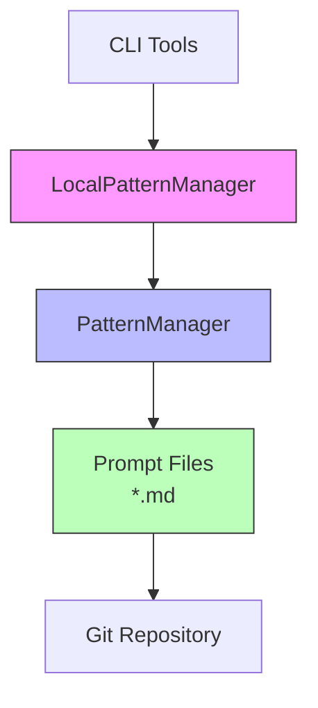
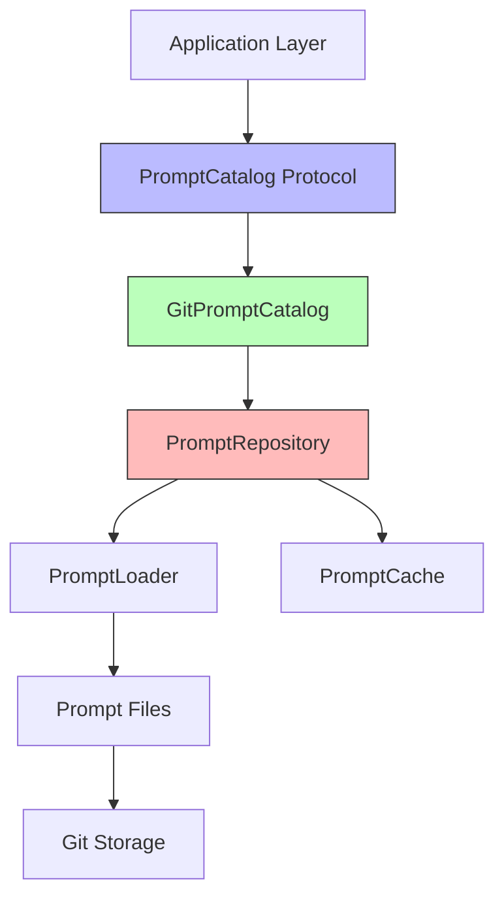

# Prompt System Architecture

Current and planned architecture for the TNH Scholar prompt system, including VS Code integration and PromptCatalog service design.

## Overview

The TNH Scholar prompt system provides engineered text inputs (prompts) for AI models, enabling consistent, reproducible, and customizable text processing. This document describes the current implementation and planned enhancements.

**Current Status**: See [ADR-PT03: Current Status & Roadmap](/architecture/prompt-system/adr/adr-pt03-prompt-system-status-roadmap.md) for implementation details. Historical prototype notes are summarized in the Historical References section.

## Design Goals

1. **Simplicity**: Git-based storage, human-readable Jinja2 templates
2. **Transparency**: All prompts are plain text files, version-controlled
3. **Versioning**: Git lineage provides collaborative editing and reproducibility
4. **Flexibility**: Template-based customization with context variables
5. **Discoverability**: Structured metadata enables browsing and selection
6. **Reproducibility**: Fingerprinting ensures identical inputs produce identical outputs

## Current Architecture (V1)

### Storage and Versioning

**Implementation**:

- Prompts stored as Jinja2 `.md` files in `~/.config/tnh_scholar/prompts/`
- Git version control for prompt history
- Simple file-based discovery

**Access Pattern**:

```python
from tnh_scholar.ai_text_processing.patterns import LocalPatternManager

# Singleton access (prototype phase)
manager = LocalPatternManager()
prompt = manager.get_pattern("default_punctuate")
rendered = prompt.apply_template(context={"language": "en"})
```

### Components



**Key Classes**:

- `LocalPatternManager`: Singleton wrapper for global access
- `PatternManager`: Core prompt loading and rendering
- Jinja2 templates: Prompt files with variable substitution

### Limitations

- **No structured metadata**: Limited discoverability
- **Singleton access**: Difficult to test, hard to inject
- **No fingerprinting**: Can't verify reproducibility
- **Limited validation**: No enforcement of required variables
- **No caching**: Repeated renders re-parse templates

## Planned Architecture (V2)

### PromptCatalog Service

Following the [Object-Service Design](/architecture/object-service/object-service-design-overview.md) pattern:



**Service Protocol**:

```python
from typing import Protocol

class PromptCatalog(Protocol):
    """Protocol for prompt catalog implementations."""

    def get_prompt(self, name: str, version: Optional[str] = None) -> Prompt:
        """Retrieve prompt by name and optional version."""
        ...

    def list_prompts(
        self,
        task_type: Optional[TaskType] = None,
        tags: Optional[list[str]] = None
    ) -> list[PromptMetadata]:
        """List available prompts with optional filtering."""
        ...

    def render_prompt(
        self,
        name: str,
        context: dict[str, Any],
        version: Optional[str] = None
    ) -> RenderedPrompt:
        """Render prompt with context and return fingerprinted result."""
        ...

    def validate_prompt(self, name: str) -> PromptValidation:
        """Validate prompt template and metadata."""
        ...
```

### Prompt Metadata Model

```python
from pydantic import BaseModel, Field
from enum import Enum

class TaskType(str, Enum):
    """Types of processing tasks."""
    PUNCTUATE = "punctuate"
    TRANSLATE = "translate"
    SECTION = "section"
    CUSTOM = "custom"

class PromptMetadata(BaseModel):
    """Metadata for a prompt template."""

    name: str = Field(..., description="Unique prompt identifier")
    version: str = Field(..., description="Semantic version (e.g., '1.0.0')")
    task_type: TaskType = Field(..., description="Type of processing task")
    description: str = Field(..., description="Human-readable description")

    # Variable requirements
    required_variables: list[str] = Field(default_factory=list)
    optional_variables: dict[str, Any] = Field(default_factory=dict)

    # Model constraints
    recommended_model: Optional[str] = None
    min_context_window: Optional[int] = None
    max_tokens: Optional[int] = None

    # Organizational
    tags: list[str] = Field(default_factory=list)
    author: Optional[str] = None
    created: datetime
    modified: datetime

    # Git provenance
    git_commit: Optional[str] = None
    git_branch: Optional[str] = None
```

### Prompt Fingerprinting

```python
from dataclasses import dataclass
from hashlib import sha256

@dataclass(frozen=True)
class PromptFingerprint:
    """Immutable fingerprint for rendered prompt."""

    template_hash: str  # Hash of template content
    metadata_hash: str  # Hash of metadata
    context_hash: str   # Hash of context variables
    git_commit: Optional[str]  # Git commit of template

    @property
    def full_hash(self) -> str:
        """Combined hash of all components."""
        combined = f"{self.template_hash}:{self.metadata_hash}:{self.context_hash}"
        return sha256(combined.encode()).hexdigest()

@dataclass(frozen=True)
class RenderedPrompt:
    """Rendered prompt with provenance."""

    content: str
    metadata: PromptMetadata
    fingerprint: PromptFingerprint
    rendered_at: datetime
```

**Use Case**: Caching AI responses by fingerprint:

```python
# Check cache before expensive AI call
fingerprint = catalog.render_prompt("translate", context).fingerprint
cached_response = response_cache.get(fingerprint.full_hash)

if cached_response:
    return cached_response

# Make AI call and cache by fingerprint
response = ai_service.generate(prompt)
response_cache.set(fingerprint.full_hash, response)
```

## VS Code Integration Requirements

See [ADR-VSC01](/architecture/ui-ux/vs-code-integration/adr-vsc01-vscode-integration-strategy.md) and ADR-VSC02 (pending) for full context.

### Interactive Prompt Selection

**Command Palette Integration**:

```typescript
// VS Code command: "TNH Scholar: Select Prompt"
const prompts = await promptCatalog.listPrompts({
  taskType: "translate",
  tags: ["dharma", "vietnamese"]
});

const selected = await vscode.window.showQuickPick(
  prompts.map(p => ({
    label: p.name,
    description: p.description,
    detail: `v${p.version} | ${p.tags.join(", ")}`
  }))
);
```

### Prompt Preview and Editing

**Requirements**:

- Real-time rendering with sample context
- Syntax highlighting for Jinja2 templates
- Variable validation and autocomplete
- Git diff view for prompt versions

**Preview Workflow**:

1. User selects prompt in VS Code
2. Extension loads prompt metadata
3. User provides context variables (or uses defaults)
4. Extension renders preview with current values
5. User can edit template and see live updates

### Prompt Authoring Workflow

**Create New Prompt**:

1. User runs command: "TNH Scholar: Create Prompt"
2. VS Code prompts for metadata (name, task type, description)
3. Extension generates scaffold with metadata frontmatter:

```markdown
---
name: custom_summarize
version: 1.0.0
task_type: custom
description: Summarize dharma talk with key insights
required_variables: [text, max_words]
optional_variables: {language: en, style: concise}
tags: [summarize, dharma]
---

# Summarize Dharma Talk

Please summarize the following dharma talk in {{max_words}} words or less.

**Language**: {{language}}
**Style**: {{style}}

## Text to Summarize

{{text}}

## Summary Instructions

Focus on:
- Core dharma teachings
- Practical applications
- Key insights for practitioners
```

4. User edits template
5. Extension validates on save (required variables, Jinja2 syntax)
6. User commits to Git

## Migration Path

### Phase 1: Enhanced Metadata (Current)

- ✅ Add YAML frontmatter to existing prompts
- ✅ Document required/optional variables
- ✅ Add task_type and tags

### Phase 2: PromptCatalog Service (Q1 2026)

- Implement `PromptCatalog` protocol
- Create `GitPromptCatalog` implementation
- Add fingerprinting and caching
- Maintain backwards compatibility with `LocalPatternManager`

### Phase 3: VS Code Integration (Q1-Q2 2026)

- Implement command palette integration
- Add prompt preview/editing UI
- Create authoring workflow
- Enable git-based versioning UI

### Phase 4: Production Hardening (Q2 2026)

- Replace `LocalPatternManager` singleton with dependency injection
- Full prompt validation and error reporting
- Usage analytics and cost tracking
- Performance optimization

## Implementation Examples

### Current Usage (V1)

```python
# CLI tool using singleton
from tnh_scholar.ai_text_processing.patterns import LocalPatternManager

manager = LocalPatternManager()
prompt = manager.get_pattern("default_translate")
rendered = prompt.apply_template(context={
    "text": input_text,
    "target_language": "en",
    "source_language": "vi"
})

# Pass to AI service
result = ai_service.process(rendered)
```

### Planned Usage (V2)

```python
# Service with dependency injection
from tnh_scholar.gen_ai_service import GenAIService
from tnh_scholar.prompt_system import GitPromptCatalog

# Initialize with config
catalog = GitPromptCatalog(config=prompt_config)
ai_service = GenAIService(config=ai_config)

# Render with fingerprinting
rendered = catalog.render_prompt(
    name="default_translate",
    context={
        "text": input_text,
        "target_language": "en",
        "source_language": "vi"
    }
)

# Check cache
cached = response_cache.get(rendered.fingerprint.full_hash)
if cached:
    return cached

# Process with AI
result = ai_service.generate(rendered.content)

# Cache by fingerprint
response_cache.set(rendered.fingerprint.full_hash, result)
```

## Security and Safety

### Prompt Injection Prevention

- **Variable validation**: Only allow expected variables
- **Template sandboxing**: Restrict Jinja2 capabilities (no code execution)
- **Input sanitization**: Escape special characters in context values
- **Audit logging**: Track prompt modifications and usage

### Secrets Management

- **Never store secrets in prompts**
- **Use environment variables for API keys**
- **Git-ignore sensitive context files**
- **Prompt templates are public artifacts**

## Performance Considerations

### Caching Strategy

- **Template cache**: Parsed Jinja2 templates (in-memory)
- **Metadata cache**: Prompt metadata (in-memory, TTL: 5 min)
- **Response cache**: AI responses by fingerprint (Redis/disk, TTL: 24 hours)

### Lazy Loading

- Load prompts on demand, not at startup
- Cache only frequently-used prompts
- Invalidate cache on Git updates

## Testing Strategy

### Unit Tests

- Prompt rendering with various contexts
- Metadata validation
- Fingerprint uniqueness and stability
- Variable substitution edge cases

### Integration Tests

- Git repository operations
- Cache invalidation
- VS Code extension integration
- End-to-end authoring workflow

## Related Documentation

- [ADR-PT03: Current Status & Roadmap](/architecture/prompt-system/adr/adr-pt03-prompt-system-status-roadmap.md) - Current implementation
- [ADR-DD03: Terminology Standardization](/architecture/docs-system/adr/adr-dd03-pattern-to-prompt.md) - Pattern→Prompt shift
- [ADR-VSC01: VS Code Integration Strategy](/architecture/ui-ux/vs-code-integration/adr-vsc01-vscode-integration-strategy.md)
- [Object-Service Design](/architecture/object-service/object-service-design-overview.md) - Architecture pattern

## References

- [Jinja2 Template Designer Documentation](https://jinja.palletsprojects.com/en/3.1.x/templates/)
- [Prompt Engineering Guide](https://www.promptingguide.ai/)
- [LangChain Prompt Templates](https://python.langchain.com/docs/modules/model_io/prompts/)

---

## Historical References

<details>
<summary>📚 View superseded design documents (maintainers/contributors)</summary>

**Note**: These documents are archived and excluded from the published documentation. They provide historical context for the current design.

### Earlier Design Explorations

- **[Core Pattern Architecture](/architecture/prompt-system/archive/core-pattern-architecture.md)** (2024-11-09)
  *Status*: Replaced by this architecture document. Uses legacy "Pattern" terminology before standardization to "Prompt" nomenclature.

</details>
