# Diarization Algorithms

This document details the key algorithms in the diarization system, focusing on high-level design without implementation details. Each algorithm is presented with its inputs, outputs, and process flow.

## 1. Speaker Segment Merging Algorithm

The algorithm merges adjacent segments from the same speaker when they're close enough in time.

### 1.1 Inputs and Outputs

**Inputs:**

- List of speaker segments from diarization API
- Gap threshold (maximum gap to consider segments contiguous)

**Outputs:**

- Dictionary mapping speaker IDs to lists of merged segments

### 1.2 Algorithm Flowchart

```mermaid
flowchart TD
    A[Input: Segments + Threshold] --> B[Sort segments by start time]
    B --> C[Initialize speaker blocks]
    C --> D[For each segment]
    D --> E{Is first segment?}
    E -->|Yes| F[Initialize current block]
    E -->|No| G{Same speaker as current?}
    G -->|Yes| H{Gap ≤ threshold?}
    G -->|No| I[Finalize current block]
    I --> J[Start new block with segment]
    H -->|Yes| K[Extend current block]
    H -->|No| L[Finalize current block]
    L --> M[Start new block with same speaker]
    F --> D
    J --> D
    K --> D
    M --> D
    D --> N{More segments?}
    N -->|Yes| D
    N -->|No| O[Finalize last block]
    O --> P[Return speaker blocks]
```

### 1.3 Algorithm Description

1. **Sort segments**: Arrange all segments in chronological order by start time
2. **Process sequentially**: Examine each segment in order
3. **Speaker change detection**: Check if current segment has same speaker as previous
4. **Gap analysis**: For same speaker, check if gap between segments is below threshold
5. **Block management**:
   - If same speaker and small gap: extend current block
   - If same speaker but large gap: finalize current block and start new one
   - If different speaker: finalize current block and start new one
6. **Result generation**: Return dictionary mapping speaker IDs to lists of merged segments

### 1.4 Potential Enhancements

- **Adaptive gap thresholds**: Adjust threshold based on speaker characteristics
- **Confidence-based merging**: Incorporate confidence scores from API
- **Speech rate analysis**: Consider speech rate in gap threshold determination
- **Overlapping segment handling**: Intelligently resolve overlapping segments

## 2. Audio Extraction Algorithm

This algorithm extracts speaker segments from the original audio and creates speaker-specific tracks.

### 2.1 Inputs and Outputs

**Inputs:**

- Path to original audio file
- Speaker blocks (dictionary mapping speakers to segments)
- Output directory
- Configuration for silence padding

**Outputs:**

- Dictionary of timeline mapping information for each speaker
- Speaker-specific audio files on disk

### 2.2 Algorithm Flowchart

### 2.3 Algorithm Description

1. **Load original audio**: Read the complete audio file
2. **Speaker iteration**: Process each speaker independently
3. **Track creation**: For each speaker:
   - Create an empty audio track
   - Initialize timeline mapping information
4. **Segment processing**: For each segment:
   - Extract audio from original file
   - Add silence padding if configured
   - Add to speaker track
   - Record mapping information
5. **Export**: Save each speaker's audio to disk
6. **Return mappings**: Provide timeline mapping information for later use

### 2.4 Potential Enhancements

- **Streaming processing**: Handle large audio files without loading entirely
- **Parallel extraction**: Process multiple speakers simultaneously
- **Audio enhancement**: Apply noise reduction or normalization per speaker
- **Adaptive padding**: Adjust silence duration based on context
- **Format optimization**: Support different output formats with optimized settings

## 3. SRT Timeline Mapping Algorithm

This algorithm transforms SRT timestamps from speaker timeline to original audio timeline.

### 3.1 Inputs and Outputs

**Inputs:**

- Path to SRT file (with timestamps in speaker timeline)
- Timeline mapping information
- Output path for transformed SRT

**Outputs:**

- SRT file with timestamps mapped to original timeline

### 3.2 Algorithm Flowchart

### 3.3 Algorithm Description

1. **Parse SRT**: Extract subtitle entries with timestamps and text
2. **Build intervals**: Create complete mapping intervals for timeline transformation
3. **Entry processing**: For each subtitle entry:
   - Convert timestamps to seconds
   - Find best matching mapping interval
   - Apply timeline transformation
   - Create new entry with mapped timestamps
4. **Output generation**: Write transformed entries to SRT file

### 3.4 Potential Enhancements

- **Non-linear mapping**: Support for variable-rate timeline transformations
- **Format preservation**: Maintain formatting and styling in transformed SRT
- **Metadata enrichment**: Add speaker information to subtitle entries
- **Multi-language support**: Handle translated SRTs with correct timing
- **Overlap resolution**: Intelligent handling of overlapping subtitle entries

## 4. Finding Best Interval Algorithm

A subcomponent of the SRT mapping algorithm that finds the most appropriate interval for a subtitle.

### 4.1 Inputs and Outputs

**Inputs:**

- List of timeline intervals
- Start and end time of subtitle (in speaker timeline)

**Outputs:**

- Interval with best overlap with the subtitle

### 4.2 Algorithm Flowchart

### 4.3 Algorithm Description

1. **Initialization**: Start with no overlap found
2. **Interval iteration**: Examine each potential mapping interval
3. **Overlap calculation**: Determine how much the subtitle overlaps with each interval
4. **Best match selection**: Choose interval with greatest overlap
5. **Result return**: Provide best interval for mapping, or None if no overlap

### 4.4 Potential Enhancements

- **Weighted overlap**: Consider duration and content in overlap importance
- **Context awareness**: Consider surrounding subtitles in interval selection
- **Confidence scoring**: Include confidence metrics in interval selection
- **Multiple interval mapping**: Split subtitle across intervals when necessary

## 5. Timeline Mapping Function

Maps time from speaker timeline to original timeline using interval information.

### 5.1 Inputs and Outputs

**Inputs:**

- Mapping interval (original and speaker timeline information)
- Time to map (in speaker timeline)

**Outputs:**

- Corresponding time in original timeline

### 5.2 Algorithm Flowchart

### 5.3 Algorithm Description

1. **Parameter extraction**: Get original and speaker timeline boundaries from interval
2. **Position calculation**: Determine relative position of time within speaker timeline range
3. **Timeline mapping**: Apply same relative position to original timeline range
4. **Result return**: Return the mapped time in original timeline

### 5.4 Potential Enhancements

- **Non-linear mapping**: Support for variable rates within intervals
- **Interpolation**: Multi-point interpolation for improved accuracy
- **Boundary handling**: Special cases for interval boundaries
- **Error estimation**: Include confidence/error metrics with mapped times

## 6. Improvements and Extensions

### 6.1 Enhanced Speaker Merging

- **Speaker characteristics**: Adapt merging based on speech patterns
- **Content awareness**: Consider linguistic content in merging decisions
- **Machine learning**: Train models to predict optimal merge points
- **Speaker identification**: Incorporate voice recognition for improved accuracy

### 6.2 Advanced Timeline Mapping

- **Content-aware stretching**: Vary mapping based on speech content
- **Multi-point anchoring**: Use multiple reference points for mapping
- **Adaptive resolution**: Higher precision for critical segments
- **Bidirectional optimization**: Ensure equal accuracy in both mapping directions

### 6.3 Audio Processing Enhancements

- **Noise profiling**: Identify and remove background noise specific to each speaker
- **Volume normalization**: Consistent loudness across all speakers
- **Voice enhancement**: Improve clarity of speech for each speaker
- **Acoustic environment matching**: Maintain consistent room acoustics

### 6.4 SRT Processing Extensions

- **Formatting preservation**: Maintain styling across timeline mapping
- **Speaker identification**: Label subtitles with speaker information
- **Confidence indication**: Include reliability markers for uncertain segments
- **Multi-language alignment**: Coordinate timing across translated subtitles

### 6.5 Performance Optimizations

- **Progressive processing**: Begin processing before complete file download
- **Memory-efficient handling**: Process large files without excessive memory use
- **Computation distribution**: Distribute processing across multiple cores/machines
- **Caching strategies**: Reuse intermediate results when appropriate

## 7. Integration with audio-transcribe

### 7.1 Integration Points

- **Command-line flags**: Add diarization-specific options to CLI
- **Configuration file**: Support for detailed diarization configuration
- **Pipeline integration**: Use diarization in place of or alongside existing chunking
- **Output control**: Options for organizing and formatting diarized output

### 7.2 Workflow Integration

- **Preprocessing**: Use diarization to guide chunking strategy
- **Speaker-aware transcription**: Optimize transcription for each speaker
- **Result combination**: Merge speaker transcripts with proper attribution
- **Output generation**: Create integrated output with speaker identification