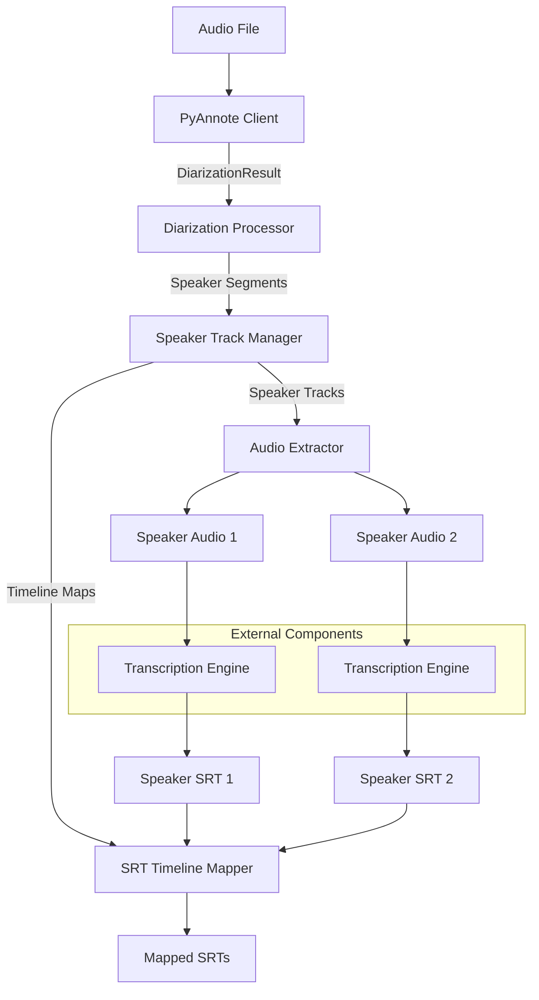
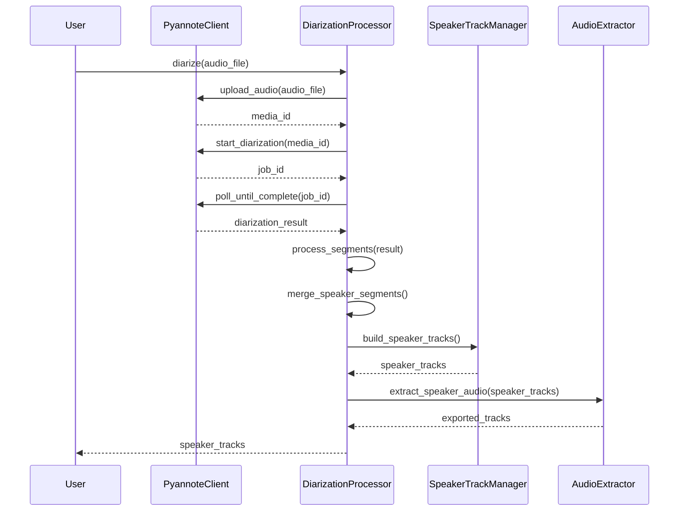
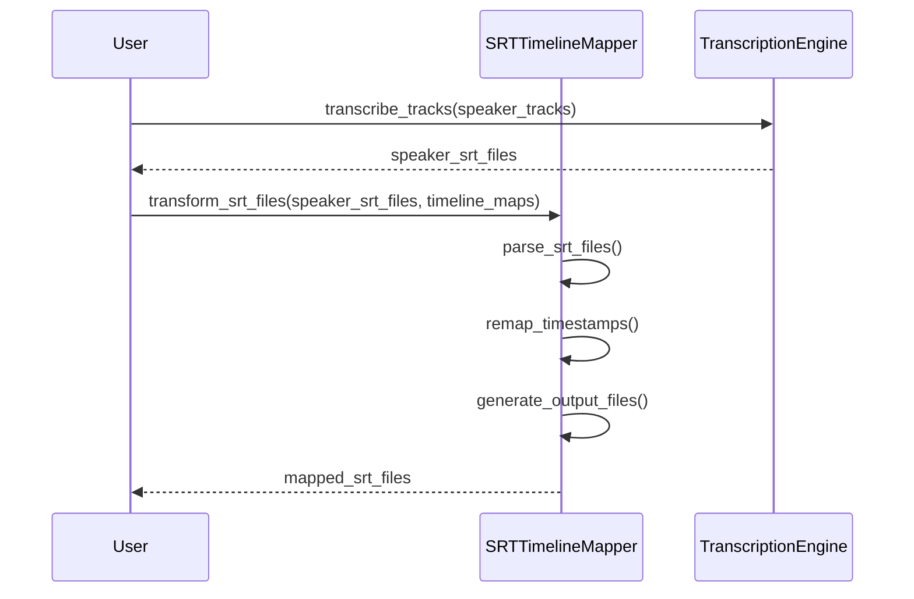

# Diarization System Design

## 1. System Overview

The diarization system identifies and separates different speakers in audio content, enabling speaker-specific processing of transcripts and audio. The system has evolved from the successful proof-of-concept implementation, which demonstrated effective speaker separation, audio track extraction, and timeline mapping for SRT generation.

The system follows these high-level steps:
1. Process audio through remote diarization service (PyAnnote)
2. Identify and merge speaker segments
3. Extract speaker-specific audio tracks with timeline mapping
4. Generate and process transcriptions for each speaker
5. Remap transcription timelines to original audio (for integrated presentation)

### Core Design Principles

- **Modularity**: Independent components with clear responsibilities
- **Single-Action Methods**: Each method performs a single logical operation
- **Timeline Integrity**: Precise tracking of timestamps across transformations
- **Extensibility**: Support for multiple output formats and processing pipelines

## 2. System Architecture

## 3. Core Components

### 3.1 PyAnnote Client

Handles communication with the PyAnnote API for speaker diarization:

- **Responsibilities**:
  - Authentication and session management
  - Media upload and URL generation
  - Job submission and status tracking
  - Result retrieval and parsing

- **Key Classes**:
  - `PyannoteClient`: Main interface to the API
  - `PyannoteConfig`: Configuration constants

### 3.2 Diarization Models

Core data structures representing diarization information:

- **Key Classes**:
  - `DiarizationSegment`: Individual speaker segment with timing
  - `DiarizationResult`: Complete result set with metadata
  - `SpeakerTrack`: Collection of segments for a single speaker

- **Responsibilities**:
  - Define consistent data structures
  - Maintain segment information
  - Support conversion between formats

### 3.3 Diarization Processor

Coordinates the diarization workflow:

- **Responsibilities**:
  - Orchestrate the diarization process
  - Handle result processing
  - Manage speaker segment merging
  - Generate speaker tracks

- **Key Methods**:
  - `diarize()`: Complete diarization process
  - `process_segments()`: Process raw segments
  - `merge_speaker_segments()`: Combine adjacent segments
  - `build_speaker_tracks()`: Generate timeline maps

### 3.4 Speaker Track Manager

Manages speaker-specific audio tracks and timeline mapping:

- **Responsibilities**:
  - Create and manage speaker track objects
  - Build timeline mapping tables
  - Export track metadata

- **Key Classes**:
  - `SpeakerTrack`: Represents a speaker's audio track
  - `TimelineMap`: Maps between original and track timelines

### 3.5 Audio Extractor

Handles extraction of speaker-specific audio:

- **Responsibilities**:
  - Extract audio segments from original file
  - Combine segments into speaker tracks
  - Handle silence/gap insertion
  - Export audio tracks

- **Key Methods**:
  - `extract_segments()`: Extract speaker segments
  - `build_track()`: Combine segments into a track
  - `save_track()`: Export audio track to file

### 3.6 SRT Timeline Mapper

Transforms SRT files between different timelines:

- **Responsibilities**:
  - Parse SRT files
  - Map timestamps between timelines
  - Generate remapped SRT files

- **Key Methods**:
  - `parse_srt()`: Parse SRT file into objects
  - `map_timeline()`: Apply timeline mapping
  - `generate_srt()`: Create SRT file with new timestamps

## 4. Process Flow

### 4.1 Diarization Process

### 4.2 SRT Transformation Process

## 5. Data Models

### 5.1 DiarizationSegment

Represents a single speaker segment with timing information:

- `speaker`: String identifier for the speaker
- `start`: Start time in seconds
- `end`: End time in seconds
- `duration`: Calculated property for segment duration

### 5.2 SpeakerTrack

Collection of segments belonging to a single speaker:

- `speaker`: Speaker identifier
- `segments`: List of DiarizationSegment objects
- `timeline_map`: Maps original timeline to track timeline
- Methods for adding segments and exporting audio

### 5.3 TimelineMap

Maps between original and track timelines:

- `intervals`: List of TimelineInterval objects
- Methods for mapping timestamps and exporting mapping data

### 5.4 SRTEntry

Represents a single subtitle entry:

- `index`: Entry index number
- `start_time`: Start time in SRT format (HH:MM:SS,mmm)
- `end_time`: End time in SRT format (HH:MM:SS,mmm)
- `text`: Subtitle text
- Properties for time conversion between formats

## 6. Integration Points

### 6.1 Audio Processing Integration

The system integrates with existing audio processing tools:

- Integration with pydub for audio manipulation
- Support for various audio formats and codecs
- Extraction and combination of audio segments

### 6.2 Transcription Integration

The system allows integration with different transcription engines:

- Configurable transcription engine selection
- Support for different output formats
- Integration with existing transcription workflows

### 6.3 CLI Integration

Integration with the audio-transcribe CLI:

- Diarization options as command-line flags
- Configuration for speaker gap handling
- Output format selection options
- Integration with existing processing pipelines

## 7. Extension Points

### 7.1 Alternative Diarization Services

Support for different diarization services through an abstract interface:

- Common API for different diarization providers
- Standardized result processing
- Pluggable service implementations

### 7.2 Custom Speaker Merging Strategies

Customizable segment merging through strategy pattern:

- Configurable merging algorithms
- Different gap threshold strategies
- Speaker-specific merging rules

### 7.3 Timeline Mapping Extensions

Support for different timeline mapping strategies:

- Various mapping algorithms
- Handling of edge cases
- Bidirectional mapping support

## 8. Implementation Considerations

### 8.1 Error Handling

In the production implementation:

- **Graceful Recovery**: Handle API failures with retries
- **Validation**: Ensure segment integrity before processing
- **User Feedback**: Provide clear error messages
- **Safe Defaults**: Use reasonable defaults when possible

### 8.2 Performance Optimization

For handling large audio files:

- **Streaming Processing**: Process large files in chunks
- **Parallel Processing**: Extract speaker tracks in parallel
- **Memory Management**: Avoid loading entire audio into memory
- **Caching**: Cache intermediate results where appropriate

### 8.3 Testing Strategy

Comprehensive testing approach:

- **Unit Tests**: Test individual components in isolation
- **Integration Tests**: Test component interactions
- **Acceptance Tests**: Test end-to-end workflows
- **Performance Tests**: Verify handling of large files

### 8.4 Documentation Strategy

Documentation requirements:

- **API Documentation**: Document public interfaces
- **Usage Examples**: Provide common usage patterns
- **Integration Guide**: Document integration points
- **Configuration Reference**: Document configuration options

## 9. Future Considerations

### 9.1 Speaker Identification

Future support for speaker identification:

- Integration with voice recognition systems
- Speaker profile management
- Consistent speaker labeling across files

### 9.2 Multi-language Support

Enhanced language handling:

- Language detection per speaker
- Language-specific transcription models
- Cross-language speaker tracking

### 9.3 Advanced Audio Processing

Future audio processing capabilities:

- Background noise reduction
- Audio quality enhancement
- Speaker audio normalization

### 9.4 Interactive Visualization

User interface enhancements:

- Interactive timeline visualization
- Speaker track playback controls
- Waveform display with speaker highlighting

### 9.5 Batch Processing

Support for batch operations:

- Process multiple files
- Generate consistent speaker IDs across files
- Aggregate statistics across multiple recordings