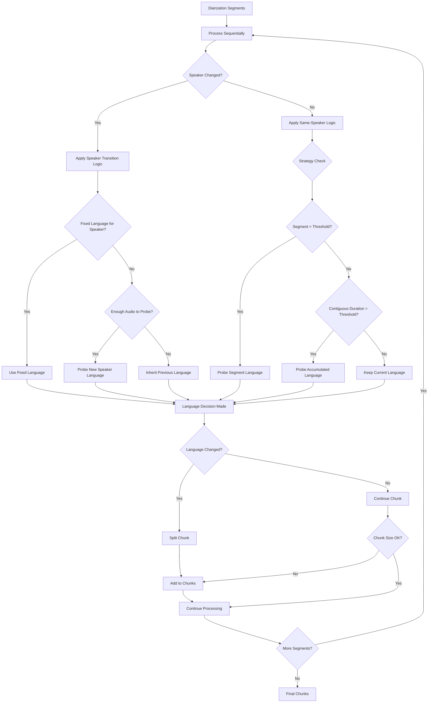
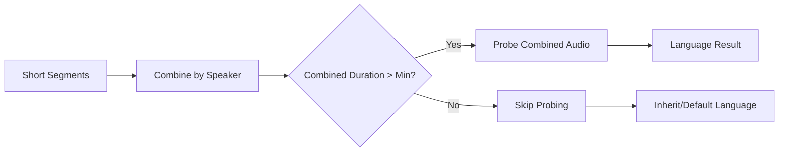

# Practical Language-Aware Chunking Design

Practical heuristics for detecting language changes during chunking when diarization output is noisy.

## Core Problem

Current chunking only considers time and speaker boundaries. We need language boundary detection for mixed-language audio, but diarization output is noisy (800+ segments, false speaker detection) requiring practical segment handling.

## Real-World Context

**Typical diarization output:**

- 1hr audio with 5 actual speakers → 800+ segments detected
- Diarizer reports 12 speakers (due to noise/audio artifacts)  
- Many segments ≤1 second (utterance-based detection)
- Need minimum 5+ seconds for reliable language detection

**Audio scenarios:**

- **Conversational**: Multiple speakers, translation, code-switching
- **Formal**: Panel discussions, Q&A sessions, prepared statements

## Probing Strategies for Testing

### 1. Individual Segment Threshold

**Strategy**: Poll any segment longer than X seconds

- **Config**: `min_segment_duration_for_probe: int = 5000  # 5 seconds`
- **Use case**: Catch longer utterances that might contain language switches
- **Pro**: Simple, catches obvious language segments
- **Con**: Misses short code-switching

### 2. Contiguous Speaker Duration

**Strategy**: Poll when speaker's contiguous segments total > Y seconds

- **Config**: `min_speaker_duration_for_probe: int = 10000  # 10 seconds`
- **Logic**: Accumulate consecutive segments from same speaker until interrupted
- **Use case**: Speaker delivers longer statement, might switch languages mid-way
- **Special case**: Y=0 means probe every speaker appearance (exhaustive)

### 3. Fixed Speaker Languages

**Strategy**: Assign known languages to specific speakers

- **Config**: `fixed_speaker_languages: Dict[str, str] = {"SPEAKER_01": "en", "SPEAKER_02": "vi"}`
- **Use case**: Known multilingual scenarios (interpreter + speaker)
- **Pro**: Eliminates false language detection
- **Con**: Requires prior knowledge

### 4. Contiguous Speaker Consistency

**Strategy**: Keep language fixed for uninterrupted speaker segments

- **Config**: `lock_language_until_interruption: bool = True`
- **Logic**: Once language detected for speaker, maintain until different speaker talks
- **Use case**: Formal presentations where speakers stick to one language per turn
- **Pro**: Reduces false language switches
- **Con**: Misses mid-turn language changes

### 5. Speaker Transition Probing

**Strategy**: Always probe language when speaker changes

- **Config**: `probe_on_speaker_change: bool = True`
- **Logic**: Check language of new speaker (if sufficient audio available)
- **Use case**: Detect language switching between speakers
- **Pro**: Catches most language boundaries
- **Con**: Expensive with many speaker transitions

## Algorithm Flow



## Configuration Options

```python
@dataclass
class LanguageProbeConfig:
    # Individual segment probing
    min_segment_duration_for_probe: int = 5000  # ms
    
    # Contiguous speaker probing  
    min_speaker_duration_for_probe: int = 10000  # ms
    probe_exhaustively: bool = False  # Y=0 case
    
    # Fixed assignments
    fixed_speaker_languages: Dict[str, str] = field(default_factory=dict)
    
    # Consistency rules
    lock_language_until_interruption: bool = False
    
    # Transition probing
    probe_on_speaker_change: bool = True
    
    # Detection settings
    confidence_threshold: float = 0.7
    sample_duration_ms: int = 5000
```

## Segment Combining Logic

Before language detection, combine very short segments to reach minimum testable duration:



**Combining rules:**

- Combine consecutive segments from same speaker
- Stop combining when different speaker appears
- If combined duration still < minimum, skip probing
- Apply probing strategy to combined segment

## Processing Sequence

### For Each Segment in Timeline

1. **Check speaker transition**: Has speaker changed from previous segment?

2. **Apply appropriate strategy**:
   - If speaker changed: Check fixed languages, probe if needed
   - If same speaker: Apply same-speaker probing rules

3. **Language detection decision**:
   - Use fixed language if configured
   - Probe if thresholds met and audio sufficient
   - Inherit previous language otherwise

4. **Chunk management**:
   - If language changed (high confidence): Split chunk
   - If chunk too large: Split on size
   - Otherwise: Continue building chunk

## Strategy Testing Plan

### Phase 1: Basic Implementation

- Implement all 5 strategies as configurable options
- Test with known multilingual audio samples
- Measure language detection accuracy vs. manual annotation

### Phase 2: Optimization

- Test different threshold values (3s, 5s, 10s, 15s)
- Compare exhaustive vs. selective probing performance
- Evaluate false positive rates for each strategy

### Phase 3: Combination Testing

- Test multiple strategies simultaneously
- Find optimal combinations for different audio types
- Measure impact on transcription quality

## Expected Outcomes

**Conversational audio** (cooking demo scenario):

- Strategy 2 + 5: Probe contiguous speaker duration + speaker transitions
- Handle 800+ segments efficiently
- Catch translation segments between speakers

**Formal audio** (panel discussions):

- Strategy 4 + 5: Lock language until interruption + speaker transitions  
- Reduce false language switches during long statements
- Probe only at natural speaker boundaries

This practical approach handles real diarization noise while providing multiple testable strategies for different audio contexts.