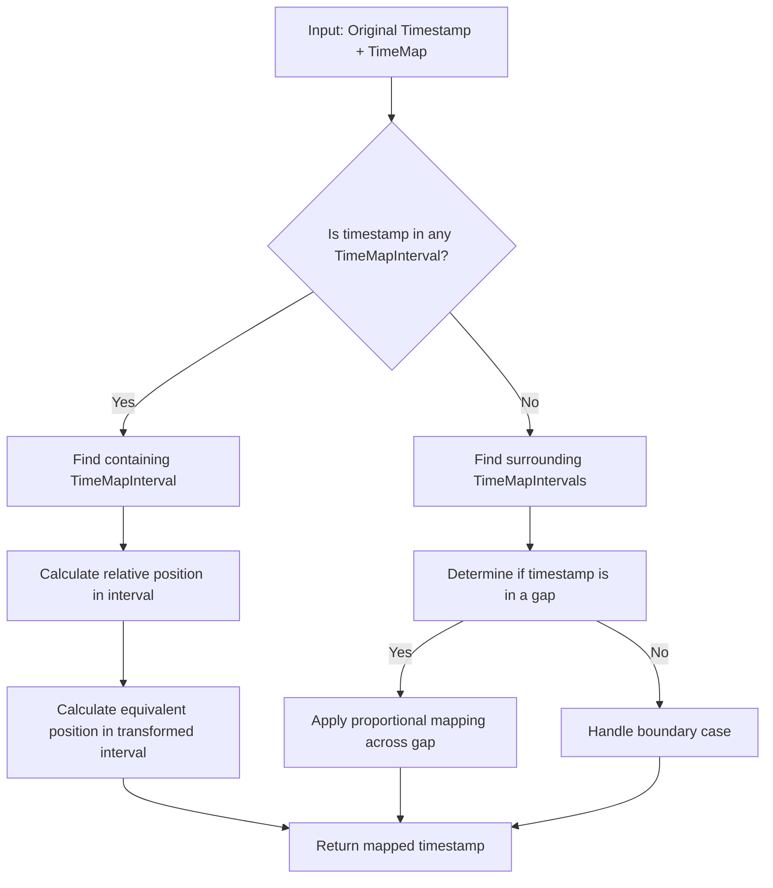
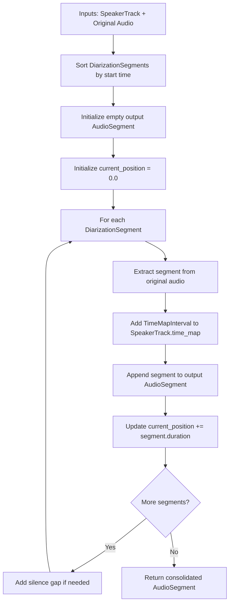
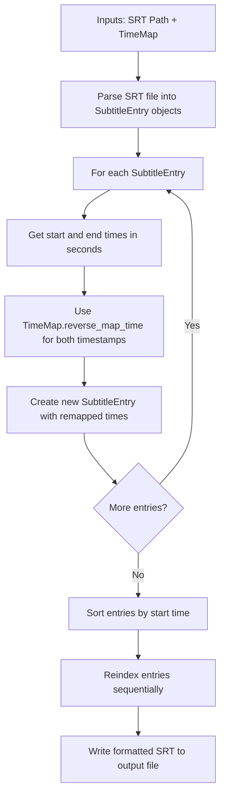
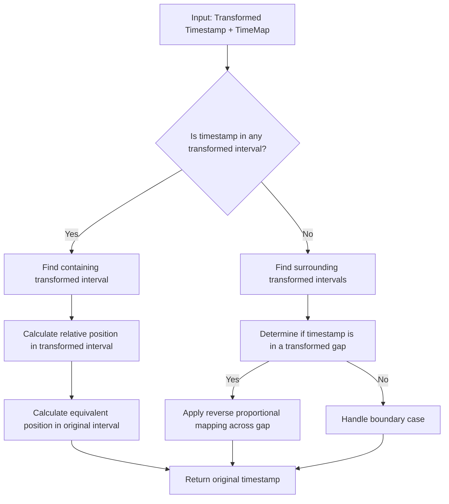
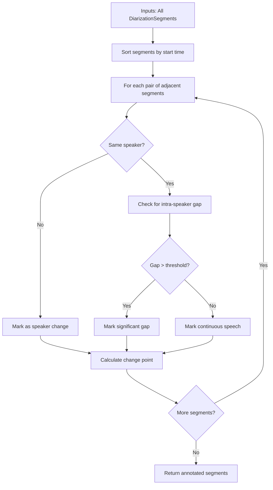

# Speaker Diarization Algorithm Design

This document details the key algorithms referenced in the main diarization system design. Each algorithm is presented with a clear breakdown of its inputs, outputs, and processing steps.

## 1. Timeline Mapping Algorithm

The core process for mapping timestamps between original and consolidated timelines.

### 1.1 Inputs and Outputs

**Inputs:**
- `TimeMap`: Collection of TimeMapInterval objects
- `timestamp`: Float value representing a time point in the original timeline (seconds)

**Outputs:**
- Mapped timestamp in the consolidated timeline (seconds)

### 1.2 Process Flow



### 1.3 Implementation Approach

This algorithm is implemented in the `TimeMap.map_time()` method with these steps:

1. Find the TimeMapInterval containing the timestamp:
   ```python
   def find_containing_interval(time_map, timestamp):
       """Find interval containing the timestamp or None if in a gap."""
       for interval in time_map.intervals:
           if interval.original_start <= timestamp <= interval.original_end:
               return interval
       return None
   ```

2. Calculate the position within an interval:
   ```python
   def calculate_position_in_interval(interval, timestamp):
       """Calculate relative position (0.0-1.0) in interval."""
       if interval.duration == 0:
           return 0
       return (timestamp - interval.original_start) / interval.duration
   ```

3. Map the position to the transformed timeline:
   ```python
   def map_within_interval(interval, position):
       """Map a relative position to the transformed timeline."""
       return interval.transformed_start + (position * interval.duration)
   ```

4. Handle gaps between intervals:
   ```python
   def handle_gap_mapping(previous_interval, next_interval, timestamp):
       """Map a timestamp in a gap between intervals."""
       original_gap = next_interval.original_start - previous_interval.original_end
       transformed_gap = next_interval.transformed_start - previous_interval.transformed_end
       
       # Position in gap (0.0-1.0)
       gap_position = (timestamp - previous_interval.original_end) / original_gap
       
       return previous_interval.transformed_end + (gap_position * transformed_gap)
   ```

## 2. SpeakerTrack Consolidation Algorithm

The process for combining discrete speaker segments into a continuous audio track.

### 2.1 Inputs and Outputs

**Inputs:**
- `SpeakerTrack`: Object containing a list of DiarizationSegment objects for a single speaker
- `AudioSegment`: Original complete audio containing all speakers
- `gap_duration`: Float value specifying silence duration to insert between non-contiguous segments

**Outputs:**
- Consolidated `AudioSegment` containing only the specified speaker's segments
- Updated `TimeMap` in the SpeakerTrack object

### 2.2 Process Flow



### 2.3 Implementation Approach

This algorithm is implemented in the `SpeakerTrack.consolidate_audio()` method:

1. Sort segments by original time:
   ```python
   def sort_segments(speaker_track):
       """Sort DiarizationSegments by start time."""
       return sorted(speaker_track.segments, key=lambda s: s.start)
   ```

2. Process each segment:
   ```python
   def process_segment(segment, original_audio, current_position, time_map):
       """Process a single segment and update the time map."""
       # Extract audio segment (ms precision for AudioSegment)
       start_ms = int(segment.start * 1000)
       end_ms = int(segment.end * 1000)
       segment_audio = original_audio[start_ms:end_ms]
       
       # Record time mapping
       time_map.add_interval(segment.start, segment.end, current_position)
       
       return segment_audio, segment.duration
   ```

3. Handle gaps between segments:
   ```python
   def create_gap(duration, format_params=None):
       """Create a silent gap of specified duration."""
       return AudioSegment.silent(duration=int(duration * 1000))
   ```

## 3. SRT Remapping Algorithm

The process for converting subtitle timestamps from consolidated to original timeline.

### 3.1 Inputs and Outputs

**Inputs:**
- `Path` to SRT file with timestamps in the consolidated timeline
- `TimeMap` object for the associated speaker
- `Path` for output remapped SRT file

**Outputs:**
- SRT file with timestamps remapped to the original timeline

### 3.2 Process Flow



### 3.3 Implementation Approach

The SRT remapping is implemented in the `TimingRemapper.remap_srt()` method:

1. Parse SRT file:
   ```python
   def parse_srt_file(file_path):
       """Parse SRT file into SubtitleEntry objects."""
       entries = []
       # Implementation details for parsing SRT format
       return entries
   ```

2. Remap individual entries:
   ```python
   def remap_entry(entry, time_map):
       """Remap a single SubtitleEntry using the TimeMap."""
       # Create a new entry to preserve original
       new_entry = entry.clone()
       
       # Remap timestamps (reverse mapping: transformed → original)
       original_start = time_map.reverse_map_time(entry.start_seconds)
       original_end = time_map.reverse_map_time(entry.end_seconds)
       
       # Update the entry
       new_entry.set_times(original_start, original_end)
       return new_entry
   ```

3. Write SRT output:
   ```python
   def write_srt_file(entries, output_path):
       """Write SubtitleEntry objects to SRT file."""
       with open(output_path, 'w', encoding='utf-8') as f:
           for entry in entries:
               f.write(entry.format_srt())
               f.write('\n\n')
   ```

## 4. TimeMap Reverse Mapping

The algorithm for mapping timestamps from transformed timeline back to original timeline.

### 4.1 Inputs and Outputs

**Inputs:**
- `TimeMap`: Collection of TimeMapInterval objects
- `timestamp`: Float value representing a time point in the transformed timeline (seconds)

**Outputs:**
- Mapped timestamp in the original timeline (seconds)

### 4.2 Process Flow



### 4.3 Implementation Approach

This is implemented in the `TimeMap.reverse_map_time()` method:

1. Find interval containing the transformed timestamp:
   ```python
   def find_containing_transformed_interval(time_map, timestamp):
       """Find interval containing the transformed timestamp."""
       for interval in time_map.intervals:
           if interval.transformed_start <= timestamp <= interval.transformed_end:
               return interval
       return None
   ```

2. Calculate reverse position:
   ```python
   def calculate_position_in_transformed_interval(interval, timestamp):
       """Calculate relative position (0.0-1.0) in transformed interval."""
       return (timestamp - interval.transformed_start) / interval.duration
   ```

3. Map back to original timeline:
   ```python
   def map_to_original(interval, position):
       """Map a relative position back to the original timeline."""
       return interval.original_start + (position * interval.duration)
   ```

## 5. Gap Detection and Speaker Change Analysis

The process for detecting speaker changes and silence gaps in the audio.

### 5.1 Inputs and Outputs

**Inputs:**
- List of `DiarizationSegment` objects from all speakers
- Threshold parameters for gap detection

**Outputs:**
- List of segments with speaker change and gap annotations

### 5.2 Process Flow



### 5.3 Implementation Approach

This algorithm helps determine how to handle transitions between segments:

1. Analyze adjacent segments:
   ```python
   def analyze_segment_transition(seg1, seg2, gap_threshold):
       """Analyze transition between two segments."""
       gap = seg2.start - seg1.end
       same_speaker = seg1.speaker == seg2.speaker
       
       if gap < 0:  # Overlapping segments
           return {
               'type': 'overlap',
               'duration': -gap,
               'speaker_change': not same_speaker
           }
       
       return {
           'type': 'gap',
           'duration': gap,
           'speaker_change': not same_speaker,
           'significant': gap > gap_threshold
       }
   ```

2. Find optimal split points:
   ```python
   def find_split_point(seg1, seg2):
       """Find optimal point to split between segments."""
       if seg1.end < seg2.start:  # Gap exists
           return (seg1.end + seg2.start) / 2  # Middle of gap
       else:  # Overlapping
           return (seg1.end + seg2.start) / 2  # Middle of overlap
   ```

These algorithms form the core processing logic of the diarization system. They are designed to be modular and focused on single tasks, making them easier to implement and test in the prototype phase.