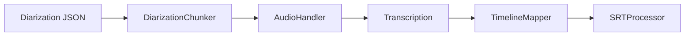
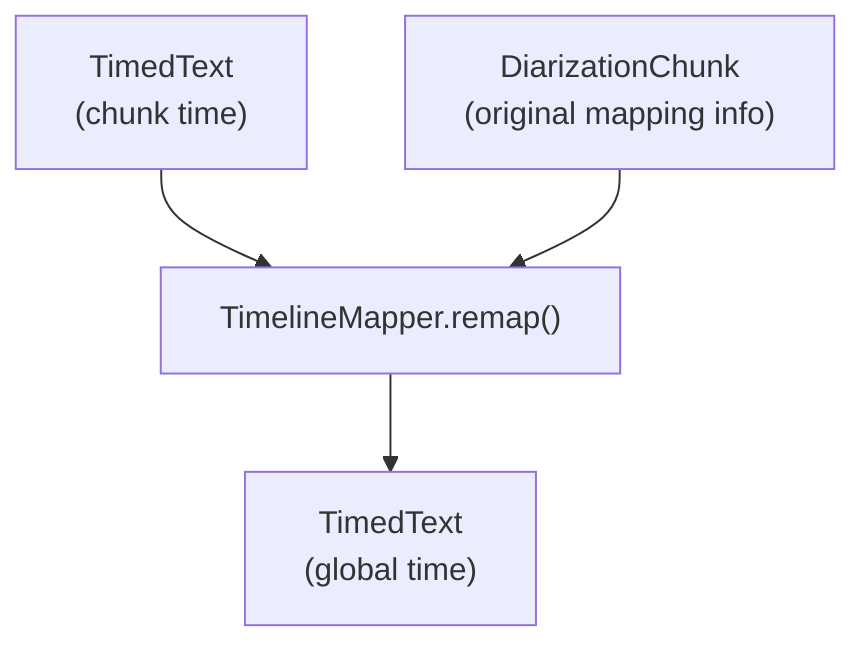

# TimelineMapper Design Document

Design for the TimelineMapper component that reprojects chunk-level transcripts into the original audio timeline.

## Purpose

In an audio transcription pipeline that integrates **speaker diarization** and **chunked audio processing**, transcriptions produced by ASR (Automatic Speech Recognition) are **offset relative to each audio chunk** rather than the original full audio file.

The `TimelineMapper` solves this by **remapping** each transcription segment's start and end timecodes from the chunk's local timeline back into the global original audio timeline.

---

## Context

### High-Level Pipeline



1. **DiarizationChunker** splits diarization segments into manageable processing units
2. **AudioHandler** extracts corresponding audio for each chunk
3. **Transcription** produces transcriptions relative to chunk timelines
4. **TimelineMapper** **reprojects** the transcription back into original audio coordinates
5. **SRTProcessor** formats the finalized subtitles

---

## Core Problem

When a chunk of audio is built, it **splices together** diarized segments, sometimes **inserting silences** for gaps.
This causes the chunk's internal time (0 → chunk duration) to **diverge** from the original global audio timeline.

Since ASR operates on the chunk, its output **must be corrected** to be meaningful relative to the original full audio.

---

## Remapping Strategy

| Step | Description                                                                                                                         |
| :--- | :---------------------------------------------------------------------------------------------------------------------------------- |
| 1    | **Build a piecewise mapping table** from original segment start/end times and their corresponding chunk offsets (`audio_map_time`). |
| 2    | **For each subtitle segment** (in chunk time), find the **best matching interval** in the mapping table.                            |
| 3    | **Apply a simple shift** (no stretch or scale): `global_time = orig_start + (chunk_time - local_start)`                             |
| 4    | **Handle edge cases** gracefully, e.g., no matching interval found.                                                                 |
| 5    | **Return a new `TimedText` object** with remapped times, keeping all text and metadata intact.                                      |

---

## Conceptual Illustration



---

## Detailed Algorithm

### Mapping Table Construction

Each diarization segment produces an interval:

* `orig_start` → `orig_end` (original timeline)
* `local_start` = `audio_map_time`
* `local_end` = `audio_map_time + segment_duration`

For inserted silences (gap fill-ins), we can infer synthetic intervals if needed to maintain timeline continuity.

---

### Remapping Each Subtitle

For each transcription segment:

1. **Identify overlap**: Find the mapping interval with the **largest overlap** (≥ 1 ms).
2. **Shift time**:

   ```text
   new_start = orig_start + (subtitle_start - local_start)
   new_end   = orig_start + (subtitle_end - local_start)
   ```

3. **Edge Handling**:

   * If no matching interval is found, either:

     * Log a warning and leave unchanged
     * Apply a fallback shift
     * Raise an exception (configurable)

---

## Proposed `TimelineMapper` Class

```python
from typing import List, Optional
from tnh_scholar.audio_processing.transcription_service.diarization_chunker import DiarizationChunk
from tnh_scholar.audio_processing.timed_text import TimedText, TimedTextUnit

class TimelineMapper:
    """Maps TimedText from chunk-relative timecodes back to global timecodes."""
    
    def remap(self, timed_text: TimedText, chunk: DiarizationChunk) -> TimedText:
        """
        Remap TimedText from chunk-relative timecodes back to global timecodes.
        
        Args:
            timed_text: TimedText with chunk-relative timestamps
            chunk: DiarizationChunk with mapping information
            
        Returns:
            New TimedText with global timestamps
        """
        if not chunk.segments:
            raise exception
            
        ...
                
        return TimedText(segments=remapped_segments)
```

---

## Internal Helpers

| Helper                                              | Purpose                                                             |
| :-------------------------------------------------- | :------------------------------------------------------------------ |
| `_build_mapping_intervals(chunk: DiarizationChunk)` | Constructs ordered list of mapping intervals                        |
| `_find_best_overlap(intervals, start, end)`         | Finds the mapping interval with the greatest overlap for a subtitle |
| `_apply_shift(interval, segment)`                   | Applies the simple shift formula to subtitle times                  |

**Internal data structure**:

```python
@dataclass
class MappingInterval:
    orig_start: int
    orig_end: int
    local_start: int
    local_end: int
```

---

## Design Considerations

* **Statelessness**: `TimelineMapper` does not hold state between remaps.
* **Immutability**: Never mutate the input `TimedText`; always produce a new instance.
* **Performance**:

  * Pre-sort intervals by `local_start`
  * Consider `bisect` (binary search) for efficient lookup
* **Configurability**:

  * Handling of unmatched subtitles (warn/skip/fallback)
  * Optional detailed logging for debug mode
* **Testability**:

  * Easily unit-testable with synthetic chunks and known offsets
  * Edge case coverage: overlaps, straddling gaps, missing matches

---

## Testing Plan

| Test Case            | Description                                       |
| :------------------- | :------------------------------------------------ |
| Basic remap          | Straightforward 1-to-1 mapping with no gaps       |
| Overlapping segments | Subtitle overlaps two mapping intervals           |
| Gaps and silences    | Subtitle falls into an inserted silence           |
| No matching interval | Subtitle completely outside known mappings        |
| Boundary conditions  | Subtitle exactly starts/ends at interval boundary |
| Performance test     | 10,000+ segments                                  |

---

## Potential Future Extensions

* **Affine time transforms**: for stretch/compression correction (e.g., `(t) → a·t + b`)
* **Speaker-aware remapping**: Map only into segments from the same speaker
* **Multi-chunk remapping**: Process an entire transcription consisting of multiple chunks in one pass
* **Confidence-weighted remap**: If multiple overlaps, prefer higher ASR confidence segments

---

## Implementation Plan

### 1. **Core Implementation (1-2 days)**

* Build `MappingInterval` class and internal helpers
* Implement basic remapping algorithm
* Handle edge cases for unmatched segments

### 2. **Testing (1 day)**

* Create unit tests with synthetic data
* Test with real audio data from the pipeline

### 3. **Pipeline Integration (1 day)**

* Add to the transcription processing workflow
* Optimize for performance with real data

---

## Summary

The `TimelineMapper` cleanly restores transcriptions into the global audio timeline after diarization and chunked processing, preserving the modular design and clarity of the broader transcription pipeline.

Its simplicity, performance, and testability make it a critical bridge from localized ASR output to globally meaningful subtitle and transcript data.