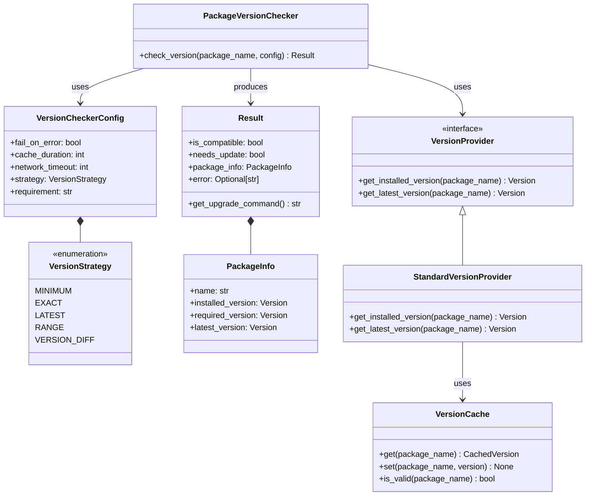

# Package Version Checker Design Document

## Overview

This document outlines the design for a robust, reusable package version checking utility that can verify versions for any Python package against minimum requirements, latest versions, or specific version constraints.

The utility provides a simple, flexible API for checking package versions with configurable behavior for different compatibility requirements. It's designed to support both simple version checks and sophisticated version difference monitoring.

## Context

Modern Python applications often depend on rapidly evolving libraries. Ensuring compatibility with these dependencies requires monitoring version differences and enforcing version requirements. This is especially important for libraries with frequent updates and API changes, such as OpenAI's client libraries.

Existing approaches often lack flexibility in defining what constitutes a "compatible" version, particularly when dealing with semantic versioning differences at various levels (major, minor, patch).

## Goals

- Create a modular, extensible version checking system that works with any Python package
- Provide both programmatic and CLI interfaces
- Support multiple checking strategies (minimum version, exact version, version range)
- Include robust error handling with configurable failure modes
- Maintain clean separation of concerns
- Support caching to minimize network requests
- Provide clear, actionable feedback to users
- Allow fine-grained control over version difference thresholds

## Design

### Core Components



### Key Classes

#### 1. `PackageVersionChecker`

The main entry point for version checking functionality:

```python
class PackageVersionChecker:
    def __init__(self, 
                 provider: Optional[VersionProvider] = None,
                 cache: Optional[VersionCache] = None):
        self.provider = provider or StandardVersionProvider()
        self.cache = cache or VersionCache()
        
    def check_version(self, 
                      package_name: str, 
                      config: Optional[VersionCheckerConfig] = None) -> Result:
        """Check if package meets version requirements based on config."""
        # Implementation
```

#### 2. `VersionCheckerConfig`

Configuration for version checking behavior:

```python
class VersionCheckerConfig:
    def __init__(self,
                 strategy: VersionStrategy = VersionStrategy.MINIMUM,
                 requirement: str = "",
                 fail_on_error: bool = False,
                 cache_duration: int = 3600,  # 1 hour
                 network_timeout: int = 5,    # seconds
                 vdiff_warn_matrix: Optional[str] = None,
                 vdiff_fail_matrix: Optional[str] = None):
        """
        Initialize version checker configuration.
        
        Args:
            strategy: Version checking strategy to use
            requirement: Version requirement string (for MINIMUM, EXACT, RANGE strategies)
            fail_on_error: Whether to raise exceptions on errors
            cache_duration: How long to cache PyPI results in seconds
            network_timeout: Network request timeout in seconds
            vdiff_warn_matrix: Version difference matrix for warnings [major.minor.micro]
                               Use * for any/infinity, e.g. "1.5.*" 
            vdiff_fail_matrix: Version difference matrix for failures [major.minor.micro]
                               Use * for any/infinity, e.g. "0.20.*"
        """
        self.strategy = strategy
        self.requirement = requirement
        self.fail_on_error = fail_on_error
        self.cache_duration = cache_duration
        self.network_timeout = network_timeout
        
        # Version difference matrices
        self.vdiff_warn_matrix = vdiff_warn_matrix
        self.vdiff_fail_matrix = vdiff_fail_matrix
        
    def parse_vdiff_matrix(self, matrix_str: Optional[str]) -> Tuple[Optional[int], Optional[int], Optional[int]]:
        """
        Parse a version difference matrix string into component thresholds.
        
        Args:
            matrix_str: String in format "major.minor.micro" where each component
                       is either a number or * for infinity
                       
        Returns:
            Tuple of (major_diff, minor_diff, micro_diff) thresholds
            
        Examples:
            "1.5.*" -> (1, 5, None)  # Major diff > 1 or minor diff > 5, ignore micro
            "0.0.0" -> (0, 0, 0)     # Any difference triggers
            "*.*.*" -> (None, None, None)  # No difference triggers
        """
        if not matrix_str:
            return None, None, None
            
        parts = matrix_str.split(".")
        if len(parts) != 3:
            raise ValueError(f"Invalid version difference matrix: {matrix_str}. "
                            f"Format should be 'major.minor.micro'")
            
        thresholds = []
        for part in parts:
            if part == "*":
                thresholds.append(None)  # None represents infinity/any
            else:
                try:
                    thresholds.append(int(part))
                except ValueError:
                    raise ValueError(f"Invalid version component in matrix: {part}. "
                                    f"Must be a number or *")
                                    
        return tuple(thresholds)  # type: Tuple[Optional[int], Optional[int], Optional[int]]
```

#### 3. `Result`

Structured result of version check operations:

```python
class Result:
    def __init__(self,
                 is_compatible: bool,
                 needs_update: bool,
                 package_info: PackageInfo,
                 error: Optional[str] = None,
                 warning_level: Optional[str] = None,
                 diff_details: Optional[Dict[str, int]] = None):
        self.is_compatible = is_compatible
        self.needs_update = needs_update
        self.package_info = package_info
        self.error = error
        self.warning_level = warning_level  # e.g., "MAJOR", "MINOR", "MICRO"
        self.diff_details = diff_details    # e.g., {"major": 1, "minor": 5}
        
    def get_upgrade_command(self) -> str:
        """Return pip command to upgrade package."""
        # Implementation
```

### Implementation Phases

#### Phase 1: Core Implementation

1. Define all interfaces and data classes
2. Implement `StandardVersionProvider` (using importlib.metadata and PyPI API)
3. Implement basic caching mechanism
4. Implement core `PackageVersionChecker` functionality
5. Add support for minimum version strategy

#### Phase 2: Enhanced Functionality

1. Add support for all version strategies
2. Implement robust error handling
3. Add configurable logging
4. Implement cache invalidation
5. Add utility functions for common use cases

#### Phase 3: CLI and Integration

1. Create CLI interface
2. Add support for requirements.txt parsing
3. Implement environment-aware version checking
4. Add documentation and examples
5. Create integration tests

## Implementation Plan

### Module Structure

```
src/tnh_scholar/utils/
├── version_check/
│   ├── __init__.py
│   ├── checker.py       # Main PackageVersionChecker class
│   ├── config.py        # Configuration classes
│   ├── providers.py     # Version provider implementations  
│   ├── cache.py         # Caching mechanisms
│   ├── models.py        # Data models (Result, PackageInfo)
│   ├── strategies.py    # Version comparison strategies
│   └── cli.py           # Command-line interface
└── __init__.py
```

### Implementation Details

#### Version Retrieval

We'll build on the existing implementation, but make it more generic:

```python
def get_installed_version(package_name: str) -> Version:
    """Get installed package version."""
    try:
        if version_str := str(importlib.metadata.version(package_name)):
            return Version(version_str)
        else:
            raise InvalidVersion(f"{package_name} version string is empty")
    except importlib.metadata.PackageNotFoundError as e:
        raise ImportError(f"{package_name} is not installed") from e
    except InvalidVersion as e:
        raise InvalidVersion(f"Invalid version for {package_name}: {e}") from e
```

#### Version Comparison

Version strategies will use comparison operators from `packaging.version`:

```python
def check_minimum_version(installed: Version, 
                         required: Version) -> bool:
    """Check if installed version meets minimum requirement."""
    return installed >= required

def check_compatible_version(installed: Version, 
                           required: Version) -> bool:
    """Check if installed version is compatible with requirement."""
    # Example: versions like 2.1.x are compatible with 2.1.0
    return (installed.major == required.major and 
            installed.minor == required.minor and
            installed.micro >= required.micro)
            
def check_version_diff(installed: Version,
                      reference: Version,
                      vdiff_matrix: Optional[str] = None) -> Tuple[bool, Dict[str, int]]:
    """
    Check if version difference is within specified limits.
    
    Args:
        installed: The installed version
        reference: The reference version to compare against (typically latest)
        vdiff_matrix: Version difference matrix string in format "major.minor.micro"
            
    Returns:
        Tuple of (is_within_limits, diff_details)
        where diff_details is a dict with actual differences
    """
    # Calculate actual differences
    major_diff = abs(reference.major - installed.major)
    minor_diff = abs(reference.minor - installed.minor) if reference.major == installed.major else 0
    micro_diff = abs(reference.micro - installed.micro) if (reference.major == installed.major and 
                                                            reference.minor == installed.minor) else 0
    
    diff_details = {
        "major": major_diff,
        "minor": minor_diff,
        "micro": micro_diff
    }
    
    # If no matrix provided, differences are acceptable
    if not vdiff_matrix:
        return True, diff_details
        
    # Parse matrix
    major_limit, minor_limit, micro_limit = parse_vdiff_matrix(vdiff_matrix)
    
    # Check limits (None means no limit)
    if major_limit is not None and major_diff > major_limit:
        return False, diff_details
        
    if minor_limit is not None and minor_diff > minor_limit:
        return False, diff_details
        
    if micro_limit is not None and micro_diff > micro_limit:
        return False, diff_details
        
    return True, diff_details

def parse_vdiff_matrix(matrix_str: str) -> Tuple[Optional[int], Optional[int], Optional[int]]:
    """
    Parse a version difference matrix string.
    
    Args:
        matrix_str: String in format "major.minor.micro"
        
    Returns:
        Tuple of (major_limit, minor_limit, micro_limit)
        where None represents no limit
    """
    parts = matrix_str.split(".")
    if len(parts) != 3:
        raise ValueError(f"Invalid version difference matrix: {matrix_str}")
        
    limits = []
    for part in parts:
        if part == "*":
            limits.append(None)  # No limit
        else:
            try:
                limits.append(int(part))
            except ValueError:
                raise ValueError(f"Invalid version component: {part}")
                
    return tuple(limits)  # type: Tuple[Optional[int], Optional[int], Optional[int]]
```

#### Caching Mechanism

Simple time-based caching for PyPI results:

```python
class VersionCache:
    def __init__(self, cache_duration: int = 3600):
        self.cache = {}
        self.timestamps = {}
        self.cache_duration = cache_duration
        
    def get(self, key: str) -> Optional[Version]:
        """Get cached version if still valid."""
        if not self.is_valid(key):
            return None
        return self.cache.get(key)
        
    def set(self, key: str, value: Version) -> None:
        """Cache version with current timestamp."""
        self.cache[key] = value
        self.timestamps[key] = time.time()
        
    def is_valid(self, key: str) -> bool:
        """Check if cached value is still valid."""
        if key not in self.timestamps:
            return False
        age = time.time() - self.timestamps[key]
        return age < self.cache_duration
```

#### Error Handling

Robust error handling with configurable behavior:

```python
def handle_error(error: Exception, 
                config: VersionCheckerConfig, 
                package_name: str) -> Result:
    """Handle errors based on configuration."""
    error_message = str(error)
    logger.error(f"Error checking {package_name} version: {error_message}")
    
    if config.fail_on_error:
        raise error
        
    return Result(
        is_compatible=False,
        needs_update=False,
        package_info=PackageInfo(name=package_name),
        error=error_message
    )
```

## Usage Examples

### Basic Usage

```python
from tnh_scholar.utils.version_check import PackageVersionChecker, VersionCheckerConfig, VersionStrategy

# Check if package meets minimum version
checker = PackageVersionChecker()
result = checker.check_version(
    "openai", 
    VersionCheckerConfig(
        strategy=VersionStrategy.MINIMUM,
        requirement="1.70.0"
    )
)

if not result.is_compatible:
    print(f"openai package version {result.package_info.installed_version} " 
          f"does not meet minimum requirement {result.package_info.required_version}")
    print(f"Upgrade with: {result.get_upgrade_command()}")
```

### Integration with Whisper Service

```python
def __init__(self, api_key: Optional[str] = None, **config_options):
    # Check OpenAI package version
    checker = PackageVersionChecker()
    result = checker.check_version(
        "openai",
        VersionCheckerConfig(
            strategy=VersionStrategy.MINIMUM,
            requirement="1.70.0",
            fail_on_error=False
        )
    )
    
    if not result.is_compatible:
        logger.warning(
            f"OpenAI package version {result.package_info.installed_version} "
            f"is older than required version {result.package_info.required_version}. "
            f"Some features may not work as expected. "
            f"Please upgrade using: {result.get_upgrade_command()}"
        )
    
    # Continue with initialization
    self.config = WhisperConfig()
    # ...
```

## Command-line Interface

```
usage: version-check [-h] [--min MIN_VERSION] [--exact EXACT_VERSION] 
                     [--vdiff-warn VDIFF_WARN_MATRIX]
                     [--vdiff-fail VDIFF_FAIL_MATRIX]
                     [--fail-on-error] [--timeout TIMEOUT] [--no-cache]
                     PACKAGE_NAME

Check if a Python package meets version requirements.

positional arguments:
  PACKAGE_NAME          Name of the package to check

optional arguments:
  -h, --help            show this help message and exit
  --min MIN_VERSION     Minimum required version
  --exact EXACT_VERSION Exact required version
  --vdiff-warn VDIFF_WARN_MATRIX
                        Version difference matrix for warnings in format major.minor.micro
                        Use * for any/infinity, e.g. "1.5.*"
  --vdiff-fail VDIFF_FAIL_MATRIX
                        Version difference matrix for failures in format major.minor.micro
                        Use * for any/infinity, e.g. "0.20.*"
  --fail-on-error       Exit with error code on version mismatch
  --timeout TIMEOUT     Network timeout in seconds
  --no-cache            Bypass cache and check PyPI directly
```

## Implementation Examples

Here's a simplified sketch of the key implementation components:

```python
def check_version(
    package_name: str, 
    config: VersionCheckerConfig
) -> Result:
    """Main version checking function."""
    try:
        installed = get_installed_version(package_name)
        latest = get_latest_version(package_name, config.network_timeout)
        
        # Determine compatibility based on strategy
        is_compatible = True
        needs_update = False
        warning_level = None
        diff_details = None
        
        if config.strategy == VersionStrategy.MINIMUM:
            required = Version(config.requirement)
            is_compatible = installed >= required
            needs_update = installed < latest
            
        elif config.strategy == VersionStrategy.EXACT:
            required = Version(config.requirement)
            is_compatible = installed == required
            needs_update = installed != required
            
        elif config.strategy == VersionStrategy.VERSION_DIFF:
            # Check warning threshold
            if config.vdiff_warn_matrix:
                warn_within_limits, diff_details = check_version_diff(
                    installed, latest, config.vdiff_warn_matrix)
                if not warn_within_limits:
                    warning_level = determine_warning_level(diff_details)
            
            # Check failure threshold
            if config.vdiff_fail_matrix:
                fail_within_limits, diff_details = check_version_diff(
                    installed, latest, config.vdiff_fail_matrix)
                is_compatible = fail_within_limits
                
            needs_update = installed < latest
        
        # Create package info
        package_info = PackageInfo(
            name=package_name,
            installed_version=str(installed),
            latest_version=str(latest),
            required_version=config.requirement if hasattr(config, 'requirement') else None
        )
        
        # Create and return result
        return Result(
            is_compatible=is_compatible,
            needs_update=needs_update,
            package_info=package_info,
            warning_level=warning_level,
            diff_details=diff_details
        )
        
    except Exception as e:
        # Handle errors based on configuration
        if config.fail_on_error:
            raise
        return Result(
            is_compatible=False,
            needs_update=False,
            package_info=PackageInfo(name=package_name),
            error=str(e)
        )
```

## Extensibility

The design supports these extension points:

1. **New Version Strategies**: Adding new comparison strategies is as simple as extending the `VersionStrategy` enum and implementing the corresponding check in the `check_version` method.

2. **Custom Version Providers**: The separation of version retrieval logic allows for swapping in alternative providers for handling private repositories, alternate package indexes, or specialized version parsing.

3. **Advanced Caching**: The caching system can be extended to provide persistent caching, environment-aware caching, or more sophisticated invalidation strategies.

4. **Result Processing**: The detailed `Result` object can be used to generate different types of reports, integrate with monitoring systems, or enforce custom policies.

## Future Enhancements

- Support for version ranges with upper bounds
- Integration with virtual environment detection
- Cache persistence across runs
- Support for private PyPI repositories
- Batch checking of multiple packages
- Integration with dependency resolution
- Support for pre-release versions
- More sophisticated version difference metrics (e.g., weighted differences)
- Configurable version comparison for non-semver packages
- Support for checking against specific release channels (stable, beta, etc.)
- Integration with package security advisories

## Conclusion

This version checking utility will provide a robust, flexible solution for ensuring package compatibility across the TNH Scholar project. By building on the existing YTDVersionChecker implementation but making it more generic and configurable, it will help prevent runtime errors and improve user experience.