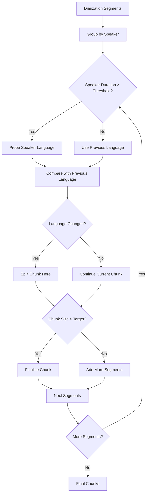
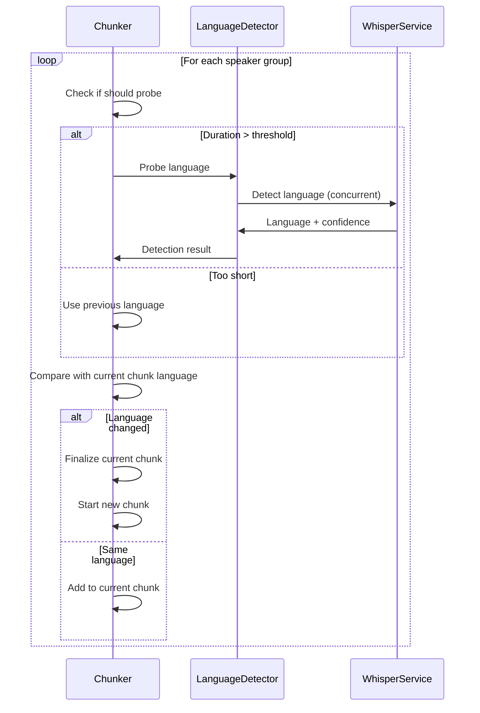

# Simplified Language-Aware Chunking Design

## Core Problem

Current chunking only considers time and speaker boundaries. We need to add language boundary detection to prevent mixed-language chunks that degrade ASR performance.

## Core Functionality

1. **Detect language changes within speaker blocks** (when speaker has long continuous speech)
2. **Detect language changes between speakers**
3. **Keep segments together when language is consistent** (up to target chunk size)

## Basic Protocols

```python
class ChunkingStrategy(Protocol):
    def chunk(self, segments: List[DiarizationSegment], config: ChunkerConfig) -> List[DiarizationChunk]:
        ...

class LanguageDetector(Protocol):
    def detect(self, audio_chunk: AudioChunk, start_ms: int = 0, duration_ms: int = 5000) -> tuple[str, float]:
        """Returns (language_code, confidence)"""
        ...
    
    def detect_multiple(self, audio_samples: List[tuple[AudioChunk, int, int]]) -> List[tuple[str, float]]:
        """Concurrent detection for multiple samples"""
        ...
```

## Simple Configuration

```python
@dataclass 
class ChunkerConfig:
    # Existing fields
    target_time: int = 300_000
    
    # Language detection
    enable_language_detection: bool = False
    min_speaker_duration_for_probe: int = 20_000  # Only probe long speaker segments
    sample_duration_ms: int = 5000
    confidence_threshold: float = 0.7
```

## High-Level Algorithm

### Language-Aware Chunking Flow



### Core Algorithm Logic

1. **Initialize**: Start with first speaker's segments
2. **For each speaker transition**:
   - If speaker duration > threshold: probe language
   - Compare language with current chunk language
   - If different: split chunk, start new chunk
   - If same: continue adding to current chunk
3. **Within speaker**: Only probe if speaker has very long continuous segments
4. **Size check**: Split chunk if target size exceeded regardless of language

## Simple Implementation Outline

```python
class LanguageAwareStrategy:
    def __init__(self, detector: LanguageDetector):
        self.detector = detector
        
    def chunk(self, segments: List[DiarizationSegment], config: ChunkerConfig) -> List[DiarizationChunk]:
        chunks = []
        current_chunk_segments = []
        current_language = None
        
        speaker_groups = self._group_by_speaker(segments)
        
        for speaker_group in speaker_groups:
            # Probe language if speaker duration is significant
            if self._should_probe_language(speaker_group, config):
                detected_language = self._probe_speaker_language(speaker_group, config)
            else:
                detected_language = current_language  # Inherit previous
            
            # Check for language change
            if (current_language is not None and 
                detected_language != current_language and 
                current_chunk_segments):
                # Language changed - finalize current chunk
                chunks.append(self._create_chunk(current_chunk_segments, current_language))
                current_chunk_segments = []
            
            # Add speaker segments to current chunk
            current_chunk_segments.extend(speaker_group)
            current_language = detected_language
            
            # Check size limit
            if self._chunk_too_large(current_chunk_segments, config):
                chunks.append(self._create_chunk(current_chunk_segments, current_language))
                current_chunk_segments = []
        
        # Handle final chunk
        if current_chunk_segments:
            chunks.append(self._create_chunk(current_chunk_segments, current_language))
            
        return chunks
```

## Concurrency Requirements

### WhisperService Thread Safety

```python
class ConcurrentLanguageDetector:
    def __init__(self, max_workers: int = 3):
        self.max_workers = max_workers
        self._thread_local = threading.local()
    
    def _get_whisper_service(self) -> WhisperTranscriptionService:
        """Thread-local whisper service instance"""
        if not hasattr(self._thread_local, 'service'):
            self._thread_local.service = WhisperTranscriptionService()
        return self._thread_local.service
```

**Key Requirements:**

- Thread-local WhisperService instances (avoid shared state)
- Concurrent audio sample processing
- Simple result aggregation

## Decision Points

### When to Probe Language

- **Always probe**: When speaker duration > `min_speaker_duration_for_probe`
- **Never probe**: Short speaker segments (inherit previous language)
- **Future enhancement**: Probe within very long single-speaker segments

### Language Change Handling

- **High confidence change**: Split chunk immediately
- **Low confidence**: Continue current chunk (avoid false splits)
- **No previous language**: Use detected language as baseline

## Simple Data Flow



## Minimal Extensions

### Future Hooks

- **Energy-based detection**: Add energy threshold checks before language probing
- **Topic awareness**: Add semantic similarity checks
- **Adaptive thresholds**: Adjust confidence thresholds based on audio quality

### Configuration Expansion

```python
# Future config additions (placeholders)
adaptive_thresholds: bool = False  # Future: adjust based on audio quality
probe_long_segments: bool = False  # Future: probe within long single-speaker segments
```

## Success Criteria

- **Functional**: Chunks have consistent language when confidence is high
- **Performance**: Language detection doesn't significantly slow processing
- **Simple**: Easy to understand and modify algorithm
- **Extensible**: Clear hooks for future enhancements

This simplified approach focuses on the core language boundary detection while maintaining the extensibility needed for future improvements.
