# Speaker Diarization and Time-Mapped Transcription System Design

## 1. Overview

This document outlines a design for enhancing the existing diarization system to support speaker-specific transcription with accurate time mapping. The system will consolidate audio segments by speaker while preserving timing information, generate transcriptions for each speaker's track, and remap the transcription timings back to the original audio timeline.

## 2. Design Goals

- **Minimal Changes**: Extend existing functionality with minimal modifications to current code
- **Accurate Timing**: Maintain precise timing relationships throughout the pipeline
- **Conceptual Simplicity**: Use clear, minimalist data structures that map directly to the problem domain
- **Single-Action Functions**: Each function or method should perform a single, well-defined action; for sequences, each element should be implemented as a single-action function
- **Modularity**: Create well-defined components with clear responsibilities
- **Code Reuse**: Maximize reuse of data structures and helper functions across components
- **Extensibility**: Support future enhancements like language detection
- **Usability**: Integrate with existing CLI interfaces

## 3. System Architecture

### 3.1 Core Components

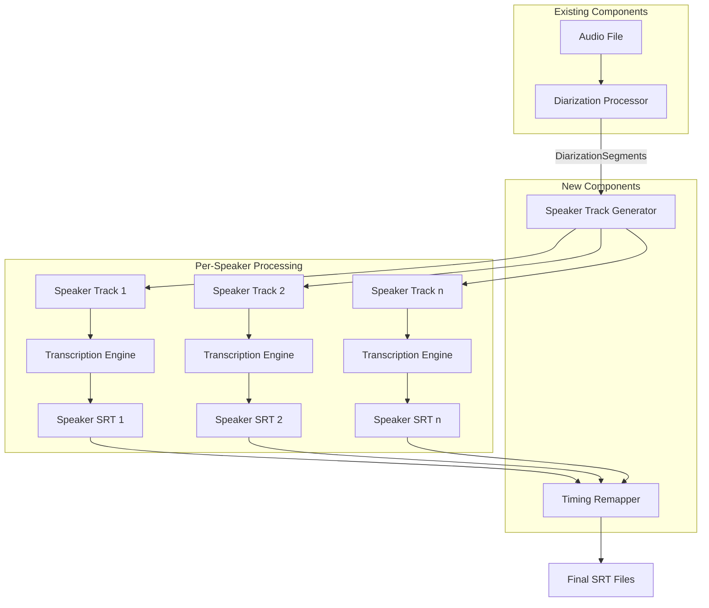

### 3.2 Data Flow Architecture

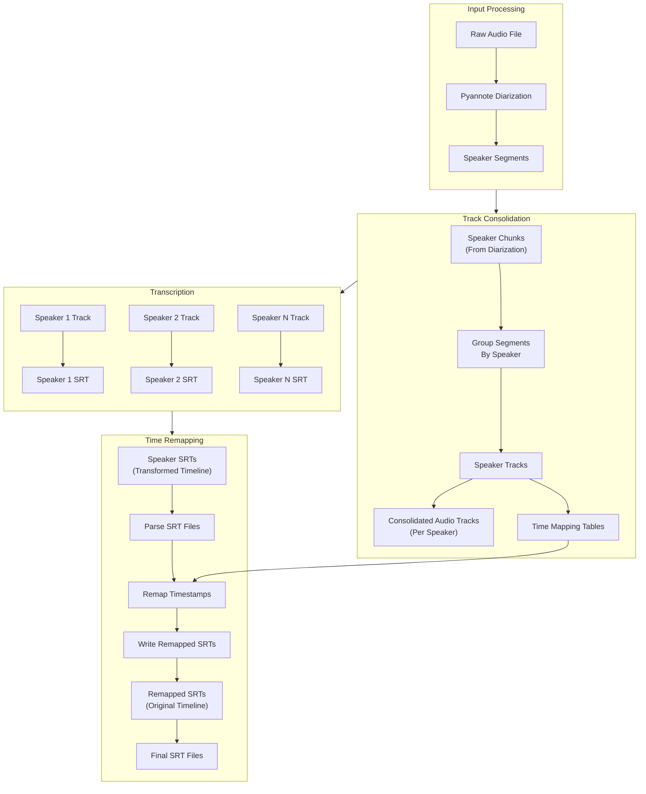

## 3.3 Error Handling Strategy

For the prototype phase, error handling will be minimal, allowing failures to surface immediately for debugging.

### 3.3.1 Core Approach

- Focus on logging rather than error handling for most operations
- Handle only critical expected errors (file access, format errors)
- Allow other exceptions to propagate and terminate execution for easier debugging
- Use descriptive log messages for error contexts

### 3.3.2 Implementation Examples

Only handle errors where they commonly occur and are expected:

```python
def load_audio_file(file_path):
    """Load audio file or raise appropriate error."""
    if not file_path.exists():
        logger.error(f"Audio file not found: {file_path}")
        raise FileNotFoundError(f"Audio file not found: {file_path}")
    
    # Let any other exceptions propagate up
    return AudioSegment.from_file(file_path)
```

In all other cases, log the operation and let exceptions propagate:

```python
def process_speaker_track(track, audio_file):
    """Process a speaker track."""
    logger.info(f"Processing track for speaker {track.speaker_id}")
    return track.consolidate_audio(audio_file)
```

This minimal approach is appropriate for the prototype phase, with comprehensive error handling to be implemented later.

## 4. Component Specifications

### 4.1 Speaker Track Generator

**Purpose**: Consolidate speaker segments into continuous audio tracks while maintaining timing relationships

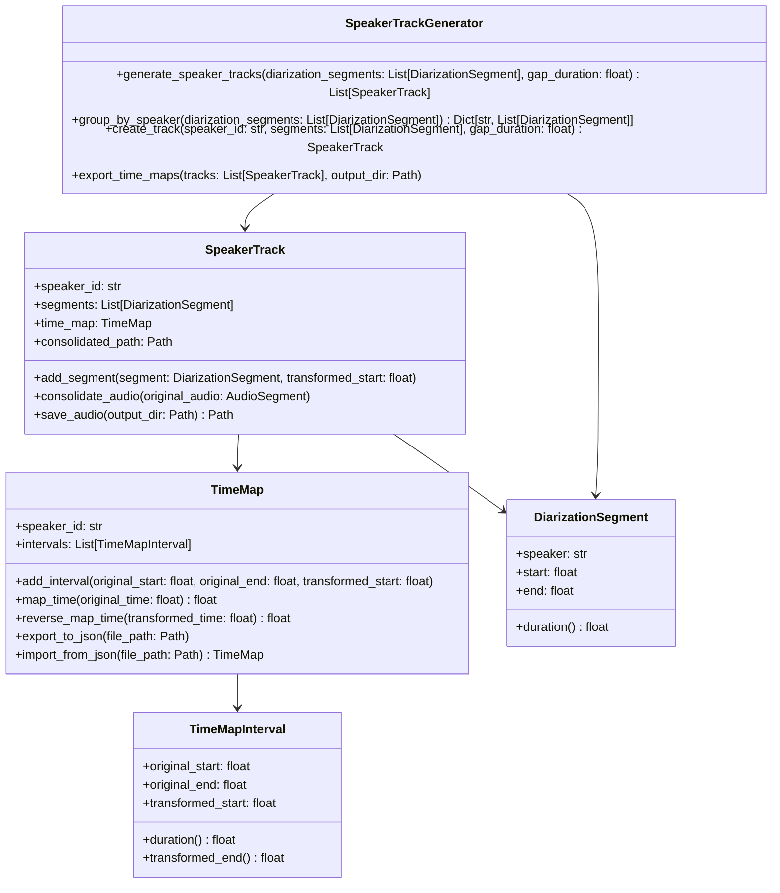

### 4.2 Time Mapping System

**Purpose**: Track time relationships between original and consolidated audio

```mermaid
graph TB
    subgraph "Original Timeline (Mixed Speakers)"
        OT1[Speaker 1 <br> 0:00-0:30]
        OT2[Speaker 2 <br> 0:30-1:15]
        OT3[Speaker 3 <br> 1:15-2:00]
        OT4[Speaker 1 <br> 2:00-2:45]
        OT5[Speaker 2 <br> 2:45-3:10]
        OT6[Speaker 3 <br> 3:10-3:45]
        OT7[Speaker 1 <br> 3:45-4:20]
        OT8[Speaker 3 <br> 4:20-5:00]
        OT9[Speaker 2 <br> 5:00-5:30]
    end
    
    subgraph "Consolidated Timeline (Speaker 1)"
        CT1_1[0:00-0:30]
        CT1_2[0:31-1:16]
        CT1_3[1:17-1:52]
    end
    
    subgraph "Consolidated Timeline (Speaker 2)"
        CT2_1[0:00-0:45]
        CT2_2[0:46-1:11]
        CT2_3[1:12-1:42]
    end
    
    subgraph "Consolidated Timeline (Speaker 3)"
        CT3_1[0:00-0:45]
        CT3_2[0:46-1:21]
        CT3_3[1:22-2:02]
    end
    
    OT1 -- map --> CT1_1
    OT4 -- map --> CT1_2
    OT7 -- map --> CT1_3
    
    OT2 -- map --> CT2_1
    OT5 -- map --> CT2_2
    OT9 -- map --> CT2_3
    
    OT3 -- map --> CT3_1
    OT6 -- map --> CT3_2
    OT8 -- map --> CT3_3
    
    style OT1 fill:#f9f,stroke:#333,stroke-width:2px
    style OT4 fill:#f9f,stroke:#333,stroke-width:2px
    style OT7 fill:#f9f,stroke:#333,stroke-width:2px
    
    style OT2 fill:#bbf,stroke:#333,stroke-width:2px
    style OT5 fill:#bbf,stroke:#333,stroke-width:2px
    style OT9 fill:#bbf,stroke:#333,stroke-width:2px
    
    style OT3 fill:#bfb,stroke:#333,stroke-width:2px
    style OT6 fill:#bfb,stroke:#333,stroke-width:2px
    style OT8 fill:#bfb,stroke:#333,stroke-width:2px
    
    style CT1_1 fill:#f9f,stroke:#333,stroke-width:2px
    style CT1_2 fill:#f9f,stroke:#333,stroke-width:2px
    style CT1_3 fill:#f9f,stroke:#333,stroke-width:2px
    
    style CT2_1 fill:#bbf,stroke:#333,stroke-width:2px
    style CT2_2 fill:#bbf,stroke:#333,stroke-width:2px
    style CT2_3 fill:#bbf,stroke:#333,stroke-width:2px
    
    style CT3_1 fill:#bfb,stroke:#333,stroke-width:2px
    style CT3_2 fill:#bfb,stroke:#333,stroke-width:2px
    style CT3_3 fill:#bfb,stroke:#333,stroke-width:2px
```

### 4.3 Timing Remapper

**Purpose**: Convert SRT timings from consolidated tracks to original timeline

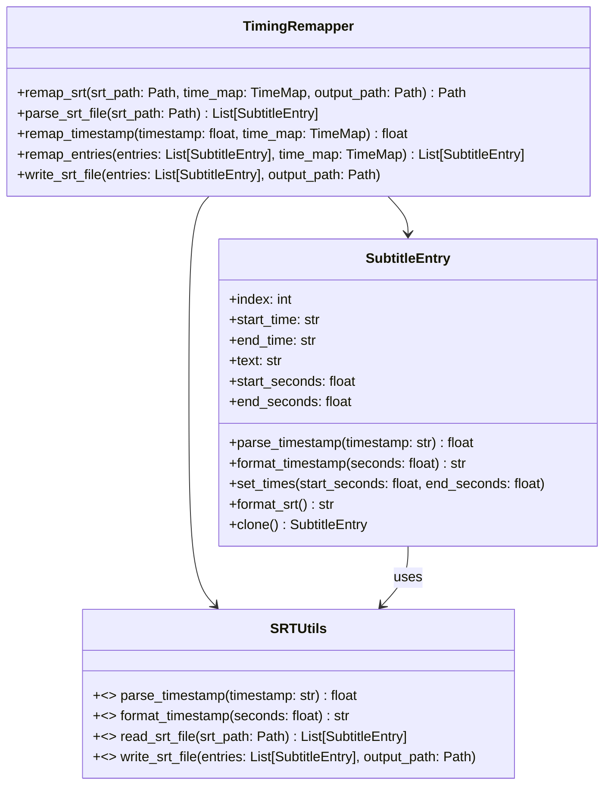

### 4.4 CLI Integration

**Purpose**: Extend existing CLI interface to support the new functionality

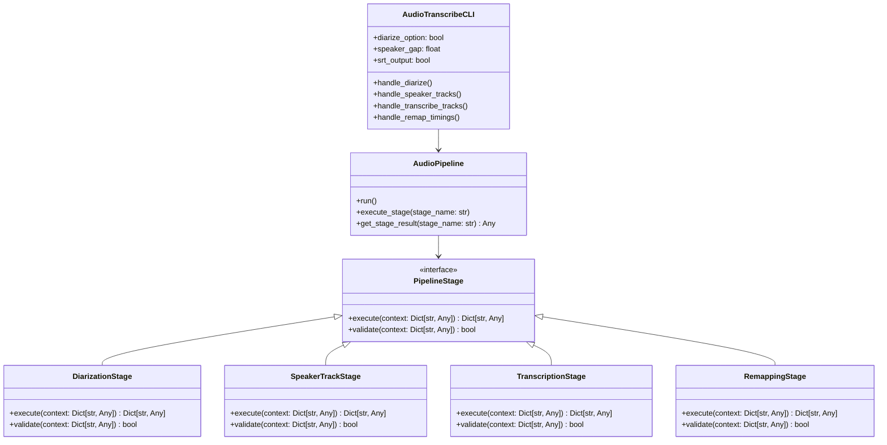

## 5. Algorithm Approaches

### 5.1 Time Mapping Approach

The core time mapping functionality can be broken down into simple steps:

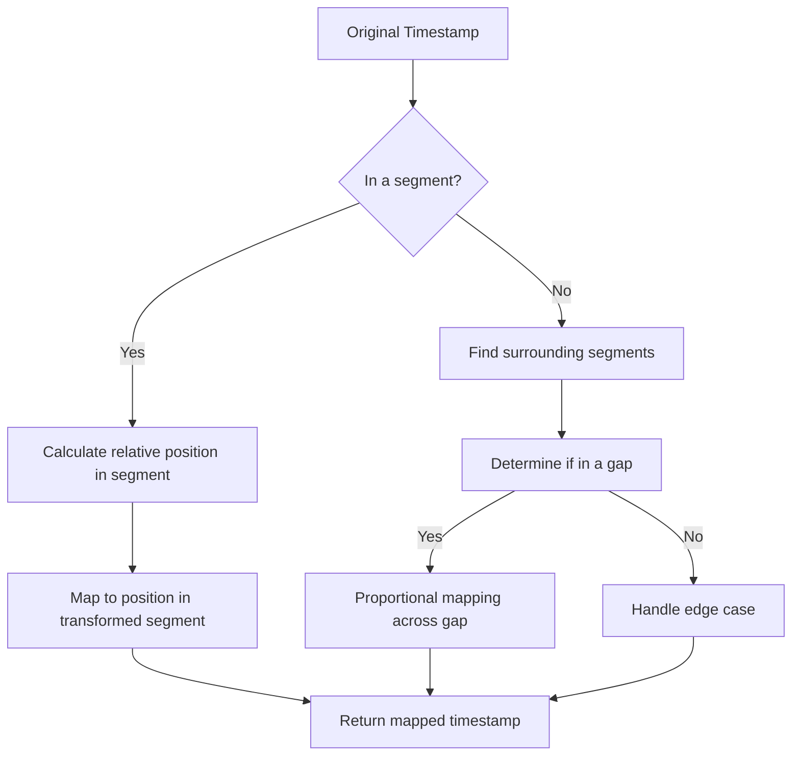

For implementation, each step should be a simple function:

1. Find containing segment for a timestamp
2. Calculate relative position within segment
3. Map timestamp from segment to transformed timeline
4. Handle gap mapping with simple proportional scaling

### 5.2 Audio Consolidation Approach

Audio consolidation can be simplified into these discrete steps:

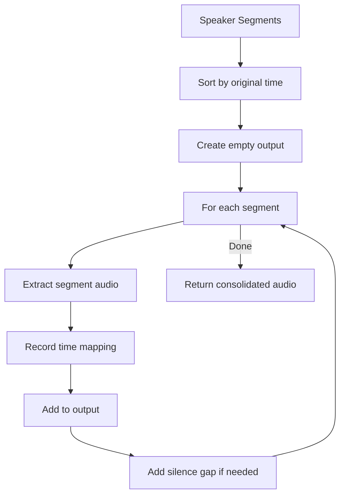

Implementation approach:
1. Extract each segment as a separate function
2. Add segments to output sequentially
3. Track current position for time mapping
4. Insert silence between non-contiguous segments

### 5.3 SRT Remapping Approach

The SRT remapping process follows these simple steps:

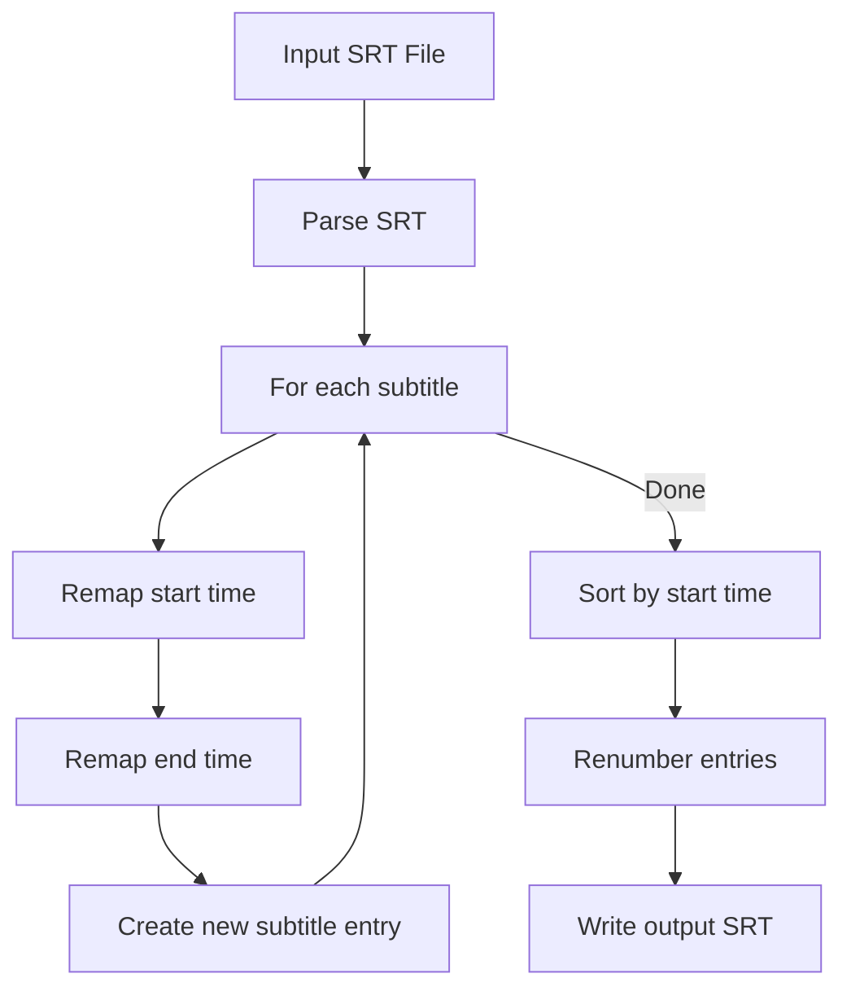

Each step should be implemented as a separate single-purpose function:
1. Parse SRT entries
2. Remap individual timestamps
3. Create new entries with remapped times
4. Sort and renumber entries
5. Write formatted SRT output

## 6. Resource Management

### 6.1 Temporary File Handling

For the prototype phase, a minimalist approach to file management:

1. **Simple Directory Structure**
   - Create timestamped parent directory for each processing run
   - Create subdirectory for each speaker
   - Log all created paths for potential manual cleanup

2. **File Naming Convention**
   - Use consistent prefixes for file types: `speaker_<id>_track.mp3`
   - Include start/end timestamps in filenames
   - Keep critical metadata in filenames for manual inspection

3. **Minimal Cleanup Logic**
   ```python
   # Simple list of temporary files
   temp_files = []
   
   # Register temporary file
   def register_temp_file(file_path):
       temp_files.append(file_path)
       logger.debug(f"Registered temporary file: {file_path}")
   
   # Basic cleanup function - call manually when needed
   def cleanup_temp_files():
       for file_path in temp_files:
           if file_path.exists():
               file_path.unlink()
               logger.debug(f"Removed: {file_path}")
   ```

4. **Development Strategy**
   - In prototype phase, prefer leaving files for inspection
   - Add command-line flag for cleanup (`--clean-temp`) 
   - Document created files for manual cleanup when needed

## 7. Data Structures

### 7.1 TimeMap

The TimeMap structure is crucial for maintaining timing relationships:

```python
class TimeMapInterval:
    """Maps a segment of the original timeline to the transformed timeline."""
    original_start: float  # Start time in original audio (seconds)
    original_end: float    # End time in original audio (seconds)
    transformed_start: float  # Start time in transformed audio (seconds)
    
    @property
    def duration(self) -> float:
        """Duration of the interval (same in both timelines)."""
        return self.original_end - self.original_start
    
    @property
    def transformed_end(self) -> float:
        """End time in the transformed timeline."""
        return self.transformed_start + self.duration
```

```python
class TimeMap:
    """Maps time points between original and transformed timelines."""
    speaker_id: str
    intervals: List[TimeMapInterval]  # Ordered list of intervals
    
    def add_interval(self, original_start: float, original_end: float, 
                    transformed_start: float) -> None:
        """Add a new mapping interval."""
    
    def map_time(self, original_time: float) -> float:
        """Map a time from original timeline to transformed timeline."""
        
    def reverse_map_time(self, transformed_time: float) -> float:
        """Map a time from transformed timeline back to original timeline."""
        
    def export_to_json(self, file_path: Path) -> None:
        """Export the time map to a JSON file."""
        
    @classmethod
    def import_from_json(cls, file_path: Path) -> 'TimeMap':
        """Import a time map from a JSON file."""
```

### 7.2 SpeakerTrack

```python
class SpeakerTrack:
    """Represents a consolidated audio track for a single speaker."""
    speaker_id: str
    segments: List[DiarizationSegment]  # Original segments from diarization
    consolidated_path: Optional[Path]  # Path to consolidated audio file
    time_map: TimeMap  # Mapping between original and transformed timelines
    
    def add_segment(self, segment: DiarizationSegment, transformed_start: float) -> None:
        """Add a segment to the track with its position in the transformed timeline."""
    
    def consolidate_audio(self, original_audio: AudioSegment) -> AudioSegment:
        """Extract and concatenate all segments to create a continuous audio track."""
    
    def save_audio(self, output_dir: Path) -> Path:
        """Save the consolidated audio to a file."""
```

### 7.3 SubtitleEntry

```python
class SubtitleEntry:
    """Represents a single subtitle entry in an SRT file."""
    index: int
    start_time: str  # SRT format time (HH:MM:SS,mmm)
    end_time: str    # SRT format time (HH:MM:SS,mmm)
    text: str
    start_seconds: float  # Time in seconds for calculations
    end_seconds: float    # Time in seconds for calculations
    
    @staticmethod
    def parse_timestamp(timestamp: str) -> float:
        """Convert SRT timestamp to seconds."""
    
    @staticmethod
    def format_timestamp(seconds: float) -> str:
        """Convert seconds to SRT timestamp."""
    
    def set_times(self, start_seconds: float, end_seconds: float) -> None:
        """Set both timestamps from seconds values."""
    
    def format_srt(self) -> str:
        """Format entry as SRT text."""
    
    def clone(self) -> 'SubtitleEntry':
        """Create a copy of this entry."""
```

## 8. Process Flow

### 8.1 Speaker Track Generation

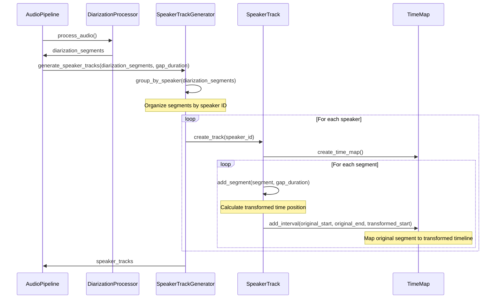

### 8.2 Audio Consolidation and Transcription

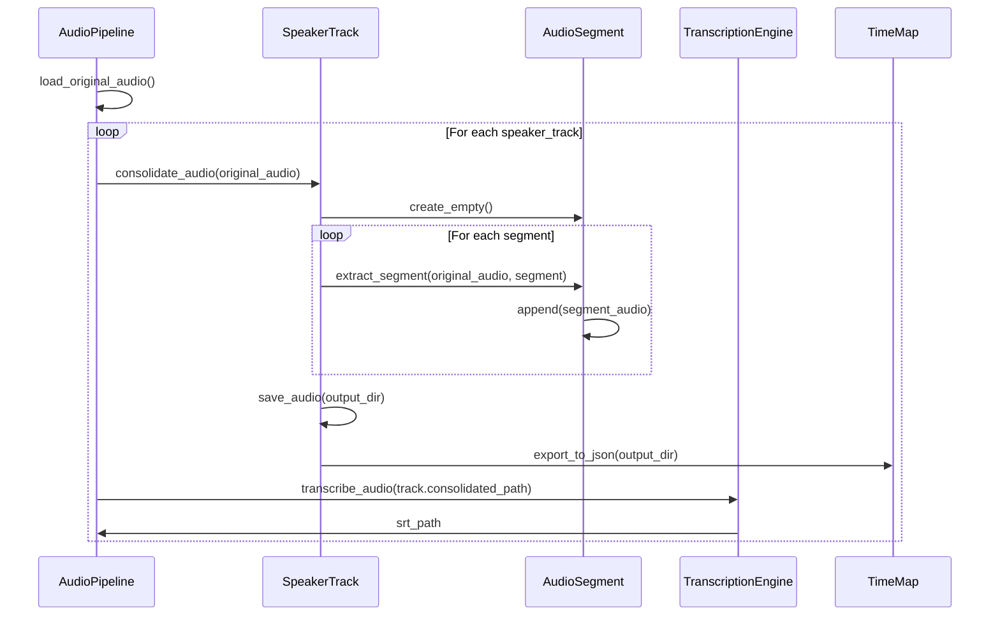

### 8.3 Timing Remapping

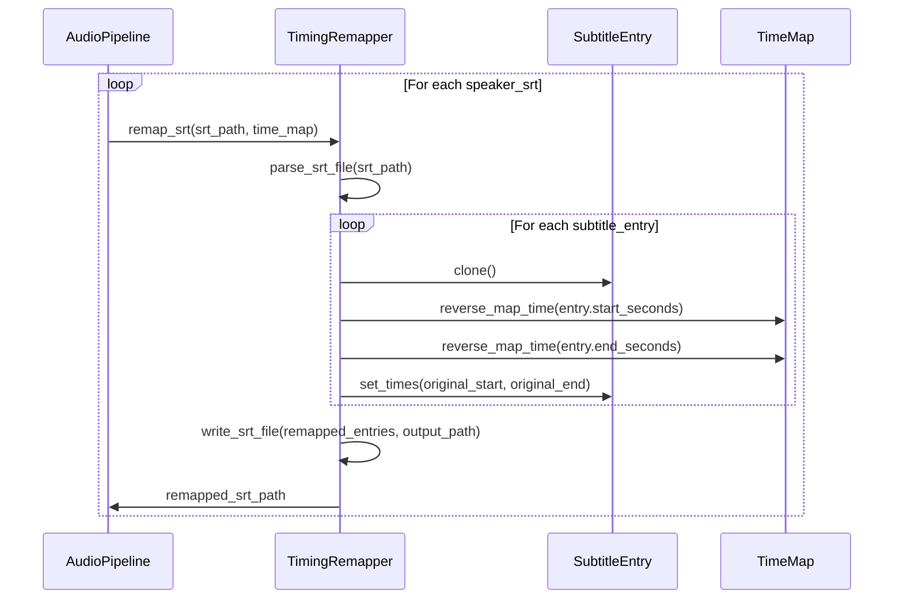

### 8.4 Complete Pipeline Flow

```mermaid
stateDiagram-v2
    [*] --> InitializeContext
    InitializeContext --> LoadAudio
    LoadAudio --> Diarization
    Diarization --> SpeakerSegmentation
    
    SpeakerSegmentation --> TrackGeneration
    TrackGeneration --> AudioConsolidation
    AudioConsolidation --> Transcription
    Transcription --> TimingRemapping
    
    TimingRemapping --> GenerateMasterSRT
    GenerateMasterSRT --> [*]
    
    state TrackGeneration {
        [*] --> GroupBySpeaker
        GroupBySpeaker --> SortSegments
        SortSegments --> BuildTracks
        BuildTracks --> BuildTimeMaps
        BuildTimeMaps --> [*]
    }
    
    state AudioConsolidation {
        [*] --> ProcessSegments
        ProcessSegments --> SaveTracks
        SaveTracks --> [*]
    }
    
    state TimingRemapping {
        [*] --> LoadSRTs
        LoadSRTs --> ParseSRTFiles
        ParseSRTFiles --> RemapTimestamps
        RemapTimestamps --> WriteRemappedSRTs
        WriteRemappedSRTs --> [*]
    }
    
    state GenerateMasterSRT {
        [*] --> MergeSpeakerSRTs
        MergeSpeakerSRTs --> SortByTimestamp
        SortByTimestamp --> FormatOutput
        FormatOutput --> [*]
    }
```

## 9. Integration Strategy

### 9.1 Modular Single-Action Functions

To adhere to the single-action principle, functions in the implementation are designed with the following characteristics:

1. **Focused Responsibility**: Each function has one clear purpose
2. **Limited Side Effects**: Functions minimize state changes
3. **Clear Input/Output Boundaries**: Well-defined parameters and return values
4. **Single Level of Abstraction**: Operations within a function are at the same conceptual level

Examples of single-action functions:

```python
# Time mapping
def map_timestamp(timestamp: float, time_map: TimeMap) -> float:
    """Map a single timestamp from one timeline to another."""
    
# SRT processing
def parse_srt_timestamp(timestamp: str) -> float:
    """Parse SRT timestamp format to seconds."""
    
# Audio processing
def extract_audio_segment(audio: AudioSegment, start: float, end: float) -> AudioSegment:
    """Extract a segment of audio between specified times."""
```

### 9.2 Simplified Core Concepts

The design centers around three key concepts:

1. **SpeakerTrack**: Contains segments for a single speaker throughout the recording
2. **TimeMapInterval**: Maps an interval of time from the original timeline to the transformed timeline
3. **TimeMap**: Collection of intervals that collectively define the complete timeline transformation

This minimalist approach makes the design:
- More intuitive to understand
- Easier to implement and maintain
- Directly mapped to real-world entities

### 9.3 Modifications to Existing Code

1. **DiarizationProcessor**:
   - No changes needed - already produces required data format

2. **audio_transcribe.py**:
   - Extend CLI options for diarization and SRT generation
   - Add pipeline stage for track generation and remapping

3. **Pyannote Client**:
   - No changes needed

## 10. Extensibility for Language Detection

The design supports future language detection with minimal changes:

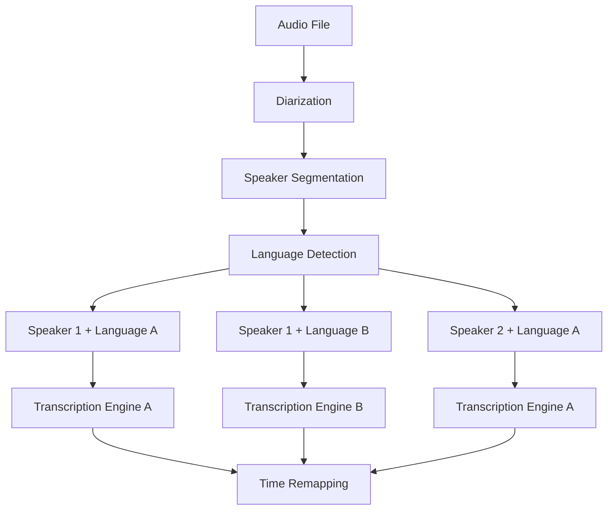

The speaker track abstraction already accommodates this extension through:

1. **Composable Track Generator**:
   - Language detection can be added as a stage between speaker segmentation and track generation
   - Results can feed into extended version of SpeakerTrack

2. **Extended TimeMap Structure**:
   - TimeMap structure can accommodate additional metadata like language
   - Segments can be tagged with language information

3. **Specialized Transcription Engines**:
   - SpeakerTrack can be extended with language information
   - Transcription pipeline can select appropriate engine based on language

## 11. Implementation Plan

1. **Phase 1: Core Infrastructure**
   - Implement TimeMap and related utilities
   - Create SpeakerTrack data structures
   - Build SRT parsing/writing utilities

2. **Phase 2: Audio Processing**
   - Implement track consolidation
   - Add gap insertion logic
   - Build audio segment extraction

3. **Phase 3: Integration**
   - Extend AudioPipeline with new stages
   - Create CLI integration
   - Add configuration options

4. **Phase 4: Testing and Refinement**
   - Test with various speaker patterns
   - Fine-tune timing accuracy
   - Optimize performance

## 12. Configuration Options

The design supports the following configuration options:

1. **Speaker Gap Duration**: Time gap (in seconds) to insert between non-contiguous segments
2. **Minimum Segment Duration**: Threshold for including a speaker segment
3. **Maximum Audio Processing Chunk**: Size limit for audio processing to manage memory usage
4. **Audio Export Format**: Format options for speaker tracks (MP3, WAV, etc.)
5. **SRT Output Options**: Character encoding, line formatting, etc.
6. **Timeline Tolerance**: Precision threshold for timestamp mapping operations

## 13. Future Development Needs

### 13.1 Testing Strategy

A comprehensive testing strategy will need to be developed for the production version. This should include unit tests for core algorithms, integration tests for component interactions, and end-to-end tests with real audio samples. Performance benchmarks and accuracy measurements will be essential for validating the system.

### 13.2 Performance Optimization

While the prototype implementation focuses on correctness, the production version will require performance optimization. This includes memory management for large audio files, potentially implementing streaming processing for segments, and parallelizing independent operations like speaker track processing.

### 13.3 Integration Details

Detailed integration specifications with existing TNH Scholar components will be required. This includes formal API definitions, compatibility requirements, and version management strategies to ensure smooth integration with the broader system.

### 13.4 Validation Metrics

A formal set of validation metrics needs to be established. This should include measures of diarization accuracy (speaker identification precision/recall), timing accuracy (temporal alignment of speech segments), and overall quality metrics for the final output.

## 14. Conclusion

This design provides an elegant and streamlined approach to speaker-specific transcription with accurate time mapping. By focusing on essential concepts and removing unnecessary complexity, the implementation will be both intuitive and maintainable.

The core of the design is the simplified TimeMapInterval concept, which maps sections of the original audio timeline to the transformed timeline with minimal complexity. This approach elegantly handles the complex interleaved speaker patterns common in real conversations.

The system requires minimal changes to existing code while providing a powerful new capability. By adhering to the single-action function principle and applying Occam's razor to remove unnecessary components, this design achieves conceptual clarity without sacrificing functionality.

This streamlined architecture will be easier to implement, test, and extend in the future, providing a solid foundation for enhancements such as language detection.
