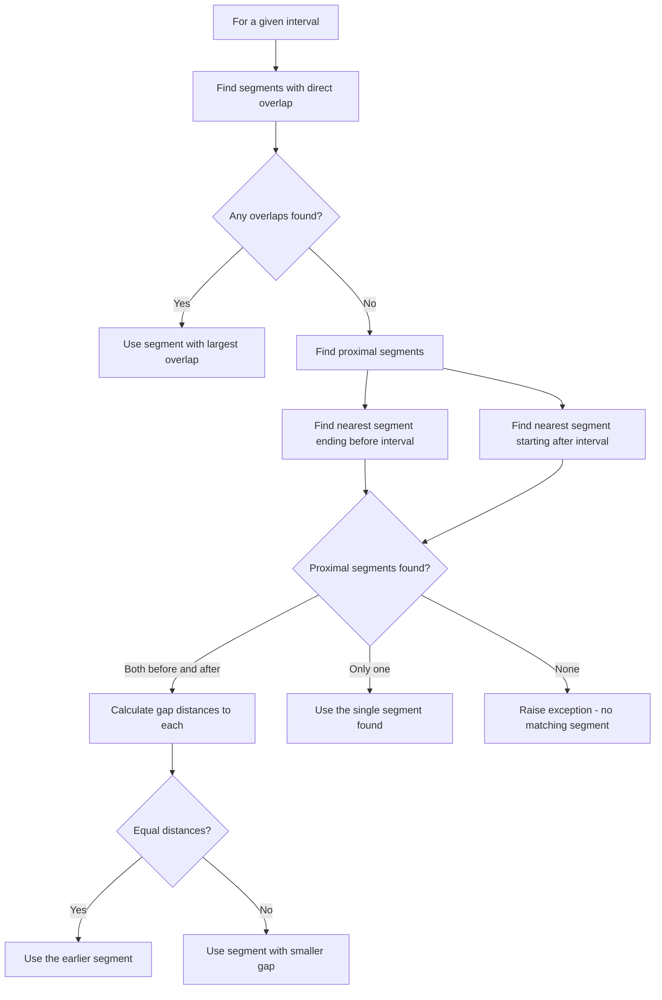
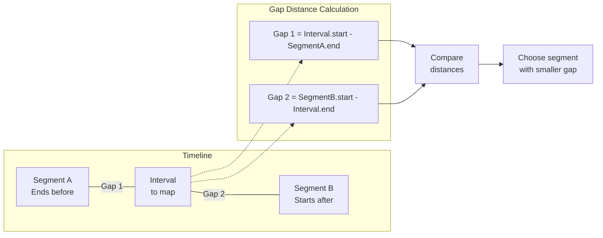
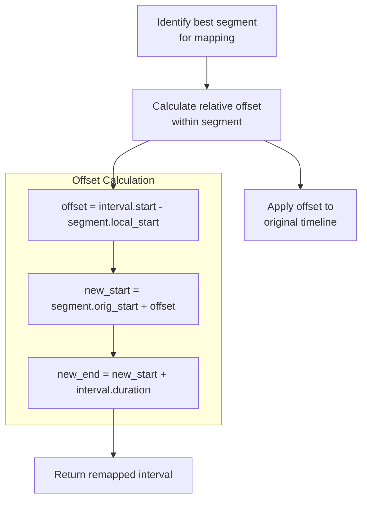

# Interval-to-Segment Mapping Algorithm

## Terminology

- **Interval**: A TimedTextUnit from the TimedText module, representing a unit of text with start and end times in the chunk-relative timeline
- **Segment**: A unit of speech from the diarization process, representing a span of speech in the original audio timeline
- **Mapping**: The process of transforming interval timings from chunk-relative coordinates to original audio coordinates

## Core Algorithm

For each interval in the TimedText object, we need to find the appropriate diarization segment to use for mapping:

1. **First attempt direct overlap matching**:
   - For a given interval, find all diarization segments that directly overlap with it
   - If any overlaps exist, use the segment with the largest overlap
   - Use this segment for timeline mapping

2. **If no overlap found, use proximal segment matching**:
   - Find the nearest segment that ends before the interval starts
   - Find the nearest segment that starts after the interval ends
   - Calculate gap distances to each proximal segment
   - Choose the segment with the smaller gap (or the earlier one if equal)
   - Use this segment for timeline mapping

3. **Apply the mapping transformation**:
   - Once the best segment is identified, apply a timeline shift:
     - Calculate the offset of the interval start relative to segment's local start
     - Add this offset to the segment's original start time
     - Apply the same transformation to the interval's end time

## Finding Best Segment Flowchart

## Gap Distance Calculation

For intervals with no direct overlap, we calculate gap distances to determine the closest segment:

## Mapping Transformation

Once the best segment is identified, the mapping applies a timing transformation:

## Modular Algorithm Components

To ensure flexibility and maintainability, the algorithm is divided into these modular components:

1. **Overlap Calculation**:
   - Calculate overlap between an interval and a segment
   - Return overlap amount in milliseconds (0 if no overlap)

2. **Best Overlap Finding**:
   - For a given interval, find segment with maximum overlap
   - Return best segment or null if no overlap

3. **Proximal Segment Finding**:
   - Find nearest segment ending before interval starts
   - Find nearest segment starting after interval ends
   - Return tuple of (before_segment, after_segment)

4. **Gap Distance Calculation**:
   - For a segment that doesn't overlap with the interval
   - Calculate the gap distance between them
   - Return distance in milliseconds

5. **Proximal Segment Selection**:
   - Given before and after segments, calculate distances
   - Choose segment with smaller distance (or earlier if equal)
   - Return selected segment

6. **Mapping Application**:
   - Apply the timeline mapping transformation
   - Create new interval with adjusted timestamps

## Edge Cases

1. **No segments available**: If the diarization chunk contains no segments at all, we cannot perform mapping and must raise an exception.

2. **No overlapping or proximal segments**: This should not occur if there is at least one segment, as each interval will be a either overlap with or be before or after this segment, guaranteeing that there is at least one segment that will be selected. This logic is fairly complex but it can be proven to be the case.

3. **Equal gap distances**: If the gap distance to the segment before equals the gap distance to the segment after, prefer the earlier segment for consistent behavior.

4. **Zero-duration intervals or segments**: These should be handled carefully to avoid division-by-zero errors in calculations. for any interval or segment with zero duration, this implies start==end. Therefore we can do a preprocessing step which searches for zero duration intervals/segments and maps the end time to be +1 of the start time. This 1 millisecond accuracy loss will generally not be consequential, but the algorithm should be clear in stating its operation in this regard.

## Complete Algorithm

1. **Find best segment for mapping**
   - For a given interval:
     - Find all segments with direct overlap
     - If one or more exists, select the one with maximum overlap
     - If none, find proximal segments (before and after)
     - Choose best proximal segment based on gap distance

2. **If no matching segment found**
   - Raise an exception - every interval must map to a segment
   - This indicates no diarization segments. In fact we can raise an error on method entry if there are no segments.

3. **Apply mapping transformation**
   - Calculate offset = interval.start_ms - segment.local_start
   - new_start_ms = segment.orig_start + offset
   - new_end_ms = new_start_ms + (interval.end_ms - interval.start_ms)
   - Create new interval with transformed timestamps

By maintaining this modular approach, the algorithm can be optimized or modified in specific areas (e.g., implementing bisection search for large segment collections) without affecting the overall logic flow.
