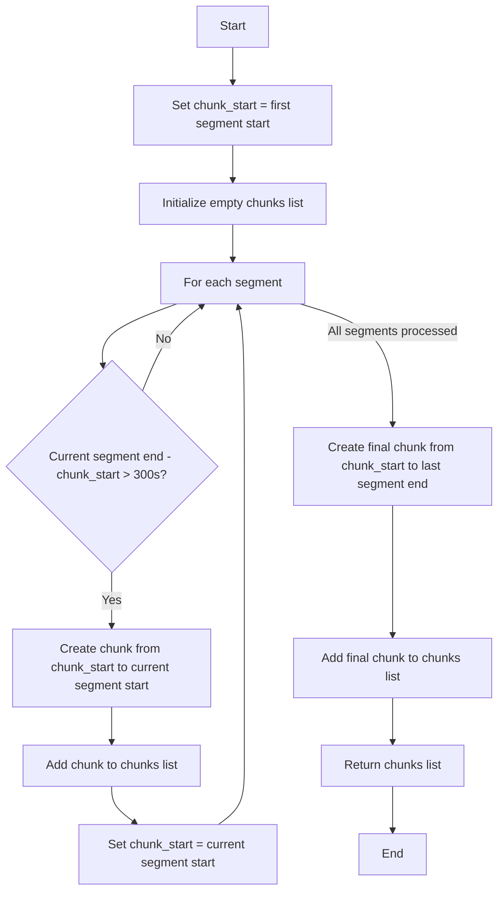
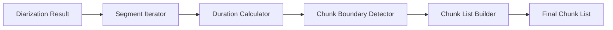

# Audio Chunking Algorithm Design Document

## Problem Statement

We need to split an audio file into approximately 5-minute chunks, using speaker diarization results to determine the split points. The algorithm should:

1. Use segment boundaries as potential split points
2. Create chunks that are each greater than 5 minutes in duration
3. Use a simple greedy approach to accumulate segments until reaching the target duration

## Input Data Structure

The input is a list of diarization segments, where each segment contains:
- `speaker`: Speaker identifier (e.g., "SPEAKER_00")
- `start`: Start time in seconds
- `end`: End time in seconds

Example:
```
{
  'diarization': [
    {'speaker': 'SPEAKER_00', 'start': 93.745, 'end': 94.525},
    {'speaker': 'SPEAKER_00', 'start': 95.645, 'end': 97.765},
    ...
  ]
}
```

## Algorithm Description

### High-Level Approach

1. **Set up initial state**:
   - Start with the first segment
   - Initialize first chunk starting point
   - Initialize empty list to store chunk boundaries

2. **Greedy Segment Accumulation**:
   - Accumulate segments sequentially
   - Track total accumulated duration
   - When accumulated duration exceeds 5 minutes, create a chunk boundary
   - Continue process until all segments are processed

### Detailed Steps

1. **Initialization**:
   - Set current chunk start time to the start of the first segment
   - Initialize empty list to store chunks
   - Initialize empty list to store segments for current chunk

2. **Chunking Process**:
   - Iterate through segments in order
   - For each segment:
     - Calculate accumulated running time (current segment end - chunk start time)
     - Add current segment to current chunk segments list
     - If accumulated running time > 5 minutes (300 seconds):
       - Create a chunk containing all accumulated segments
       - Record chunk boundary times (start time of first segment to end time of last segment)
       - Add chunk to chunks list
       - Reset current chunk segments list
       - Update chunk start time to current segment end time
     - Continue to next segment

3. **Finalizing**:
   - Add final chunk containing any remaining segments
   - If final chunk is empty, do nothing

## Flowchart



## Data Flow



## Data Structures

### Input
```
DiarizationResult {
    diarization: Array<Segment>
}

Segment {
    speaker: String
    start: Float
    end: Float
}
```

### Working Data
```
ChunkBoundary {
    start_time: Float
    end_time: Float
    segments: Array<Segment>
}
```

### Output
```
ChunkList {
    chunks: Array<ChunkBoundary>
}
```

## Special Considerations

1. **Edge Cases**:
   - **Short Audio**: If the total audio duration is less than 5 minutes, create a single chunk
   - **Long Single Segment**: If a single segment spans more than 5 minutes, use its boundaries
   - **Silent Gaps**: Long silent gaps between segments are simply part of the running time calculation, not special cases

2. **Performance Considerations**:
   - The algorithm has O(n) time complexity where n is the number of segments
   - Memory usage is O(n) where n is the number of segments (each segment is stored in exactly one chunk)

## Addendum: Discussion of Data Structures

[I proposed using pydantic classes for later easier integration into tnh-scholar system]

You've raised an excellent point about balancing simplicity in prototyping with long-term code sustainability. I appreciate your perspective that investing in properly structured data models early can pay dividends later.

Here are some reflections on using Pydantic models for this implementation:

### Benefits of Using Pydantic from the Start

1. **Integration with Existing Code**: If the rest of the TNH Scholar project already uses Pydantic models, maintaining that consistency would make this component more naturally integrate with the existing ecosystem.

2. **Future-Proofing**: Starting with Pydantic models means less refactoring when moving from prototype to production. The validation logic would already be in place.

3. **Self-Documenting**: Pydantic models serve as both data structures and documentation of the expected data shape, making the code more maintainable.

4. **Validation Logic**: Automatic validation catches errors early, which can save debugging time even in the prototype phase.

5. **JSON Serialization**: If these chunks need to be stored or transmitted (which seems likely), Pydantic's serialization capabilities are immediately useful.

### Additional Considerations

1. **Model Hierarchy**: We could create a hierarchy where the diarization models extend or relate to other audio processing models in the system.

2. **Computed Properties**: Things like "duration" can be added as computed properties, reducing duplicated logic throughout the codebase.

3. **Type Safety**: The typing benefits apply throughout the development lifecycle - IDEs can provide better assistance during both prototyping and production.

4. **Schema Evolution**: If the diarization format changes in the future, Pydantic makes it easier to handle backward compatibility with validators.

5. **Standardization**: It encourages standardized access patterns across different parts of the system.

### My Revised Opinion

Given these considerations, I agree that using Pydantic models from the beginning makes sense, especially if:

1. Other parts of TNH Scholar use this pattern
2. The implementation will likely move to production
3. The data structures might be reused elsewhere

The cost of setting up these models is fairly low (a few extra lines of code), especially compared to the benefits of consistency, validation, and integration with the rest of the system.

If the TNH Scholar codebase is consistently moving toward Pydantic models, then implementing them here maintains that design direction and will make future maintenance and integration simpler.

### Proposed Data Structures

```python
class Segment(BaseModel):
    speaker: str
    start: float
    end: float

class Chunk(BaseModel):
    start_time: float
    end_time: float
    segments: List[Segment]
    
    @property
    def duration(self) -> float:
        return self.end_time - self.start_time

class ChunkResult(BaseModel):
    chunks: List[Chunk]
```

## Next Steps

As for next steps, I would propose:

1. **Define the Pydantic Models** - Create proper models for Segment, Chunk, and ChunkResult with appropriate validation and computed properties

2. **Implement the Core Algorithm** - Write the chunking function using the models we've defined, following our agreed approach

3. **Add Simple Test Cases** - Create tests with various patterns of segments (including edge cases like very long segments, short audio, long silent gaps)

4. **Create a Visualization** - Build a simple visualization showing the original segments and how they've been grouped into chunks, which would help verify the algorithm's behavior

5. **Integration Design** - Sketch how this would integrate with the existing audio processing pipeline in TNH Scholar

Would you like to proceed with implementing the Pydantic models and algorithm, or should we further refine any aspects of the design?
