# Core Pattern Architecture: Meta-patterns, Textual Expansion Processing

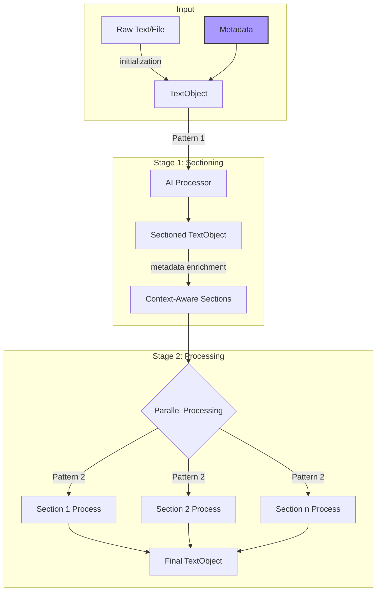

This captures your basic flow, but let's riff on some interesting dimensions:

1. **Information Flow Architecture**

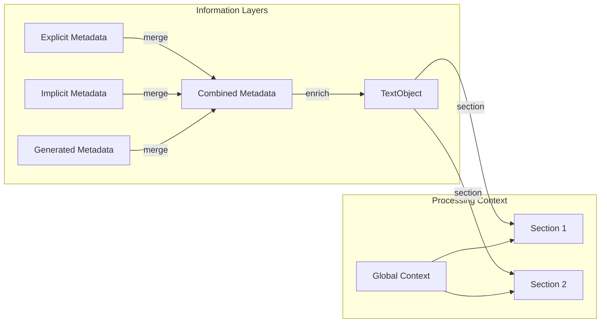

2. **Pattern-Process Relationship**

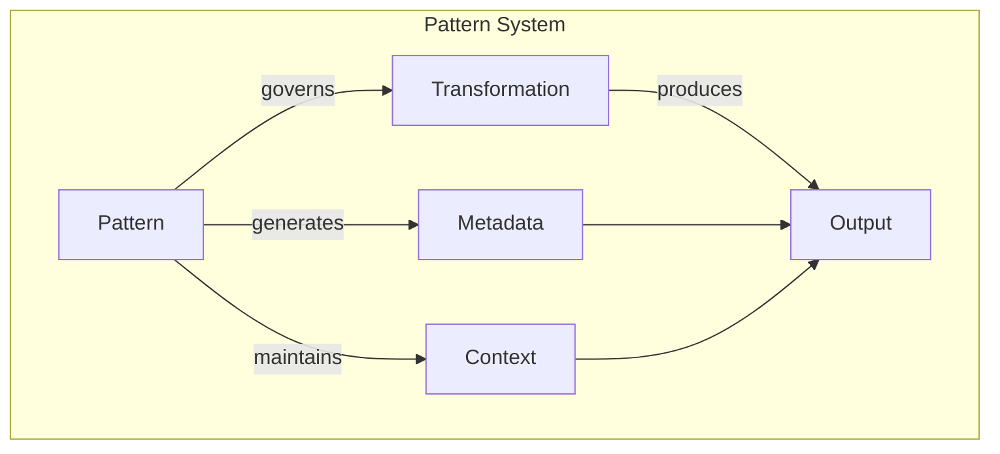

Some interesting conceptual dimensions to explore:

1. **Metadata Evolution**

- Metadata as a living entity that grows/evolves through processing
- Metadata inheritance between processing stages
- Context preservation through metadata

2. **Pattern Flexibility**

- Patterns as declarative transformations
- Pattern composition and chaining
- Pattern-specific metadata requirements

3. **Context Management**

- Bidirectional context flow (section ↔ whole)
- Context preservation through transformations
- Dynamic context generation

4. **Processing Granularity**

- Optimal chunk size determination
- Context window optimization
- Processing boundary detection

This framework suggests some interesting possibilities:

1. **Recursive Processing**

- Sections could themselves be further sectioned
- Processing patterns could be hierarchical
- Context could flow up and down the hierarchy

2. **Parallel Processing Potential**

- Section processing could be parallelized
- Metadata could be processed independently
- Context could be shared across parallel processes

3. **Flexible Pattern Application**

- Patterns could be conditionally applied
- Pattern selection could be dynamic
- Pattern composition could be automated

---

## meta-pattern concept

This gets into almost self-reflective territory, where patterns could help generate or evolve other patterns. Let me visualize this idea:

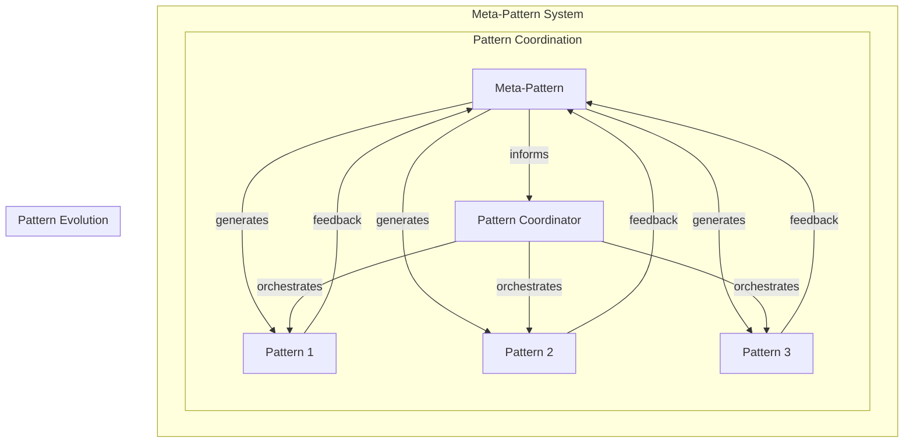

And here's an interesting view of how meta-patterns could coordinate complex transformations:

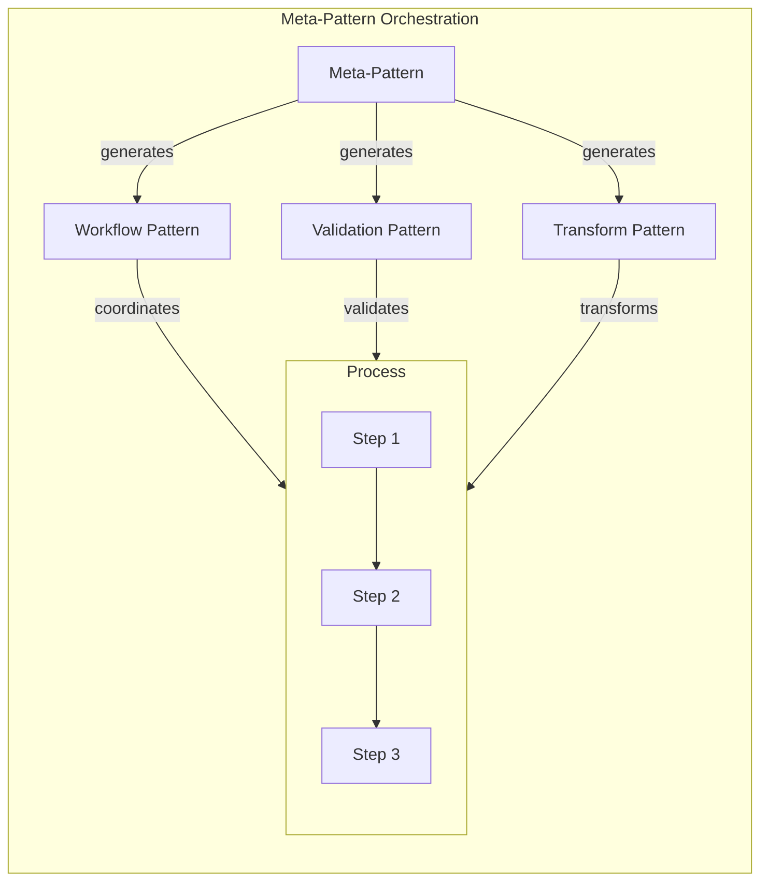

This opens up some fascinating possibilities:

1. **Pattern Generation**

- Meta-patterns that create specialized patterns based on content type
- Dynamic pattern adaptation based on processing results
- Pattern evolution through feedback loops

2. **Pattern Orchestration**

- High-level patterns that coordinate pattern application
- Context-aware pattern selection
- Pattern composition and decomposition

3. **Pattern Learning**

- Meta-patterns that learn from pattern effectiveness
- Pattern optimization through usage analytics
- Pattern adaptation to content characteristics

4. **Pattern Ecosystems**

- Interrelated patterns that work together
- Pattern dependencies and relationships
- Pattern conflict resolution

This could lead to some really interesting capabilities:

1. **Self-Improving Systems**

- Patterns that evolve based on results
- Meta-patterns that optimize pattern generation
- Learning systems for pattern effectiveness

2. **Content-Adaptive Processing**

- Dynamic pattern generation based on content
- Adaptive processing strategies
- Context-sensitive pattern application

3. **Pattern Intelligence**

- Smart pattern selection
- Pattern effectiveness analysis
- Pattern optimization strategies

---

## Ecosystem Perspective

Let me explore this ecosystem perspective with a focus on evolution and parallelism. Here's a visualization of these interacting systems:

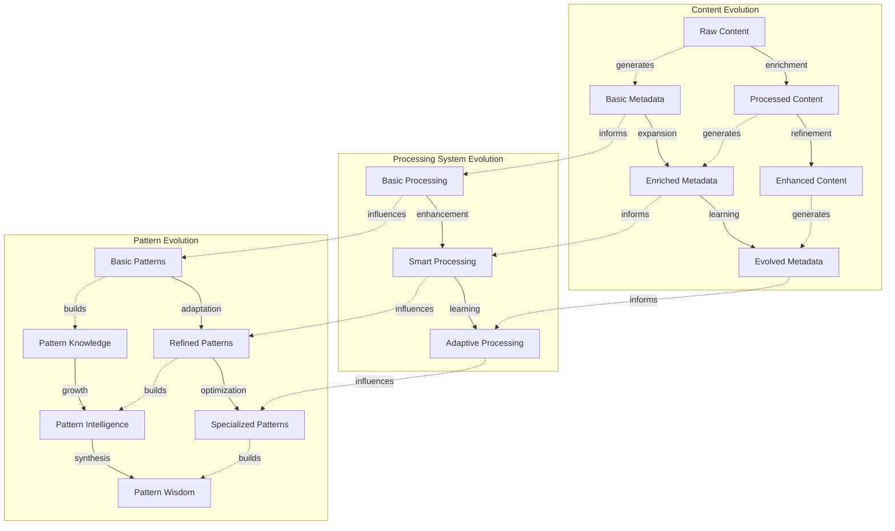

Key insights about each component:

**Content + Metadata Evolution**

- Content is never just content - it's always paired with metadata
- Metadata grows richer through processing
- New metadata can reveal new content relationships
- Content understanding deepens through metadata evolution
- Metadata becomes a form of institutional memory

**Pattern Evolution**

- Patterns learn from their application
- Pattern effectiveness creates feedback loops
- Patterns develop specializations
- Patterns can merge or split based on usage
- Pattern relationships form naturally

**Processing System Evolution**

- Processing systems adapt to content characteristics
- They learn optimal pattern applications
- They develop content-specific strategies
- They build processing intelligence
- They optimize resource usage

The fascinating thing is how these systems interact:

1. **Content influences Patterns**

- New content types inspire new patterns
- Content complexity drives pattern evolution
- Content relationships suggest pattern relationships

2. **Patterns influence Processing**

- Pattern effectiveness guides processing strategies
- Pattern relationships inform processing flow
- Pattern evolution drives processing adaptation

3. **Processing influences Content**

- Processing reveals content relationships
- Processing generates new metadata
- Processing deepens content understanding

This ecosystem view suggests some important principles:

1. **Organic Growth**

- Systems evolve naturally through use
- Relationships form based on effectiveness
- Evolution follows actual needs

2. **Interdependence**

- Each system supports the others
- Changes ripple through the ecosystem
- Balance maintains system health

3. **Emergent Intelligence**

- System wisdom emerges from interaction
- Learning happens at multiple levels
- Intelligence is distributed

---

## Architectural implications

Let me reflect on these ideas through a different lens, focusing on pattern roles and architectural implications.

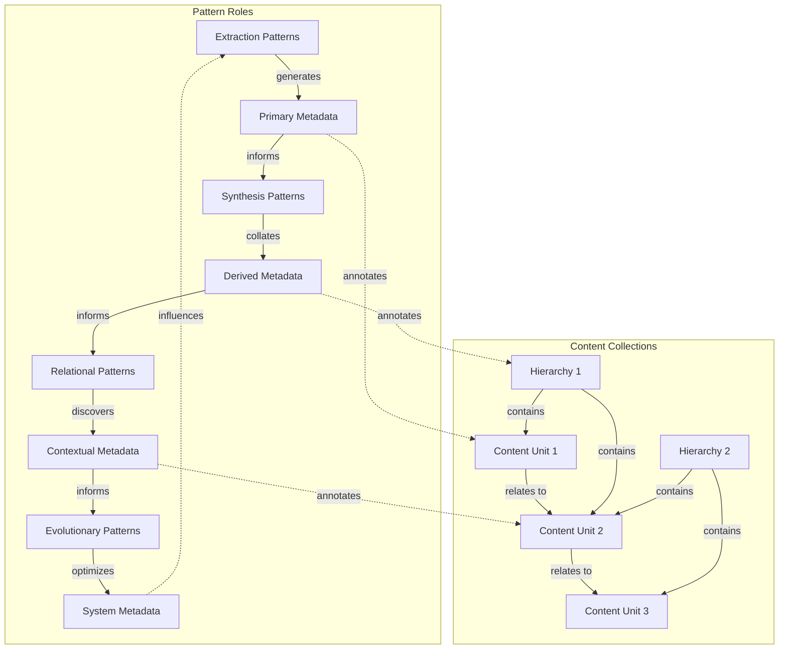

Key insights about pattern roles:

1. **Information Generation Patterns**

- Extract implicit information
- Generate new metadata layers
- Create derivative content
- Identify relationships

2. **Synthesis Patterns**

- Collate related metadata
- Combine information across sources
- Generate higher-level insights
- Create metadata hierarchies

3. **Relationship Patterns**

- Discover content connections
- Map information networks
- Build context webs
- Track information flow

Architectural considerations for prototyping:

1. **Flexible Data Structures**

```python
class ContentNode:
    """Represents a unit of content with associated metadata"""
    content: Any
    metadata: Dict[str, MetadataLayer]
    relationships: List[Relationship]
    
class MetadataLayer:
    """A specific layer/type of metadata"""
    type: str
    data: Dict[str, Any]
    source_pattern: str
    timestamp: datetime
    
class Relationship:
    """Represents a connection between content units"""
    type: str
    target: ContentNode
    metadata: MetadataLayer
```

2. **Pattern Interface Evolution**

```python
class Pattern(ABC):
    """Base pattern interface that can evolve"""
    @abstractmethod
    def apply(self, context: ProcessingContext) -> ProcessingResult:
        pass
    
    def generate_metadata(self) -> MetadataLayer:
        """Patterns can generate their own metadata"""
        pass
    
    def learn(self, result: ProcessingResult):
        """Patterns can learn from their application"""
        pass
```

3. **Dynamic Processing System**

```python
class ProcessingSystem:
    """Evolving processing system"""
    patterns: Dict[str, Pattern]
    context_manager: ContextManager
    metadata_store: MetadataStore
    
    def select_pattern(self, task: Task) -> Pattern:
        """Dynamic pattern selection"""
        pass
    
    def learn_from_processing(self, result: ProcessingResult):
        """System-level learning"""
        pass
```

Key architectural principles for prototyping:

1. **Loose Coupling**

- Content and metadata separation
- Pattern independence
- Flexible relationships

2. **Extensible Foundations**

- Abstract base classes
- Plugin architecture
- Interface evolution

3. **Learning Support**

- Feedback mechanisms
- Pattern adaptation
- System evolution

4. **Information Flow**

- Metadata propagation
- Relationship tracking
- Context preservation

Prototyping priorities:

1. **Core Framework**

- Basic content/metadata structure
- Simple pattern interface
- Essential processing system

2. **Pattern Foundation**

- Basic pattern types
- Pattern execution
- Metadata generation

3. **Relationship Handling**

- Content connections
- Metadata relationships
- Context management

This suggests an iterative development approach:

1. Start with simple content + metadata structures
2. Add basic pattern execution
3. Introduce relationship handling
4. Develop metadata synthesis
5. Add learning mechanisms
6. Evolve pattern roles

## Toward a detailed understanding of Sectioning

Let me try to untangle and visualize this specific domain of sectioning, focusing on the key relationships.

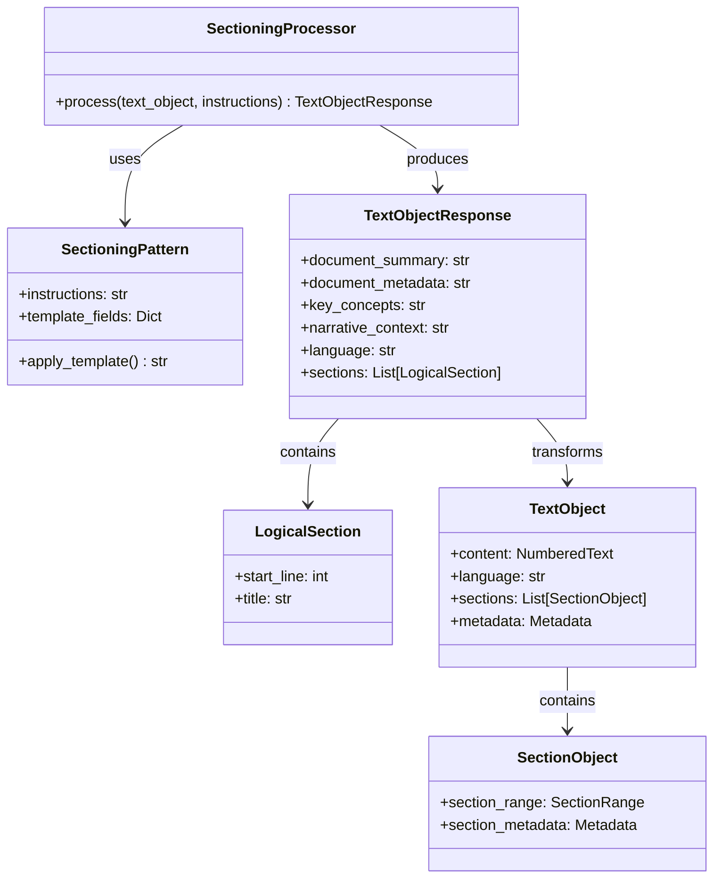

Key insights about the relationships:

1. **Pattern-Processor Coupling**

- Pattern must produce instructions that processor understands
- Processor must interpret pattern output correctly
- Both must align with AI model capabilities
- Both must understand response format

2. **Information Flow**

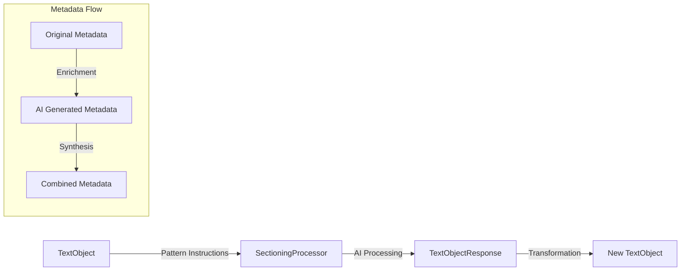

3. **Dependencies**

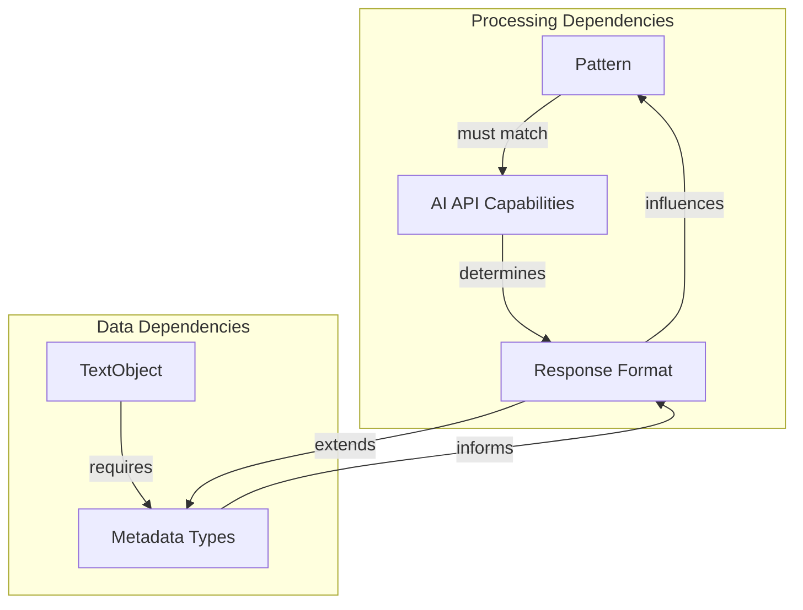

Let's break down some key considerations:

1. **Pattern-Processor Relationship**

- Pattern defines "what" to do
- Processor handles "how" to do it
- Both must understand the same "language"
- Both must work within API constraints

2. **Response Format Role**

- Bridges pattern and processor
- Defines metadata structure
- Captures sectioning logic
- Preserves original context

3. **Metadata Evolution**

- Original metadata informs sectioning
- Sectioning generates new metadata
- Response format structures metadata
- TextObject combines metadata layers

Some architectural implications:

1. **Decoupling Opportunities**

```python
class SectioningStrategy(ABC):
    """Abstraction of sectioning logic"""
    @abstractmethod
    def create_sections(
        self, 
        content: str, 
        metadata: Metadata
    ) -> List[Section]:
        pass

class AIBasedSectioning(SectioningStrategy):
    """Implementation using AI"""
    def __init__(self, pattern: Pattern, processor: Processor):
        self.pattern = pattern
        self.processor = processor
```

2. **Metadata Management**

```python
class MetadataTransformer:
    """Handles metadata evolution through processing"""
    def combine_metadata(
        self,
        original: Metadata,
        generated: AIGeneratedMetadata
    ) -> EnrichedMetadata:
        pass
```

3. **Response Handling**

```python
class ResponseTransformer:
    """Transforms AI response into system objects"""
    def transform_response(
        self,
        response: TextObjectResponse,
        original: TextObject
    ) -> TextObject:
        pass
```

Some potential clarifying principles:

1. **Separation of Concerns**

- Pattern defines sectioning criteria
- Processor handles AI interaction
- Response format defines structure
- TextObject manages content/metadata

2. **Information Flow**

- Clear transformation path
- Metadata preservation
- Context maintenance
- Structure evolution

3. **Flexibility Points**

- Pattern variation
- Processor implementation
- Response format extension
- Metadata enrichment

## Meta-patterns for AIResponse generation?

This is a fascinating direction - using meta-patterns to generate the response models. Let me explore this relationship between patterns and response formats.

Let's start with the minimal requirements for an AIResponse:

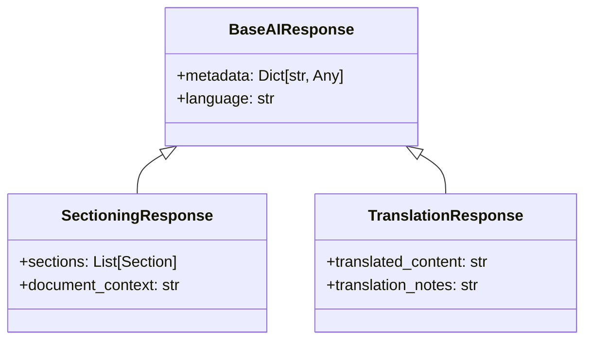

The interesting challenge is deriving these models from patterns. A sectioning pattern might look like:

```python
class SectioningMetaPattern:
    """Generates both instruction pattern and response model"""
    
    def analyze_pattern(self, pattern_text: str) -> Dict[str, str]:
        """Extract expected response fields from pattern instructions"""
        # Pattern parsing logic to identify:
        # - Required fields
        # - Field types
        # - Field descriptions
        pass
    
    def generate_response_model(self, fields: Dict[str, str]) -> Type[BaseModel]:
        """Create Pydantic model from analyzed fields"""
        model_fields = {
            name: (str, Field(..., description=desc))
            for name, desc in fields.items()
        }
        
        return create_model(
            'DynamicResponse',
            **model_fields,
            __base__=BaseAIResponse
        )
```

The processor could be adapted to handle dynamic response types:

```python
class FlexibleProcessor:
    """Processor that adapts to different response models"""
    
    def process_with_response(
        self,
        text: str,
        pattern: Pattern,
        response_model: Type[BaseModel]
    ) -> BaseAIResponse:
        """Process text using pattern and specified response model"""
        # Generate instructions from pattern
        instructions = pattern.apply_template()
        
        # Process with OpenAI using dynamic response type
        return openai_process_text(
            text,
            instructions,
            response_format=response_model
        )

    def validate_pattern_response_compatibility(
        self,
        pattern: Pattern,
        response_model: Type[BaseModel]
    ) -> bool:
        """Verify pattern outputs match response model requirements"""
        # Validation logic
        pass
```

Some key considerations:

1. **Pattern Analysis**

- Patterns need clear markers for expected outputs
- Pattern language needs to indicate field types
- Pattern instructions must align with response fields

2. **Response Model Requirements**

- Must extend BaseAIResponse
- Must handle validation
- Must support transformation to TextObject
- Must preserve essential metadata

3. **Processor Flexibility**

- Must validate pattern-response compatibility
- Must handle dynamic response types
- Must ensure consistent TextObject transformation

Would you like me to explore any of these aspects in more detail? For example, we could look at:

- Pattern markup for response generation
- Response model validation requirements
- Processor adaptation strategies