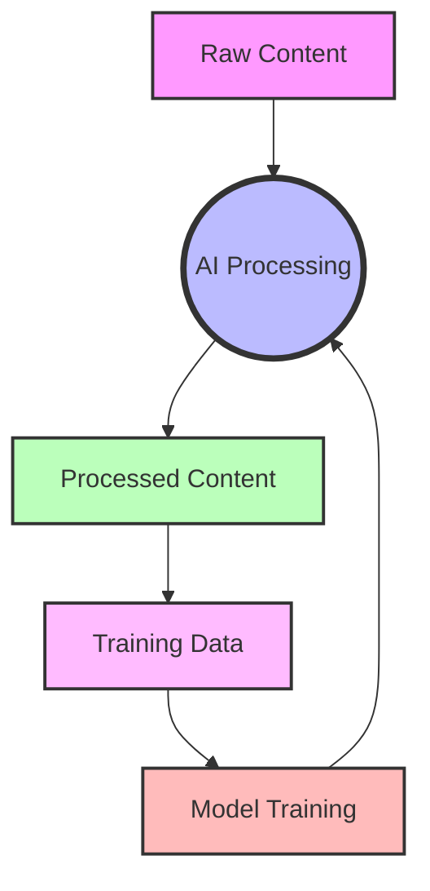

# TNH Scholar System Design

High-level system design describing the cyclical AI processing architecture powering TNH Scholar.

> **Terminology Note**: This document uses historical "Pattern" terminology. In current TNH Scholar documentation, "Pattern" has been replaced with "Prompt" to align with industry standards. See [ADR-DD03](../architecture/docs-system/adr/adr-dd03-pattern-prompt-terminology.md) for details.
>
> When reading this document: "Pattern-based processing" → "Prompt-based processing"

## 1. Overview and Vision

TNH Scholar is an AI-enhanced content processing and transformation system designed to work with dharma materials. The system is distinguished by its cyclical learning architecture, where processing outputs can be used to generate training data for model improvement, creating a self-enhancing feedback loop.

### 1.1 Core Design Philosophy

The system embraces several key philosophical principles:

- Evolutionary improvement through self-generated training data
- Modular design enabling flexible pipeline construction
- Balance of rapid prototyping with extensible architecture
- Focus on AI-enhanced content processing and transformation

### 1.2 System Objectives

Primary objectives of the system include:

- Transform multilingual content across various formats and mediums
- Generate high-quality training data from processing operations
- Enable continuous improvement of AI processing capabilities
- Support flexible pipeline construction for varied content workflows

## 2. System Architecture

### 2.1 Core Components

The system is built around four primary subsystems that form a cyclical processing chain:

#### 1. Content Acquisition System

- Source content ingestion from various platforms
- Metadata extraction and standardization
- Initial content preparation and validation

#### 2. Processing System

- AI-enhanced content transformation
- Pattern-based processing workflows
- Metadata enrichment and validation

#### 3. Training Data Generation

- Automated extraction of training pairs
- Quality assessment of generated data
- Training data storage and management

#### 4. Model Enhancement

- Training data integration
- Model fine-tuning and validation
- Processing capability improvement

### 2.2 Processing Flow

The system (can) operate in a cyclical pattern. This diagram shows the flow of content through the system:

```plaintext
Content → AI Processing → Processed Content → Training Data → Model Training
    ↑                                                                  ↓
    └──────────────────── Enhanced Processing ◄────────────────────────┘
```



This cycle enables:

- Continuous system improvement
- Accumulation of specialized training data
- Evolution of processing capabilities

## 3. Core Principles

### 3.1 Modularity

Every system component should be:

- Independently deployable
- Clearly scoped in functionality
- Accessible through well-defined interfaces
- Composable into larger processing chains

### 3.2 Extensibility

The system supports extension through:

- Abstract interfaces for core components
- Plugin architecture for new processors
- Configurable processing pipelines
- Standardized metadata handling

### 3.3 Simplicity

Development prioritizes:

- Clear, focused component responsibilities
- Minimal dependencies between modules
- Straightforward pipeline construction
- Rapid prototyping capabilities

## 4. Component Framework

### 4.1 Base Interfaces

Core system interfaces define standard operations:

```python
class ContentProcessor(ABC):
    """Base interface for content processing operations."""
    
    @abstractmethod
    def process(self, content: RawContent) -> ProcessedContent:
        """Transform input content using current processing capability."""
        pass
    
    @abstractmethod
    def generate_training_data(
        self, 
        raw: RawContent, 
        processed: ProcessedContent
    ) -> TrainingData:
        """Extract training data from processing results."""
        pass
```

### 4.2 Pipeline Architecture

Pipelines compose processors into workflows:

```python
class ProcessingPipeline:
    """Orchestrates content processing workflow."""
    
    def __init__(
        self,
        processors: List[ContentProcessor],
        training_collector: Optional[TrainingCollector] = None
    ):
        self.processors = processors
        self.collector = training_collector
    
    def execute(
        self, 
        source: ContentSource
    ) -> Tuple[ProcessedContent, Optional[TrainingData]]:
        """Execute pipeline with optional training data collection."""
        pass
```

## 5. Implementation Guidelines

### 5.1 Development Phases

Development follows a staged approach:

Phase 1: Rapid Prototyping

- Focus on core functionality
- Minimal error handling
- Basic logging
- Proof of concept implementations

Phase 2: Stabilization

- Enhanced error handling
- Comprehensive logging
- Performance optimization
- Testing infrastructure

Phase 3: Production Hardening

- Full error recovery
- Performance monitoring
- Production logging
- Deployment automation

### 5.2 Code Standards

Code development prioritizes:

- Strong typing
- Clear documentation
- Consistent naming
- Modular design

### 5.3 Testing Strategy

Testing emphasis varies by phase:

- Prototyping: Basic functionality validation
- Stabilization: Comprehensive unit testing
- Production: Full test coverage and integration testing

## 6. Current State and Future Directions

### 6.1 Implemented Components

Current system includes:

- YouTube content acquisition
- Audio transcription processing
- Pattern-based text processing
- Basic pipeline orchestration

### 6.2 Planned Enhancements

Near-term priorities:

- Enhanced metadata handling
- Improved pipeline composition
- Training data collection framework
- Model fine-tuning infrastructure

### 6.3 Future Capabilities

Long-term objectives:

- Automated quality assessment
- Advanced pipeline orchestration
- Distributed processing support
- Enhanced training data generation

## 7. Design Decisions and Tradeoffs

### 7.1 Current Design Choices

The system currently prioritizes:

- Rapid prototype development
- Simple pipeline construction
- Clear component boundaries
- Flexible processing flows

### 7.2 Design Tradeoffs

Key tradeoffs include:

- Simplicity over comprehensive error handling
- Flexibility over optimization
- Rapid development over complete documentation
- Basic logging over detailed instrumentation

## 8. Conclusion

The TNH Scholar system design provides a framework for AI-enhanced content processing with self-improvement capabilities. Its modular architecture and cyclical processing model enable continuous enhancement of processing capabilities while maintaining flexibility for varied content workflows.

Success metrics for this design include:

- Ease of new pipeline creation
- Quality of generated training data
- Rate of processing improvement
- System extensibility