# Future Directions of TNH-Scholar

Explores long-horizon possibilities for TNH-Scholar and related systems—non-committal scenarios informed by the project’s philosophy, architecture, and trajectory.

TNH-Scholar is intentionally designed as a *foundational system* — a clean corpus, structured text models, provenance-rich transformations, agent-ready pipelines, and a pattern-driven GenAI interface. This foundation enables not only the current scholarly workflows, but also a number of long-horizon possibilities.

## The sections below outline potential future evolutions.

---

```mermaid
flowchart TD

    A[Foundational System<br/>Clean Corpus • Structured Text • Provenance • Patterns] --> B[Semi-Autonomous Agent Loops]
    A --> C[Autonomous Corpus Pipelines]
    A --> D[Intelligent Scholarly Assistants]
    A --> E[Corpus-Aware Model Training / Evaluation]
    A --> F[Agentic Application Framework]
    A --> G[Ecosystem-Level Integrations]

    B --> B1[Code Maintenance Agents<br/>Refactor • Test • Evaluate • Plan]
    B --> B2[Research / Data Agents<br/>Cleaning • Sectioning • Alignment]

    C --> C1[Continuous Ingest + Cleanup]
    C --> C2[Metadata + Sectioning Pipelines]
    C --> C3[Translation + Evaluation Loops]

    D --> D1[Semantic Research Companion]
    D --> D2[Interactive Dharma Exploration]

    E --> E1[Domain-Specific Models]
    E --> E2[Corpus-Aligned Evaluation Loops]

    F --> F1[General Codebase Agents]
    F --> F2[Document / Data Transformation Systems]

    G --> G1[Advanced UX Layers<br/>VS Code • Web • Jupyter]
    G --> G2[Distributed Scholarly Tools<br/>APIs • Collaborators • Multi-modal]

    style A fill:#fdf6e3,stroke:#b58900,stroke-width:2px
    style B fill:#eee8d5,stroke:#b58900
    style C fill:#eee8d5,stroke:#b58900
    style D fill:#eee8d5,stroke:#b58900
    style E fill:#eee8d5,stroke:#b58900
    style F fill:#eee8d5,stroke:#b58900
    style G fill:#eee8d5,stroke:#b58900
```

# 1. Semi-Autonomous, Long-Running Agent Loops

A natural evolution of the GenAIService + PromptCatalog + provenance system is the creation of **long-running, semi-autonomous agents** that execute sequences of tasks with human oversight.

These loops could support:

### **1.1 Code-oriented agents (descendant projects)**

Agents that can:

- Parse ADRs and design docs  
- Generate or refactor code patches  
- Evaluate quality using pattern-based evaluation prompts  
- Run tests  
- Detect architectural drift  
- Open pull requests  
- Summarize changes for humans  
- Make plans like:
  - “new-problem-encountered”
  - “design revision required”
  - “refactor recommended”
  - “evaluation failure—request human review”

This forms the basis of:

> **An AI-augmented software engineering assistant capable of maintaining complex codebases using structured, documented intent.**

A direct descendant of TNH-Scholar could be a **general-purpose agentic software engineering platform** using these same abstractions.

---

# 2. Autonomous Corpus Processing Pipelines

TNH-Scholar’s data layer (OCR → structured text → metadata → alignment) can be expanded into **autonomous pipelines** that continuously refine the corpus.

### These pipelines could

- Automatically detect new scans or materials  
- Run cleanup/normalization stages  
- Apply sectioning & metadata tagging patterns  
- Align bilingual or trilingual segments  
- Evaluate translation quality  
- Surface anomalies or inconsistencies for human review  
- Trigger model updates or fine-tuning rounds  

This becomes:

> **A living, evolving scholarly corpus with transparent, traceable transformations and continuous improvement.**

---

# 3. Intelligent Scholarly Assistants

Once the corpus is structured and richly annotated, future systems could support:

### **3.1 Semantic research companions**

Agents that:

- Trace a concept (e.g., interbeing, emptiness, mindfulness) across decades of talks  
- Construct cross-lingual concept graphs  
- Surface related sutras, commentaries, and historical contexts  
- Link concepts across Vietnamese, English, Chinese, Pali, Sanskrit, Tibetan sources  
- Generate reading paths, study plans, or commentary maps  

### **3.2 Interactive Dharma exploration**

Higher-level interfaces could enable:

- Interactive Q&A grounded in verifiable citations  
- Multilingual guided meditation or sutra explanations  
- Diachronic examination of teachings over time  
- Timeline exploration of Thích Nhất Hạnh’s writings and talks  

This brings the tradition into **rich conversation with practitioners and scholars**, with accuracy and transparency.

---

# 4. Model Training & Corpus-Aware AI Systems

TNH-Scholar could become the foundation for:

### **4.1 Domain-specific models**

- Multilingual Buddhist embedding models
- Custom translation models fine-tuned on Plum Village sources
- Topic-specific summarizers
- Dialogue systems grounded in verifiable citations

### **4.2 Corpus-aligned model evaluation loops**

With provenance and pattern-driven evaluation, you could build:

- Continuous training pipelines
- Regression tests for translation or summarization accuracy
- Style- and lineage-aware evaluation criteria
- Model quality dashboards

These models would not replace human teachers but enhance research, translation, and accessibility.

### **4.3 Training Pipeline Research Direction**

**Status**: Research spike planned (see [GitHub Issue #6](https://github.com/aaronksolomon/tnh-scholar/issues/6))

The processed content generated by TNH Scholar's AI workflows could serve as training data for model fine-tuning:

**Research Questions**:

- How to effectively extract training pairs from processed content?
- What fine-tuning approaches are most suitable (OpenAI fine-tuning, open source alternatives)?
- What are resource requirements for training?
- How to evaluate training effectiveness?
- What infrastructure is needed?

**Potential Approaches**:

- Extract human-reviewed translation pairs for fine-tuning
- Use sectioning outputs as examples for structure-aware models
- Create domain-specific evaluation datasets from validated outputs
- Develop feedback loops between model performance and corpus quality

**Considerations**:

- Balance between prototype phase priorities and long-term research
- Resource constraints (compute, storage, API costs)
- Quality assurance for training data
- Community involvement in evaluation and validation

This research direction aligns with the long-term vision of corpus-aware AI systems while remaining grounded in current prototype capabilities.

---

# 5. Agentic Application Development Framework

TNH-Scholar’s architecture (patterns → GenAIService → provenance → structured data) could generalize to:

> **A modular agentic automation framework for any domain.**

Possible future descendant projects:

- A codebase-maintaining agent system  
- A domain-specific document-processing AI  
- A pattern-driven data transformation engine  
- A provenance-preserving automation fabric

The philosophical and architectural foundations of TNH-Scholar (structured data, documented intent, provenance-first, pattern-based prompting) make it an ideal parent project for a broader agentic ecosystem.

---

# 6. Ecosystem-Level Integrations

Future possibilities include:

### **6.1 Advanced UX layers**

- VS Code development agent integration  
- In-browser corpus exploration environments  
- Interactive bilingual study interfaces  
- Multi-panel JVB + text + translation + metadata views  
- Notebook-based agent workflows (e.g., Jupyter, VS Code notebooks)

### **6.2 Distributed scholarly tools**

- APIs for universities or monasteries  
- Collaborative annotation environments  
- Integrations with digital humanities platforms  
- Cross-repository semantic search  
- Multi-modal study tools for audio/video/text composites  

---

# 7. Long-Term Vision

Many of these horizons converge into a singular possibility:

> **A living, evolving, transparent, agent-assisted repository of Plum Village teachings and related Buddhist sources — continually cleaned, translated, aligned, evaluated, and enriched, with humans guiding the meaning and quality.**

This is the highest vision of TNH-Scholar:

- A bridge between ancient wisdom and modern AI practice.  
- A platform that supports, rather than automates, interpretation.  
- A system that grows with care, clarity, and purpose.  

This document is intentionally speculative.  
As the project matures, some directions will solidify into real designs; others may remain guiding inspirations.  
It should be updated when major new horizons emerge or when certain horizons become active workstreams.
