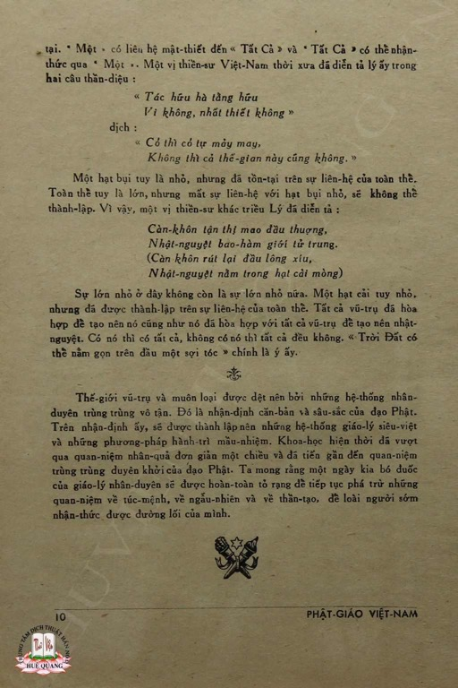
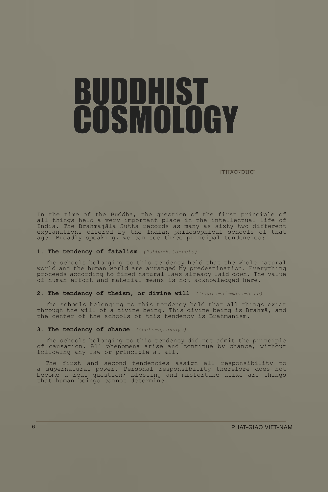

# Pipeline Case Study: Thầy Edited Journal Text

The pipeline uses `tnh-gen` to turn a scan-derived article,
[*Vũ-trụ-quan Phật học*](/user-guide/assets/journal-pipeline/pgvn-17-18-vu-tru-quan-phat-hoc.pdf), from
[*Phật Giáo Việt Nam*](https://thuvienhoasen.org/a26248/tap-chi-phat-giao-viet-nam) (Journal of Vietnamese Buddhism), edited by Thích Nhất Hạnh,
into a readable English draft:
[*A Buddhist Cosmological View*](/user-guide/assets/journal-pipeline/vu-tru-quan-phat-hoc-tnh-voice-refined-en.md). The draft is intended to be a traceable artifact that translators
can review.

---

## The pipeline

Each stage of the pipeline handles one part of the transformation and generation of the translation:

- **OCR:** starting point: an imperfect machine text derived from page images.
- **Line anchoring:** adds stable line numbers for section boundaries.
- **Sectioning:** divides the article by argument structure, not page or token limits.
- **Extraction:** isolates one reviewed section at a time.
- **Cleaning:** repairs OCR damage without modernizing the text.
- **Translation:** generates an English draft with document context and provenance attached.
- **Review:** human review with AI assisted refinement and dialog for a refined draft.

The pipeline makes the article accessible to English speakers while keeping each transformation visible.

---

## Source and context

### Article and attribution

The text, *Vũ-trụ-quan Phật học* — *A Buddhist Cosmological View* — is signed Thạc-Đức
and published in *Phật Giáo Việt Nam*, issue 17–18, December 1957. Recent scholarship
and the Plum Village extended biography identify Thạc-Đức as one of Thích Nhất Hạnh's
pen names in the *Phật Giáo Việt Nam* corpus.

### Relevance

*Phật Giáo Việt Nam* was part of a 1950s Vietnamese Buddhist reform conversation. It
published doctrinal essays, essays on Buddhist modernization, and early writing connected
with Thích Nhất Hạnh's vision for the reform of Vietnamese Buddhism.

The article discusses causality, dependent origination, moral responsibility, and
liberation. These themes appear early in the historical arc of Thích Nhất Hạnh's life
and teaching, and they may give us a window into understanding his later development of engaged
Buddhism, peace work, and community building.

Technically, the article is useful because it requires an extended pipeline and the preservation of
context: source images, OCR damage, Buddhist terminology, historical
metadata, attribution, and translation provenance.

<details>
<summary>References</summary>

Lê, Adrienne Minh-Châu. "Toward National Buddhism: Thích Nhất Hạnh on Buddhist
Nationalism and Modernity in the Journal *Phật Giáo Việt Nam*, 1956–1959." *Journal of
Vietnamese Studies* 19, no. 1 (February 2024): 9–48.
<https://online.ucpress.edu/jvs/article-abstract/19/1/9/200078/>

Lê, Adrienne Minh-Châu. "Engaged Buddhism and Vietnamese Nation-building in the Early
Writings of Thích Nhất Hạnh." *Kyoto Review of Southeast Asia*, no. 35 (2023).
<https://kyotoreview.org/issue-35/vietnamese-nation-building-early-writings-of-thich-nhat-hanh/>

Plum Village. "Thich Nhat Hanh: Extended Biography." Plum Village, 2014.
<https://plumvillage.org/about/thich-nhat-hanh/biography/thich-nhat-hanh-full-biography>

Thư Viện Hoa Sen. "Tạp chí Phật Giáo Việt Nam." Digitization credit: Thư Viện Huệ Quang.
<https://thuvienhoasen.org/a26248/tap-chi-phat-giao-viet-nam>

Thư Viện Phật Việt. "Trần Thạc Đức — Phật giáo Việt Nam và hướng đi nhân bản đích thực."
<https://thuvienphatviet.com/tran-thac-duc-phat-giao-viet-nam-va-huong-di-nhan-ban-dich-thuc/>

</details>

---

## Pipeline workflow

This section discusses the source material, then walks through the commands, inputs, outputs, and review points.

> **Technical notes:** This workflow uses the Unix shell, shell variables, file paths,
> `sed`, `cat`, and repeated TNH-scholar commands. Browser, VS Code, and terminal UI interfaces are
> planned: see [Future Platform Development](#future-platform-development).
> Though technically challenging, the entire pipeline has been run with AI assistance (Codex in VS Code) and then reviewed. This makes the complex work tractable.
> Source files live at `tests/golden/journal-pipeline/`.
> Commands are run from the repo root.
> `tnh-gen` discovers prompts from `./tnh-prompts/` by default;
> use `--prompt-dir PATH` only to override that.

### The scanned pages

The article spans five journal pages. The first and last page are shown. Translators can compare the
OCR, cleaned Vietnamese, and generated English against the page images.


*Page 7 of the scan: article title, byline, and the opening argument.
The running footer `PHẬT-GIÁO VIỆT-NAM` is visible at the bottom — one of the
artifacts the clean stage must remove. ([View with OCR region annotations](assets/journal-pipeline/pgvn-17-18-page7.jpg))*



*Page 11 scan: the article's closing discussion on trùng trùng duyên khởi, moral causality,
and liberation. The footer `PHẬT-GIÁO VIỆT-NAM` and a page-number artifact appear near
the bottom. ([View with OCR region annotations](assets/journal-pipeline/pgvn-17-18-page11.jpg))*

### Post-pipeline facsimile output

The pipeline can also feed a downstream presentation artifact: an experimental English
facsimile-translation that keeps the page feel of the journal while using the reviewed
translated text.



*Experimental `v1` post-pipeline facsimile prototype of the opening page, built from the clean
scan, local font matching, the TNH-voice translation output for the opening-page body text, and
manual layout tuning. The display title is a simplified English facsimile treatment rather
than a literal title translation. This is a presentation-layer artifact rather than a
replacement for the source images or traceable text files.
([PNG](assets/journal-pipeline/pgvn-17-18-page7-facsimile-v1.png), [PDF](assets/journal-pipeline/pgvn-17-18-page7-facsimile-v1.pdf))*

This is useful as a “what’s possible next” step after OCR, cleaning, translation, and review:
it gives a legible English page that can be compared directly against the original scan, the
cleaned Vietnamese, and the refined English draft. A short note on the generation approach and
the next research direction for interactive region overlays is here:
[Post-pipeline facsimile step](/user-guide/journal-facsimile-step.md).

### Source and attribution note

The digitized journal is hosted by Thư Viện Hoa Sen, which credits Thư Viện Huệ Quang for
digitizing. The Hoa Sen page is the source used for this project.

- Local five-page PDF extract used in this case study:
  [pgvn-17-18-vu-tru-quan-phat-hoc.pdf](assets/journal-pipeline/pgvn-17-18-vu-tru-quan-phat-hoc.pdf)
- Repo-local golden working copy of the rebuilt extract:
  `tests/golden/journal-pipeline/pgvn-17-18-vu-tru-quan-phat-hoc-complete.pdf`
- Collection page: <https://thuvienhoasen.org/a26248/tap-chi-phat-giao-viet-nam>
- Direct PDF: <https://thuvienhoasen.org/images/file/4Vp0iwbv0wgQAJAY/phat-giao-viet-nam-1956-17-18.pdf>
- Hoa Vô Ưu mirror/reference: <https://hoavouu.com/a24580/nguyet-san-phat-giao-viet-nam-1956>
- Tài Liệu Phật Học catalog record (item 33): <https://tailieuphathoc.com/tai-lieu/nguyet-san-phat-giao-viet-nam-do-tong-hoi-phat-giao-viet-nam-xuat-ban-dat-tai-chua-an-quang-tu-nam-1956-1959-1892?viewpdf=2325>

The dates are worth preserving as metadata. Some library URLs label the collection `1956`;
catalog entries for the same issue record `1957`. The pipeline can preserve this kind of
source ambiguity.

### What the raw OCR looks like

When the scan comes out of the OCR process, it looks like this:

```
VŨ-TRỤ-QUAN
PHAT-HOC                     ← title diacritics dropped
THẠC - ĐỨC
...
1.―
1-                           ← duplicate section marker
Khuynh hướng Túc mệnh-luận (Pubba kata hetu)
...
họa phúc đều
PHẬT GIÁO VIỆT NAM           ← running journal footer landed mid-paragraph
...
nhận thức được đường lối của mình.
10
PHẬT-GIÁO VIỆT-NAM           ← final-page number and journal footer (page 11)
```

The text is not yet reliable for translation. Broken lines obscure
syntax. Dropped diacritics change Vietnamese words. Running headers and page artifacts
interrupt paragraphs. Buddhist terms need to survive cleanup. 

---

## Pipeline overview

```
PDF scan
  ↓ OCR
raw OCR text
  ↓ tnh-lines number
numbered source
  ↓ tnh-gen default_section
sections_gpt54.json
  ↓ human review / correction copy
sections_gpt54_corrected.json
  ↓ extract section
section raw text
  ↓ tnh-gen default_clean
cleaned Vietnamese
  ↓ tnh-gen translate_journal_section_en
baseline English draft + provenance
  ↓ tnh-gen translate_journal_section_tnh_voice_en
assembled TNH-voice English draft
  ↓ external dialog: Aaron K. Solomon + GPT-5.5 Thinking
  [inputs: cleaned Vietnamese + TNH-voice draft]
final refined English draft
```

Each step is small enough to inspect.

> **Technical Note**: the extract step is currently a plain `sed` call. There is no dedicated
> subcommand yet. Model calls are automated, human and further AI review follow.

---

## Needed tools

- **`tnh-lines`** — adds or removes line numbers from a text file
- **`tnh-gen`** — runs a prompt against a file and writes the result
- **`sed`** — parses section file (Unix)
- **`cat`** - joins text (Unix)

All commands run from the repo root. Prompts come from the default local prompt workspace:

```bash
./tnh-prompts/
```

These shell variables are used throughout:

```bash
SOURCE_FILE=tests/golden/journal-pipeline/5page/source.txt
WORK_DIR=tests/golden/journal-pipeline/walkthrough/clean_translate_5page
mkdir -p "$WORK_DIR"

METADATA='title: Vũ-trụ-quan Phật học
author: Thạc-Đức
pen_name_of: Thích Nhất Hạnh
journal: Phật Giáo Việt Nam
issue: 17-18
year: 1957
digitization_credit: Thư Viện Huệ Quang
source_page: https://thuvienhoasen.org/a26248/tap-chi-phat-giao-viet-nam
source_pdf: https://thuvienhoasen.org/images/file/4Vp0iwbv0wgQAJAY/phat-giao-viet-nam-1956-17-18.pdf
source_mirror: https://hoavouu.com/a24580/nguyet-san-phat-giao-viet-nam-1956
catalog_record: https://tailieuphathoc.com/tai-lieu/nguyet-san-phat-giao-viet-nam-do-tong-hoi-phat-giao-viet-nam-xuat-ban-dat-tai-chua-an-quang-tu-nam-1956-1959-1892?viewpdf=2325'
```

This metadata travels into prompt calls and generated artifact provenance. Source-history
details and conflicting date labels can stay explicit without blocking the workflow.

---

## Stage 1: Number the lines

**Input:** `$SOURCE_FILE` — raw OCR text, 177 lines: `tests/golden/journal-pipeline/5page/source.txt`  
**Output:** `"$WORK_DIR/source_numbered_walkthrough.txt"` — same text with `N:` line prefix: `tests/golden/journal-pipeline/walkthrough/clean_translate_5page/source_numbered_walkthrough.txt`

The sectioning prompt needs numbered input to anchor its section boundaries. We add line
numbers to the source first:

```bash
tnh-lines number \
  "$SOURCE_FILE" \
  "$WORK_DIR/source_numbered_walkthrough.txt"
```

The output is plain text with `N:LINE` formatting. The OCR text is unchanged; line numbers
only anchor section boundaries.

```
1:VŨ-TRỤ-QUAN
2:PHAT-HOC
3:THẠC - ĐỨC
4:Vào thời đại của đức Phật, vấn đề nguyên lý của vạn vật là một vấn-
5:đề rất được chú trọng trong tư tưởng-giới Ấn Độ. Kinh Phạm-Động có
```

---

## Stage 2: Section the article

**Input:** `"$WORK_DIR/source_numbered_walkthrough.txt"`: `tests/golden/journal-pipeline/walkthrough/clean_translate_5page/source_numbered_walkthrough.txt`  
**Output:** `"$WORK_DIR/sections_gpt54.json"` — section map, titles, summaries, and document-level metadata: `tests/golden/journal-pipeline/walkthrough/clean_translate_5page/sections_gpt54.json`

[`default_section`](https://github.com/aaronksolomon/tnh-scholar/blob/main/tnh-prompts/default_section.md) reads the numbered source and divides it into logical sections. It also
generates a summary, key concepts, and section titles that travel forward into later stages.

```bash
tnh-gen run \
  --prompt default_section \
  --input-file "$WORK_DIR/source_numbered_walkthrough.txt" \
  --var source_language=Vietnamese \
  --var target_section_count=4 \
  --var target_lines_per_section=44 \
  --var document_metadata="$METADATA" \
  --output-file "$WORK_DIR/sections_gpt54.json"
```

The raw output is a JSON file. Here is what the model finds in this article:

| Section | Lines | Title |
|---------|-------|-------|
| 1 | 1–47 | Introduction and a critique of three Indian philosophical tendencies |
| 2 | 48–91 | The worldview of causality and the principle of dependent origination |
| 3 | 92–137 | Simultaneous and successive causality in the structure of the world |
| 4 | 138–177 | The larger meaning of causality and the vision of interdependent arising |

The JSON also includes document-level context: summary, key concepts, metadata, and notes
on the structure of the argument. This context gets passed into translation. The provenance
for the section run is `tests/golden/journal-pipeline/walkthrough/clean_translate_5page/sections_gpt54.json.provenance.yaml`.

> **Review point:** Section data, `sections_gpt54.json`, is inspected before proceeding. In this run,
> one boundary split a sentence across sections 2 and 3, so the workflow continues
> from a Codex-corrected and human reviewed copy:
> `tests/golden/journal-pipeline/walkthrough/clean_translate_5page/sections_gpt54_corrected.json`.
> An earlier
> section-1 English heading, "Introduction and a Critique of Three Indian Philosophical
> Tendencies," was also retained as the reviewed downstream presentation title. The raw model output remains
> preserved as the baseline artifact. Reviewed edits live in separately named files.

---

## Stage 3: Extract section

**Input:** `"$WORK_DIR/source_numbered_walkthrough.txt"` and section boundaries from `tests/golden/journal-pipeline/walkthrough/clean_translate_5page/sections_gpt54_corrected.json`  
**Output:** `"$WORK_DIR/section_01_raw.txt"` — unnumbered OCR text for section 1: `tests/golden/journal-pipeline/walkthrough/clean_translate_5page/section_01_raw.txt`

Using `start_line` and `end_line` from the reviewed section map, extract section 1 from the numbered source:

```bash
sed -n '1,47p' \
  "$WORK_DIR/source_numbered_walkthrough.txt" \
  > "$WORK_DIR/section_01_numbered.txt"
```

Then we strip the line numbers:

```bash
tnh-lines unnumber \
  "$WORK_DIR/section_01_numbered.txt" \
  "$WORK_DIR/section_01_raw.txt"
```

This produces the raw OCR text for section 1.

---

## Stage 4: Clean the OCR text

**Input:** `"$WORK_DIR/section_01_raw.txt"` — raw OCR with diacritics damage and footer artifacts: `tests/golden/journal-pipeline/walkthrough/clean_translate_5page/section_01_raw.txt`  
**Output:** `"$WORK_DIR/section_01_cleaned.txt"` — corrected Vietnamese prose: `tests/golden/journal-pipeline/walkthrough/clean_translate_5page/section_01_cleaned.txt`

[`default_clean`](https://github.com/aaronksolomon/tnh-scholar/blob/main/tnh-prompts/default_clean.md) corrects OCR damage while staying close to the original. It removes stray
footer lines, restores dropped diacritics, and rejoins lines split across page boundaries
without rewriting the text or modernizing the prose.

```bash
tnh-gen run \
  --prompt default_clean \
  --input-file "$WORK_DIR/section_01_raw.txt" \
  --vars "$WORK_DIR/clean_vars.json" \
  --output-file "$WORK_DIR/section_01_cleaned.txt"
```

Before cleaning, section 1 opens like this:

```
VŨ-TRỤ-QUAN
PHAT-HOC
THẠC - ĐỨC
...
1.―
1-
Khuynh hướng Túc mệnh-luận (Pubba kata hetu)
```

After cleaning:

```
VŨ-TRỤ-QUAN
PHẬT-HỌC
THẠC-ĐỨC

Vào thời đại của đức Phật, vấn đề nguyên lý của vạn vật là một vấn đề rất
được chú trọng trong tư tưởng giới Ấn Độ. Kinh Phạm-Động có chép lại đến
sáu mươi hai lối giải thích khác nhau của các triết-phái Ấn-Độ thời ấy.
Tựu trung, ta thấy có ba khuynh hướng sau đây:

1. — Khuynh hướng Túc mệnh-luận (Pubba kata hetu)
```

Title diacritics are restored. The duplicate section marker is collapsed. Lines are rejoined
into prose. The page footer intrusion is gone.

> **Review point:** Before translating, we compare the cleaned Vietnamese against the scanned
> page image. This is where OCR mistakes or silent normalization become visible.

---

## Stage 5: Translate the section

**Input:** `"$WORK_DIR/section_01_cleaned.txt"` and `tests/golden/journal-pipeline/walkthrough/clean_translate_5page/section_01_journal_translate_vars.json`  
**Output:** `"$WORK_DIR/section_01_translated_journal_en.txt"` — English draft with YAML provenance header: `tests/golden/journal-pipeline/walkthrough/clean_translate_5page/section_01_translated_journal_en.txt`

[`translate_journal_section_en`](https://github.com/aaronksolomon/tnh-scholar/blob/main/tnh-prompts/translate_journal_section_en.md) translates a cleaned section into English using the section
summary, key concepts, source metadata, attribution note, and section structure. This helps
keep terminology consistent across sections and keeps the draft tied to the source.

```bash
tnh-gen run \
  --prompt translate_journal_section_en \
  --input-file "$WORK_DIR/section_01_cleaned.txt" \
  --vars "$WORK_DIR/section_01_journal_translate_vars.json" \
  --output-file "$WORK_DIR/section_01_translated_journal_en.txt"
```

The vars file carries the section context from the reviewed section map forward into this call.
See [Using a vars file](#using-a-vars-file) below.

Here is the opening of the baseline English translation:

---

*Introduction and a Critique of Three Indian Philosophical Tendencies*

In the time of the Buddha, the question of the fundamental principle of all things was
one to which the Indian intellectual world gave great attention. The Brahmajāla Sutta
records as many as sixty-two different explanations advanced by the Indian philosophical
schools of that period. Broadly speaking, three tendencies may be discerned:

1. The tendency of fatalism (Pubba kata hetu)

The philosophical schools belonging to this tendency held that both the natural world
and the human world were arranged by predestination. Everything proceeded according to
pre-existing natural laws. The value of human effort and material agency was not
recognized here.

---

> **Review point:** Terminology, doctrinal vocabulary, citations, and places
> where the model made choices, all can be reviewed. The translation inherits the source attribution
> metadata supplied to the run.

---

## Improved translation prompt

A prompt can change without changing the file workflow. The same cleaned section and vars
file can run through a second prompt and produce a second provenance-tracked artifact.

For this case study, a second stage  prompt was used:

- [`translate_journal_section_en`](https://github.com/aaronksolomon/tnh-scholar/blob/main/tnh-prompts/translate_journal_section_en.md)
  - baseline journal-translation prompt
- [`translate_journal_section_tnh_voice_en`](https://github.com/aaronksolomon/tnh-scholar/blob/main/tnh-prompts/translate_journal_section_tnh_voice_en.md)
  - alternate prompt aimed at a gentler English voice associated with later published Thích Nhất Hạnh prose

The linked final article result in this case study,
[*A Buddhist Cosmological View*](/user-guide/assets/journal-pipeline/vu-tru-quan-phat-hoc-tnh-voice-refined-en.md),
is based on this TNH-voice prompt path after some additional refinement. The assembled baseline English document, the
assembled TNH-voice document, and the cleaned Vietnamese document are linked alongside it
below.

The second run uses the same cleaned section and vars file, but writes to a different
output path:

```bash
tnh-gen run \
  --prompt translate_journal_section_tnh_voice_en \
  --input-file "$WORK_DIR/section_01_cleaned.txt" \
  --vars "$WORK_DIR/section_01_journal_translate_vars.json" \
  --output-file "$WORK_DIR/section_01_translated_tnh_voice_en.txt"
```

Here is the opening paragraph of section 1 across all three forms:

| Vietnamese | Baseline English | TNH-voice English |
|---|---|---|
| Vào thời đại của đức Phật, vấn đề nguyên lý của vạn vật là một vấn-đề rất được chú trọng trong tư tưởng-giới Ấn Độ. | In the time of the Buddha, the question of the fundamental principle of all things was one to which the Indian intellectual world gave great attention. | In the time of the Buddha, the question of the first principle of all things held a very important place in the intellectual life of India. |
| Kinh Phạm-Động có chép lại đến sáu mươi hai lối giải thích khác nhau của các triết-phái Ấn-Độ thời ấy. | The Brahmajāla Sutta records as many as sixty-two different explanations advanced by the Indian philosophical schools of that period. | The Brahmajāla Sutta records as many as sixty-two different explanations offered by the Indian philosophical schools of that age. |
| Tựu trung, ta thấy có ba khuynh hướng sau đây: | Broadly speaking, three tendencies may be discerned: | Broadly speaking, we can see three principal tendencies: |

This is a useful pattern when prompt tuning is part of the work. The prompt transformation becomes part of the provenance chain.

Assembled documents for comparison and final review:

- [A Buddhist Cosmological View — baseline English](/user-guide/assets/journal-pipeline/vu-tru-quan-phat-hoc-en.md)
- [A Buddhist Cosmological View — TNH-voice](/user-guide/assets/journal-pipeline/vu-tru-quan-phat-hoc-tnh-voice-en.md)
- [A Buddhist Cosmological View — refined TNH-voice](/user-guide/assets/journal-pipeline/vu-tru-quan-phat-hoc-tnh-voice-refined-en.md)
- [Vũ-trụ-quan Phật học — cleaned Vietnamese text](/user-guide/assets/journal-pipeline/vu-tru-quan-phat-hoc-vi.md)

---

## Stage 6: Repeat for remaining sections

We repeat the same clean → translate pattern for sections 2, 3, and 4. Each section gets its
own cleaned file, translated file, and context vars file. For example:

- `tests/golden/journal-pipeline/walkthrough/clean_translate_5page/section_02_cleaned.txt`
- `tests/golden/journal-pipeline/walkthrough/clean_translate_5page/section_02_translated_journal_en.txt`
- `tests/golden/journal-pipeline/walkthrough/clean_translate_5page/section_03_cleaned.txt`
- `tests/golden/journal-pipeline/walkthrough/clean_translate_5page/section_03_translated_journal_en.txt`
- `tests/golden/journal-pipeline/walkthrough/clean_translate_5page/section_04_cleaned.txt`
- `tests/golden/journal-pipeline/walkthrough/clean_translate_5page/section_04_translated_journal_en.txt`
- `tests/golden/journal-pipeline/walkthrough/clean_translate_5page/section_04_translated_tnh_voice_en.txt`

When all four sections are done:

```bash
cat \
  "$WORK_DIR/section_01_translated_journal_en.txt" \
  "$WORK_DIR/section_02_translated_journal_en.txt" \
  "$WORK_DIR/section_03_translated_journal_en.txt" \
  "$WORK_DIR/section_04_translated_journal_en.txt" \
  > "$WORK_DIR/final_translated_journal_en.txt"
```

The assembled baseline translation: `tests/golden/journal-pipeline/walkthrough/clean_translate_5page/final_translated_journal_en.txt`

---

## Stage 7: Review and refinement

The assembled TNH-voice translation and the cleaned Vietnamese source were brought into an external review dialog — Aaron K. Solomon and *GPT-5.5 Thinking* via the OpenAI ChatGPT interface. The specific refinements made are listed below.

| Area | Baseline wording | Refined wording / choice | Reason |
|---|---|---|---|
| Voice target | later TNH voice | early TNH intellectual voice | The source is a 1957 philosophical essay, not a later Dharma talk. |
| Key phrase | principle of the universe — the law of causes and conditions | *principle of the universe* (*nguyên lý của vũ trụ*) | Keeps the translation closer to the Vietnamese; explanation moved to terminology note. |
| Technical term | name-and-form | nāmarūpa, with “name-and-form” as gloss | Matches Buddhist technical usage and later TNH English idiom. |
| Vietnamese source term | Danh, Sắc | danh sắc / danh-sắc noted as normalized form | Preserves source variation while noting standard Vietnamese Buddhist usage. |
| Relationship phrase | subtle relationship | profound relationship | Renders *mầu-nhiệm* with a term closer to the intended register. |
| Terminology support | inline explanations | end terminology notes | Keeps the body readable while preserving doctrinal context. |

> **Pipeline process note:** A source-completeness correction changed this case study
> materially: the article first appeared to end at four scanned pages, but later review
> showed that it continued onto a fifth page. The earlier four-page
> `tnh-gen` workflow artifacts were preserved for testing/reference under `tests/golden/journal-pipeline/walkthrough/clean_translate/`, then the source and workflow on the
> complete five-page article were built. New sectioning, cleaning, and translation artifacts were generated under
> `tests/golden/journal-pipeline/walkthrough/clean_translate_5page/`.
> For a user-facing assembled result, this case study links to
> **[*Vũ-trụ-quan Phật học* (refined TNH-voice)](/user-guide/assets/journal-pipeline/vu-tru-quan-phat-hoc-tnh-voice-refined-en.md)**.

> **Workflow execution:** Codex AI
> built the golden artifact infrastructure and executed shell commands, Claude Code
> helped draft and test this document against that infrastructure and assembled the final translations, GPT-5.5 participated in a directed refinement conversation with Aaron K. Solomon to refine translation language and terminology notes, and Codex and Claude both assisted with final verification of this document and the final derived file set. Aaron K. Solomon directed and reviewed the process.

---

## Additional workflow notes

### Terminal output and provenance

While a model call is running, the terminal is quiet. On success:

- the result prints to `stdout`
- if `--output-file` was used, a confirmation appears on `stderr`:
  `Wrote output to <path>`

On failure, an error message and a trace ID appear. The trace ID is useful for reporting
problems.

Plain-text outputs get an embedded YAML provenance header with model name, prompt version,
timestamp, and fingerprint. Structured JSON outputs stay as raw JSON and receive a separate
`.provenance.yaml` sidecar. For historical materials, provenance also carries source
metadata and prompt context. Provenance makes artifacts
inspectable and reproducible; it does not make them authoritative.

---

### Using a vars file

The `--vars` flag loads a JSON file as a batch of variables. For translation, the
section-specific vars file carries document context and source attribution forward:

```json
{
  "source_language": "Vietnamese",
  "target_language": "English",
  "section_title": "Bối cảnh tư tưởng Ấn Độ và lập trường phê bình của Phật giáo",
  "document_summary": "...",
  "section_summary": "...",
  "document_key_concepts": "Vũ-trụ-quan Phật học; Nhân duyên; Duyên khởi; ...",
  "document_metadata": "title: Vũ-trụ-quan Phật học\nauthor_signature: Thạc-Đức\npen_name_of: Thích Nhất Hạnh\njournal: Phật Giáo Việt Nam\nissue: 17-18\nyear: 1957"
}
```

This is built from the sectioning JSON by pulling out the relevant section and document
fields. Individual `--var key=value` flags can supplement or override it. In the checked-in
artifact set, this file is `tests/golden/journal-pipeline/walkthrough/clean_translate_5page/section_01_journal_translate_vars.json`.

---

### Artifact layout

The checked-in walkthrough artifact directory looks like this:

```
tests/golden/journal-pipeline/walkthrough/clean_translate_5page/
├── source_numbered_walkthrough.txt
├── sectioning_vars.json
├── sections_gpt54.json                         ← 4-section run (used)
├── sections_gpt54.json.provenance.yaml
├── sections_gpt54_corrected.json               ← boundary-corrected copy
├── sections_gpt54_target5.json                 ← alternative 5-section run (reference)
├── sections_gpt54_target5.json.provenance.yaml
├── section_01_numbered.txt
├── section_01_raw.txt
├── section_01_cleaned.txt
├── section_01_journal_translate_vars.json
├── section_01_translated_journal_en.txt
├── section_01_translated_tnh_voice_en.txt
├── section_02_raw.txt      ← (and numbered, cleaned, vars, baseline, TNH-voice)
├── section_02_translated_tnh_voice_en.txt
├── section_03_raw.txt
├── section_03_translated_tnh_voice_en.txt
├── section_04_raw.txt
├── section_04_cleaned.txt
├── section_04_translated_journal_en.txt
├── section_04_translated_tnh_voice_en.txt
├── final_translated_journal_en.txt             ← assembled baseline English (all 4 sections)
└── clean_vars.json
```

These files are checked into the `tnh-scholar` repository as golden artifacts for test comparison and prompt refinement. This checked-in set shows the intended workflow: every generated result
remains connected to the page image, source text, intermediate transformations, prompt
context, and provenance that produced it.

---

## Future Platform Development

Currently, the workflow is run from the command line. Every step is visible and
easy to inspect, but it also requires AI directed execution — or comfort and time for Unix shell commands, JSON, file paths,
and manual file handling. Future versions intend to make the same work simple to do while
keeping the same files, prompts, source links, and provenance records underneath.

Planned directions:

- **VS Code extension** — the nearest-term direction. A panel would let a user open a
  source file, run sectioning, review and adjust the section map, then step through
  cleaning and translation without leaving the editor. The same files would still be
  written and preserved for review.

- **TUI (terminal user interface)** — A terminal-based guided
  view of the workflow: artifact previews, section selection, and prompt output shown in
  place.

- **Web interface** — a longer-term direction for collaborative or institutionally hosted
  work: shared document queues, version tracking, and annotation.

- **Facsimile + region overlay** — a hybrid direction after the core pipeline: keep the page
  image or facsimile as the visual ground truth, then add OCR-derived bounding boxes that can
  reveal Vietnamese and English text by line, sentence, or paragraph. This would fit either a
  web viewer or a VS Code analysis pane.

---

## See also

- [tnh-gen CLI Reference](/cli-reference/tnh-gen.md)
- [Prompt System](/user-guide/prompt-system.md)
- [Best Practices](/user-guide/best-practices.md)
