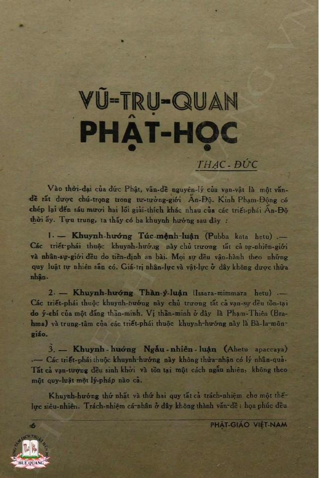
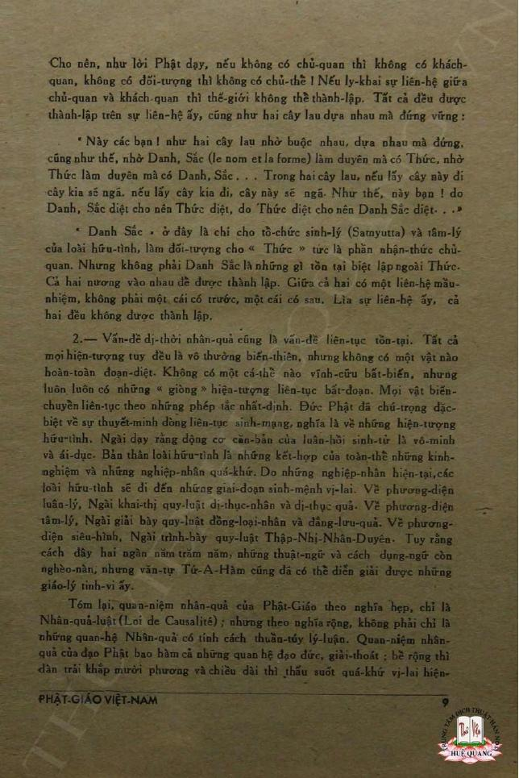

# Pipeline Case Study: Phật Giáo Việt Nam OCR Journal Text

This case study follows `tnh-scholar` work on a real document: a PDF-scanned article
from [*Phật Giáo Việt Nam*](https://thuvienhoasen.org/a26248/tap-chi-phat-giao-viet-nam),
a monthly journal published from 1956 to 1959 by Tổng Hội Phật Giáo Việt Nam at chùa
Ấn Quang, with Thích Nhất Hạnh as chủ bút (editor-in-chief). The source is historically
valuable, but technically difficult: a 1950s printed journal preserved as scanned pages,
then passed through OCR with dropped diacritics, broken lines, running footers, page
artifacts, uncertain metadata, and Buddhist terminology that must not be flattened during
cleanup or translation.

The pipeline transforms the raw scan-derived article,
[*Vũ-trụ-quan Phật học*](assets/journal-pipeline/pgvn-17-18-vu-tru-quan-phat-hoc.pdf),
into a readable English draft translation:
[*A Buddhist Cosmological View*](/user-guide/vu-tru-quan-phat-hoc-en.md). The point is not
only to make one article readable, but to show how fragile historical materials can become
more accessible to students of Thích Nhất Hạnh while remaining inspectable by translators
and researchers.

Much of this journal has not been officially translated into English. `tnh-scholar` is
designed for exactly this kind of setting: not to produce authoritative translations, but
to provide a metadata-aware, provenance-tracked generation stream for real scholarly work.
The intended output is not a finished scholarly edition; it is a traceable draft artifact
that can be checked against the source image, OCR text, cleaned Vietnamese, prompt
metadata, and generated English at every stage.

---

## What the pipeline demonstrates

The case study is organized around a practical problem: how to move from scanned historical
pages to reviewable translation artifacts without losing the source trail. Each stage solves
a specific technical problem:

- **Scanning and OCR:** start from imperfect machine text derived from page images.
- **Line anchoring:** add stable line numbers so the model can propose auditable section boundaries.
- **Sectioning:** divide the article by argument structure, not arbitrary page or token limits.
- **Extraction:** isolate one reviewed section at a time for cleaning and translation.
- **Cleaning:** repair OCR damage while preserving historical spelling, register, terminology, and source ambiguity.
- **Translation:** generate a draft English rendering with document context and provenance attached.

This is the technical heart of the walkthrough (*Technical workflow*): the pipeline makes the document more
accessible without hiding the transformations that made that access possible.

---

## Source and scholarly context

### Article and attribution

The text is *Vũ-trụ-quan Phật học* — *A Buddhist Cosmological View* — signed Thạc-Đức
and published in *Phật Giáo Việt Nam*, issue 17–18, December 1957. Thạc-Đức is associated
with Trần Thạc Đức, a pen name appearing in the *Phật Giáo Việt Nam* corpus (Lê 2024;
Plum Village 2014). Attribution to Thích Nhất Hạnh is supported by recent scholarship (Lê
2024) and confirmed in the Plum Village extended biography, which lists Thạc Đức among pen
names used during his editorship (Plum Village 2014); however, Thích Nhất Hạnh did not
confirm every attribution bearing that name (Lê 2024), so it is treated as probable but
uncertain here. The pipeline records the byline as it appears in the source and does not
resolve the authorship question.

### Why this article matters

At the doctrinal level, the article engages a question central to both the Buddha's
earliest teaching and to mid-twentieth century Buddhist reform: what principle underlies
the world of experience, action, suffering, and liberation? The author surveys three
positions from ancient India — fatalism, divine-will theory, and accidentalism — and
argues that the Buddha's doctrine of dependent origination (*duyên khởi*,
*paticca-samuppāda*) offers what none of them can: a foundation for moral responsibility
and genuine human agency. The treatment draws on the Āgamas, Abhidharma classification,
and the Huayan conception of interdependence. For a scholarly translation pipeline, this
means attending carefully to Pali and Sanskrit terminology, doctrinal register, textual
citations, and places where OCR damage could change the philosophical meaning of a
sentence.

At the level of Vietnamese Buddhist history, the article belongs to a significant moment.
*Phật Giáo Việt Nam* was a vehicle for Buddhist modernization and reform, published 1956–1959
by Tổng Hội Phật Giáo Việt Nam, with Vietnamese Buddhist thinkers working to articulate an
engaged, rational, and nationally relevant Buddhism (Lê 2024). The journal's style, the
topics chosen, and the pen-name culture around the editorial circle are all objects of
ongoing scholarly study (Lê 2024; Lê 2023). Translating this material requires awareness
of the 1950s Vietnamese Buddhist intellectual context, not just the doctrinal content.

At the level of Thích Nhất Hạnh's intellectual arc, articles from this period sit near the
beginning of a trajectory that runs from Vietnamese Buddhist renewal through socially
engaged Buddhism, peace work, and the forms of Buddhist teaching that later took root in
the United States and Europe (Lê 2023; Lê 2024). This case study does not claim that any
single article explains that arc; it shows that `tnh-scholar` must preserve philological
detail, historical context, uncertain attribution, and translator-facing provenance rather
than flattening the text into a generic English summary.

<details>
<summary>References</summary>

Lê, Adrienne Minh-Châu. "Toward National Buddhism: Thích Nhất Hạnh on Buddhist
Nationalism and Modernity in the Journal *Phật Giáo Việt Nam*, 1956–1959." *Journal of
Vietnamese Studies* 19, no. 1 (February 2024): 9–48.
<https://online.ucpress.edu/jvs/article-abstract/19/1/9/200078/>

Lê, Adrienne Minh-Châu. "Engaged Buddhism and Vietnamese Nation-building in the Early
Writings of Thích Nhất Hạnh." *Kyoto Review of Southeast Asia*, no. 35 (2023).
<https://kyotoreview.org/issue-35/vietnamese-nation-building-early-writings-of-thich-nhat-hanh/>

Plum Village. "Thich Nhat Hanh: Extended Biography." Plum Village, 2014.
<https://plumvillage.org/about/thich-nhat-hanh/biography/thich-nhat-hanh-full-biography>
*(Lists Thạc Đức among pen names used by Thích Nhất Hạnh in the 1950s.)*

Thư Viện Hoa Sen. "Tạp chí Phật Giáo Việt Nam." Digitization credit: Thư Viện Huệ Quang.
<https://thuvienhoasen.org/a26248/tap-chi-phat-giao-viet-nam>

Thư Viện Phật Việt. "Trần Thạc Đức — Phật giáo Việt Nam và hướng đi nhân bản đích thực."
<https://thuvienphatviet.com/tran-thac-duc-phat-giao-viet-nam-va-huong-di-nhan-ban-dich-thuc/>

</details>

---

## Technical workflow

> **Note on platform maturity:** The pipeline as shown requires Unix command-line facility —
> shell variables, file paths, `sed`, and multiple CLI invocations run by hand. This reflects
> the current state of the platform: the staged commands demonstrate its architectural
> foundations and core capacities before the browser, VS Code, and terminal UI interfaces
> are built out. Those interfaces are planned to make this workflow accessible without
> manual command-line orchestration; see [Future Platform Development](#future-platform-development)
> for details.

The remainder of this section covers the source material and its technical challenges,
then walks through each pipeline stage with the actual commands, inputs, outputs, and
human review points. The source files for all stages live at
`tests/golden/journal-pipeline/` in this repository.

### The scanned pages

The processed text comes from four scanned journal pages. The two below bookend the article
and give a sense of the source material. These images are not decorative — they are part of
the review chain. At the cleaning and translation stages, translators can compare the OCR
output, cleaned Vietnamese, and generated English directly against the scanned pages.



*Page 7 of the scan: article title, byline, and the opening argument.
The running footer `PHẬT-GIÁO VIỆT-NAM` is visible at the bottom — one of the
artifacts the clean stage must remove. ([View with OCR region annotations](assets/journal-pipeline/pgvn-17-18-page7.jpg))*



*Page 10: the article's closing argument on temporal causality, continuity of existence,
and liberation. The footer `PHẬT GIÁO VIỆT NAM` and a page-number artifact appear near
the bottom. ([View with OCR region annotations](assets/journal-pipeline/pgvn-17-18-page10.jpg))*

### Source and attribution note

The digitized journal is hosted by Thư Viện Hoa Sen, which credits Thư Viện Huệ Quang for
digitizing the rare materials. The Hoa Sen collection page is the definitive source for the
full run of the journal:

- Collection page: <https://thuvienhoasen.org/a26248/tap-chi-phat-giao-viet-nam>
- Direct PDF: <https://thuvienhoasen.org/images/file/4Vp0iwbv0wgQAJAY/phat-giao-viet-nam-1956-17-18.pdf>
- Hoa Vô Ưu mirror/reference: <https://hoavouu.com/a24580/nguyet-san-phat-giao-viet-nam-1956>
- Tài Liệu Phật Học catalog record (item 33): <https://tailieuphathoc.com/tai-lieu/nguyet-san-phat-giao-viet-nam-do-tong-hoi-phat-giao-viet-nam-xuat-ban-dat-tai-chua-an-quang-tu-nam-1956-1959-1892?viewpdf=2325>

The dating is worth preserving as source metadata rather than normalizing too early. Some
library URLs label the collection `1956`; catalog entries for the same issue record `1957`.
The article belongs to the 1950s *Phật Giáo Việt Nam* corpus; local file metadata stays
aligned with the scanned source being used. This kind of ambiguity is a feature of the
case study: the pipeline should preserve uncertainty in source metadata, not resolve it
falsely.

The source files live at `tests/golden/journal-pipeline/` in this repository.

### What the raw OCR looks like

When the scan comes out of the OCR process, it looks like this:

```
VŨ-TRỤ-QUAN
PHAT-HOC                     ← title diacritics dropped
THẠC - ĐỨC
...
1.―
1-                           ← duplicate section marker
Khuynh hướng Túc mệnh-luận (Pubba kata hetu)
...
họa phúc đều
PHẬT GIÁO VIỆT NAM           ← running journal footer landed mid-paragraph
...
thấu suốt quá khứ vị lai hiện-
THẢI CHO MỌT NẤU             ← page footer artifact (page 10)
```

The text is mostly intact — sentences, structure, vocabulary — but it is not yet reliable
enough for translation. Broken lines obscure syntax; dropped diacritics change Vietnamese
words; stray running headers and page artifacts interrupt paragraphs; and Buddhist terms
need to survive cleanup without being silently modernized. This is the kind of document
`tnh-gen` is built to handle.

---

## Pipeline overview

```
PDF scan
  ↓ OCR
raw OCR text
  ↓ tnh-lines number
numbered source
  ↓ tnh-gen default_section
sections.json
  ↓ extract section
section raw text
  ↓ tnh-gen default_clean
cleaned Vietnamese
  ↓ tnh-gen translate_journal_section_en
English draft translation + provenance
```

Each step is explicit and auditable. The goal is not to automate judgment away, but to
make each transformation small enough to inspect: OCR text becomes numbered text; numbered
text becomes a section map; a reviewed section becomes cleaned Vietnamese; the cleaned
section becomes a draft translation with provenance. The extract step (pulling a line range
from the numbered source) is currently a plain `sed` call — there is no dedicated
subcommand yet; that is one of the friction points noted in the
[UX directions note](/architecture/tnh-gen/notes/tnh-gen-ux-directions-2026-05.md).
The model calls are automated; the review points are human.

---

## What's needed

Two CLI tools from the repo:

- **`tnh-lines`** — adds or removes line numbers from a text file
- **`tnh-gen`** — runs a prompt against a file and writes the result

All commands run from the repo root. Prompts come from the local prompt workspace:

```bash
--prompt-dir ./tnh-prompts
```

A few shell variables simplify the commands throughout:

```bash
SOURCE_FILE=tests/golden/journal-pipeline/source.txt
WORK_DIR=tests/golden/journal-pipeline/walkthrough/clean_translate
mkdir -p "$WORK_DIR"

METADATA='title: Vũ-trụ-quan Phật học
author: Thạc-Đức
possible_author: Trần Thạc Đức / Thích Nhất Hạnh attribution uncertain
journal: Phật Giáo Việt Nam
issue: 17-18
year: 1957
digitization_credit: Thư Viện Huệ Quang
source_page: https://thuvienhoasen.org/a26248/tap-chi-phat-giao-viet-nam
source_pdf: https://thuvienhoasen.org/images/file/4Vp0iwbv0wgQAJAY/phat-giao-viet-nam-1956-17-18.pdf
source_mirror: https://hoavouu.com/a24580/nguyet-san-phat-giao-viet-nam-1956
catalog_record: https://tailieuphathoc.com/tai-lieu/nguyet-san-phat-giao-viet-nam-do-tong-hoi-phat-giao-viet-nam-xuat-ban-dat-tai-chua-an-quang-tu-nam-1956-1959-1892?viewpdf=2325'
```

This metadata travels forward into prompt calls and is written into generated artifact
provenance. Uncertain fields — `possible_author`, conflicting date labels — are preserved
explicitly rather than normalized.

---

## Stage 1: Number the lines

**Input:** `$SOURCE_FILE` — raw OCR text, approximately 146 lines  
**Output:** `"$WORK_DIR/source_numbered.txt"` — same text with `N:` line prefix

The sectioning prompt needs numbered input to anchor its section boundaries. We add line
numbers to the source first:

```bash
tnh-lines number \
  "$SOURCE_FILE" \
  "$WORK_DIR/source_numbered.txt"
```

The output is plain text with `N:LINE` formatting — every line prefixed with its position.
The OCR text is unchanged; this just gives the model something to anchor its section
boundaries to.

```
1:VŨ-TRỤ-QUAN
2:PHAT-HOC
3:THẠC - ĐỨC
4:Vào thời đại của đức Phật, vấn đề nguyên lý của vạn vật là một vấn-
5:đề rất được chú trọng trong tư tưởng-giới Ấn Độ. Kinh Phạm-Động có
```

---

## Stage 2: Section the article

**Input:** `"$WORK_DIR/source_numbered.txt"`  
**Output:** `"$WORK_DIR/sections.json"` — section map, titles, summaries, and document-level metadata

`default_section` reads the numbered source and divides it into logical sections. It also
generates document-level metadata — a summary, key concepts, and section titles in both
Vietnamese and English — that will travel with the text through later stages.

```bash
tnh-gen run \
  --prompt-dir ./tnh-prompts \
  --prompt default_section \
  --input-file "$WORK_DIR/source_numbered.txt" \
  --var source_language=Vietnamese \
  --var target_section_count=4 \
  --var target_lines_per_section=36 \
  --var document_metadata="$METADATA" \
  --output-file "$WORK_DIR/sections.json"
```

The output is a JSON file. Here is what it finds in this article:

| Section | Lines | Title |
|---------|-------|-------|
| 1 | 1–48 | Indian Intellectual Context and Buddhism's Critical Stance |
| 2 | 49–93 | The Conditioned World and the Principle of Dependent Origination |
| 3 | 94–124 | Simultaneous Causality and the Constitution of the World of Cognition |
| 4 | 125–146 | Successive-Time Causality, Continuity of Life, and Ethical-Liberative Meaning |

Beyond the section map, the JSON includes a document summary, key concepts (`nhân duyên`,
`duyên khởi`, `vô thường`, `luân hồi`, and more), Dublin Core metadata, and a narrative
context note explaining the structure of the argument. This context gets passed into the
translation stage.

> **Review point:** Inspect `sections.json` before proceeding. If a boundary looks off —
> a section breaks mid-argument, or two short sections should be merged — the JSON can be
> edited directly at this point. Sectioning is the one stage where human adjustment before
> the next step is most consequential.

---

## Stage 3: Extract a section

**Input:** `"$WORK_DIR/source_numbered.txt"` and section boundaries from `sections.json`  
**Output:** `"$WORK_DIR/section_01_raw.txt"` — unnumbered OCR text for section 1

Taking `start_line` and `end_line` from the JSON, we extract that range from the numbered
source (lines 1–48):

```bash
sed -n '1,48p' \
  "$WORK_DIR/source_numbered.txt" \
  > "$WORK_DIR/section_01_numbered.txt"
```

Next, we strip the line numbers — cleaning and translation work on plain text:

```bash
tnh-lines unnumber \
  "$WORK_DIR/section_01_numbered.txt" \
  "$WORK_DIR/section_01_raw.txt"
```

This gives us the raw OCR text for section 1, ready to clean.

---

## Stage 4: Clean the OCR text

**Input:** `"$WORK_DIR/section_01_raw.txt"` — raw OCR with diacritics damage and footer artifacts  
**Output:** `"$WORK_DIR/section_01_cleaned.txt"` — corrected Vietnamese prose

`default_clean` corrects OCR damage while staying close to the original. It removes stray
footer lines, restores dropped diacritics, and rejoins lines that were split across page
boundaries — without rewriting the text, modernizing the prose, or smoothing away source
features that may matter to later translation review.

```bash
tnh-gen run \
  --prompt-dir ./tnh-prompts \
  --prompt default_clean \
  --input-file "$WORK_DIR/section_01_raw.txt" \
  --vars "$WORK_DIR/clean_vars.json" \
  --output-file "$WORK_DIR/section_01_cleaned.txt"
```

Before cleaning, section 1 opens like this:

```
VŨ-TRỤ-QUAN
PHAT-HOC
THẠC - ĐỨC
...
1.―
1-
Khuynh hướng Túc mệnh-luận (Pubba kata hetu)
```

After cleaning:

```
VŨ-TRỤ-QUAN
PHẬT-HỌC
THẠC-ĐỨC

Vào thời đại của đức Phật, vấn đề nguyên lý của vạn vật là một vấn đề rất
được chú trọng trong tư tưởng giới Ấn Độ. Kinh Phạm-Động có chép lại đến
sáu mươi hai lối giải thích khác nhau của các triết-phái Ấn-Độ thời ấy.
Tựu trung, ta thấy có ba khuynh hướng sau đây:

1. — Khuynh hướng Túc mệnh-luận (Pubba kata hetu)
```

Title diacritics restored. Duplicate section marker collapsed to one. Lines rejoined into
continuous prose. The footer intrusion that appeared mid-paragraph on page 7
(`PHẬT GIÁO VIỆT NAM`) is gone.

> **Review point:** Before translating, compare the cleaned Vietnamese against the scanned
> page image. This is where OCR damage that the model misread or silently normalized would
> become visible. The annotation images linked above show OCR region boundaries and are
> useful here.

---

## Stage 5: Translate the section

**Input:** `"$WORK_DIR/section_01_cleaned.txt"` and `"$WORK_DIR/section_01_journal_translate_vars.json"`  
**Output:** `"$WORK_DIR/section_01_translated.txt"` — English draft with YAML provenance header

`translate_journal_section_en` translates a cleaned section into English, using the
document context from the sectioning JSON — the summary, key concepts, source metadata,
attribution note, and section structure — to make consistent terminology choices across
sections while keeping the draft tied to its source context.

```bash
tnh-gen run \
  --prompt-dir ./tnh-prompts \
  --prompt translate_journal_section_en \
  --input-file "$WORK_DIR/section_01_cleaned.txt" \
  --vars "$WORK_DIR/section_01_journal_translate_vars.json" \
  --output-file "$WORK_DIR/section_01_translated.txt"
```

The vars file carries the section context from `sections.json` forward into this call.
See [Using a vars file](#using-a-vars-file) below.

Here is the opening of the translation:

---

*The Indian Intellectual Context and Buddhism's Critical Stance*

In the time of the Buddha, the question of the principle underlying all things was
one to which the Indian intellectual world gave great attention. The Brahmajāla Sutta
records as many as sixty-two different explanations advanced by the Indian
philosophical schools of that age. In sum, we may discern the following three
tendencies:

1.— The tendency of fatalism (*pubba-kata-hetu*)

The philosophical schools belonging to this tendency held that both the natural world
and the human world are arranged by predestination. Everything operates according to
pre-existing natural laws. The value of human effort and material agency is not
acknowledged here.

---

And here is the closing of the fourth and final section:

---

In sum, the Buddhist conception of causality, in its narrow sense, is simply the law
of causality; but in its broader sense, it is not confined to causal relations of a
purely theoretical kind. The Buddhist conception of causality also encompasses ethical
and soteriological relations; in breadth it extends throughout the ten directions,
and in length it penetrates past, future, and present.

---

> **Review point:** Before treating the output as a scholarly translation draft, review
> terminology choices (especially Pali/Sanskrit renderings and Āgama citations),
> doctrinal vocabulary consistency across sections, and any place where the model resolved
> an ambiguity in the cleaned Vietnamese. The translation inherits attribution uncertainty
> from the source — it does not resolve it.

---

## Stage 6: Repeat for remaining sections

The same clean → translate pattern applies to sections 2, 3, and 4. Each section gets its
own cleaned file and its own translated file. The section-level vars files carry the right
context for each one.

When all four sections are done:

```bash
cat "$WORK_DIR/section_0"{1,2,3,4}"_translated.txt" > "$WORK_DIR/final_translated.txt"
```

> **Full pipeline output:** The complete four-section translation — assembled from the
> `.txt` artifacts produced by this pipeline and converted to a formatted `.md` document
> by Claude Code as part of this case study's drafting and workflow production — is at
> **[*Vũ-trụ-quan Phật học*: A Buddhist Cosmological View](/user-guide/vu-tru-quan-phat-hoc-en.md)**.
> The `.md` conversion was part of a collaborative workflow: Codex AI built much of the
> test infrastructure underlying the golden artifact chain; Claude Code drafted and tested
> the walkthrough documentation against that infrastructure.

---

## Additional workflow notes

### Terminal output and provenance

While a model call is running, the terminal is quiet. On success:

- the result prints to `stdout`
- if `--output-file` was used, a confirmation appears on `stderr`:
  `Wrote output to <path>`

On failure, an error message and a trace ID appear. The trace ID is useful for reporting
problems.

Each output file also gets a provenance header — model name, prompt version, timestamp,
fingerprint — written as YAML front matter at the top of the file. For historical
materials, the provenance also documents source URL, attribution uncertainty, and prompt
context. This makes artifacts self-documenting and allows later comparison runs to detect
regressions. Provenance does not make a translation authoritative; it makes it inspectable
and reproducible.

---

### Using a vars file

The `--vars` flag loads a JSON file as a batch of variables. For translation, the
section-specific vars file carries document context and source attribution forward:

```json
{
  "source_language": "Vietnamese",
  "target_language": "English",
  "style": "scholarly",
  "section_title": "Indian Intellectual Context and Buddhism's Critical Stance",
  "document_summary": "...",
  "key_concepts": ["nhân duyên", "duyên khởi", "vô thường"],
  "source_page": "https://thuvienhoasen.org/a26248/tap-chi-phat-giao-viet-nam",
  "source_pdf": "https://thuvienhoasen.org/images/file/4Vp0iwbv0wgQAJAY/phat-giao-viet-nam-1956-17-18.pdf",
  "attribution_note": "Signed Thạc-Đức; attribution to Trần Thạc Đức / Thích Nhất Hạnh uncertain"
}
```

This is built from `sections.json` by pulling out the relevant section entry along with
document-level fields. Individual `--var key=value` flags can supplement or override.
Source and attribution fields travel into the generated artifact alongside content fields,
so provenance sidecars carry the full research context.

---

### Artifact layout

After running the full pipeline, the working directory looks like this:

```
tests/golden/journal-pipeline/walkthrough/clean_translate/
├── source_numbered.txt
├── sections.json
├── sections.json.provenance.yaml
├── section_01_numbered.txt
├── section_01_raw.txt
├── section_01_cleaned.txt
├── section_01_journal_translate_vars.json
├── section_01_translated.txt
├── section_02_raw.txt      ← (and numbered, cleaned, vars, translated)
├── section_03_raw.txt
├── section_04_raw.txt
├── section_04_cleaned.txt
├── section_04_translated.txt
└── final_translated.txt
```

These files are checked in as golden artifacts for test comparison and prompt refinement.
They also show the intended research posture of the system: every generated result should
remain connected to the page image, source text, intermediate transformations, prompt
context, and provenance that produced it.

---

## Future Platform Development

`tnh-gen` is designed as a backend engine. The command-line workflow shown here is the
current working surface — explicit, inspectable, and well-suited for runs where each stage
deserves human review. Browser-based, VS Code, and terminal UI interfaces are planned so
this workflow can eventually be used without manual command-line orchestration. The same
prompt execution, provenance tracking, and structured output are intended to power those
interfaces as the project develops.

The planned trajectory:

- **VS Code extension** — the nearest-term direction. A panel that lets a user open a
  source file, run sectioning, review and adjust the section map, then step through clean
  and translate without leaving the editor. The artifact chain stays the same; the command
  surface becomes a UI.

- **TUI (terminal user interface)** — for users who prefer staying in the terminal but
  want a navigable, interactive view of the pipeline state: live artifact previews, section
  selection, and prompt output rendered in place rather than written to files first.

- **Web interface** — a longer-term direction for collaborative or institutionally-hosted
  use, where translators, editors, and researchers can work together on a shared document
  queue with version tracking and annotation.

In all cases, `tnh-gen` stays as the execution layer. The prompts, the vars contract, the
provenance sidecars, and the structured JSON output from the sectioner are the stable
foundation that the interfaces will build on top of.

---

## See also

- [tnh-gen CLI Reference](/cli-reference/tnh-gen.md)
- [Prompt System](/user-guide/prompt-system.md)
- [Best Practices](/user-guide/best-practices.md)
